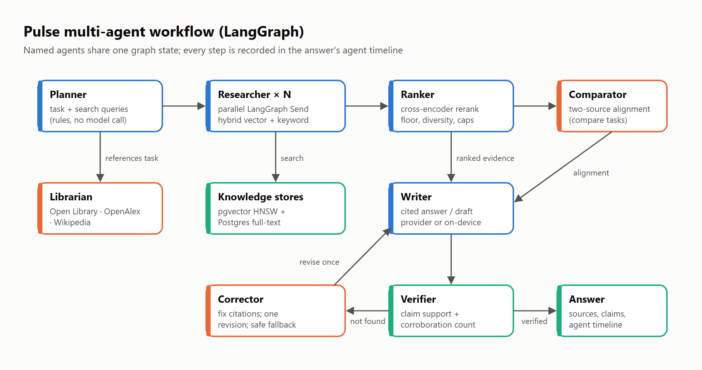
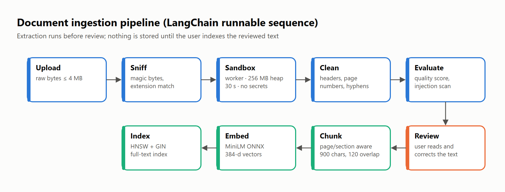

# 10 · Architecture figures

Rendered by `scripts/render-figures.ts`. Detailed design: [architecture](../../../versions/v0.4.0/architecture/design.md) and the [backend system](../../../backend-system/README.md).

| Figure | Image | What it shows |
| --- | --- | --- |
| 10.1 |  | The LangGraph workflow. The Planner classifies the request and writes queries; parallel Researchers search the knowledge stores; the Ranker reranks and filters; the Comparator aligns two sources for comparison tasks; the Writer drafts with citations; the Verifier checks every claim and counts corroborating documents; the Corrector fixes citations, requests one revision or replaces an unverifiable answer; reference requests go to the Librarian. |
| 10.2 |  | The ingestion pipeline as a LangChain runnable sequence: upload, content sniffing, sandboxed extraction, cleaning and quality evaluation, then the user’s review, followed by structure-aware chunking, MiniLM embedding and indexing (HNSW + full-text). Nothing is stored until the user indexes the reviewed text. |
