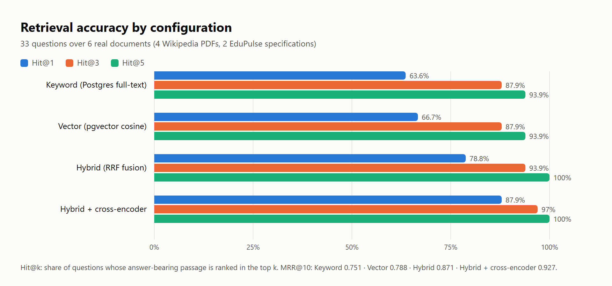
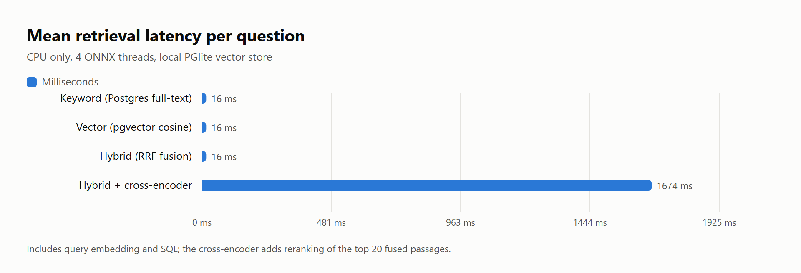
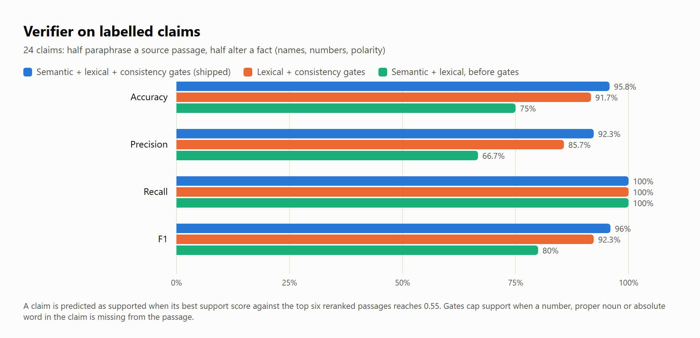
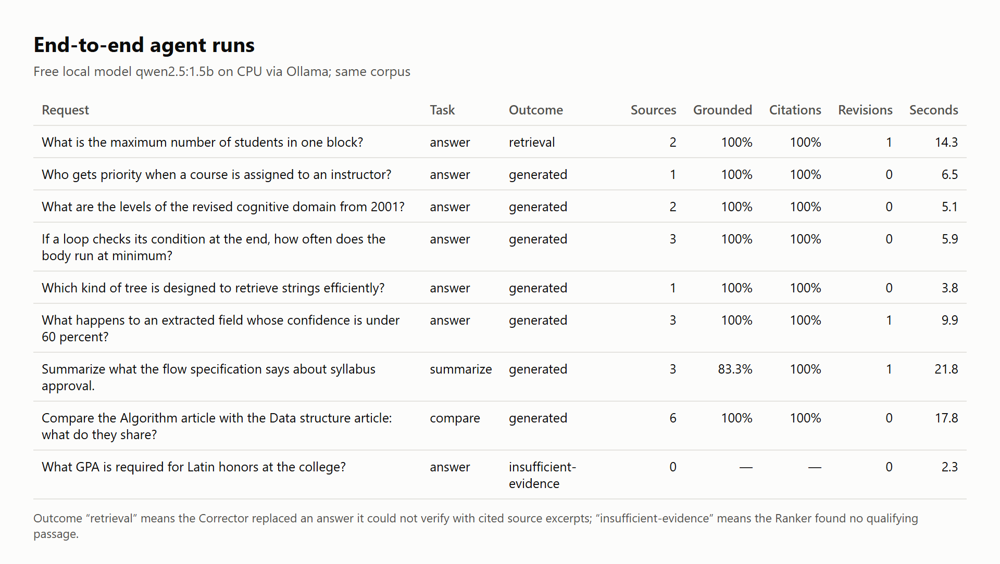

# 09 · Evaluation on real documents

Requirement: FR-RAG-14. Charts rendered by `scripts/render-figures.ts` from [`evaluation-data/rag-evaluation.json`](../evaluation-data/rag-evaluation.json), produced by `npm run eval:rag` (`EVAL_MODEL=qwen2.5:1.5b`). Corpus: four Wikipedia PDFs (CC BY-SA 4.0) and two EduPulse specifications; 289 indexed passages. Palette validated for colour-vision deficiency; every bar carries its value.

| Figure | Image | What it shows |
| --- | --- | --- |
| 9.1 |  | Hit@1/3/5 for 33 questions. Top-1 accuracy rises from 63.6% (keyword) and 66.7% (vector) to 78.8% with reciprocal rank fusion and 87.9% with cross-encoder reranking; both hybrid configurations reach 100% at Hit@5. MRR@10 0.751 → 0.788 → 0.871 → 0.927. |
| 9.2 |  | Mean time per question on CPU: ≈16 ms for keyword, vector or fused search; ≈1.7 s when the cross-encoder reranks the top 20 passages. |
| 9.3 |  | 24 labelled claims (12 faithful, 12 with altered names, numbers or polarity). Before the consistency gates the blended verifier reached 75.0% accuracy and 66.7% precision; with gates it reaches 95.8% accuracy and 92.3% precision while keeping 100% recall. |
| 9.4 |  | Nine requests through the full agent workflow with the free qwen2.5:1.5b model on CPU: all generated answers with 100% citation accuracy; one unverifiable answer replaced by verified excerpts; the unanswerable question stopped with “insufficient evidence”. |

Discussion: [results and discussion](../results-and-discussion.md). These charts are generated from evaluation data; they are not UI screenshots.
