# 2 · Build a syllabus and take it from draft to active

**Who:** instructors · **Where:** Syllabus → *Syllabus Builder* and *My Syllabus* · Requirements FR-SYL (lifecycle), FR-CW-01 (outline drives courseware).

A syllabus passes five stations: **Drafted → Checked → Out for Approval → Approved — Uploaded → Active**. Signatures (Dean review → CAO approval → EVP noting) happen offline on the downloaded file; EduPulse never marks a syllabus approved by itself. Only an **Active** syllabus, whose Course Outline you have reviewed, drives courseware generation.

The screenshots follow one real syllabus (IT 102 — Computer Programming 1) through every station.

## Build the draft

1. Open **Syllabus → Syllabus Builder** and choose the **Course**. Course title, period offered and academic year fill in from the curriculum and are locked; so is the course description in Section 2.

   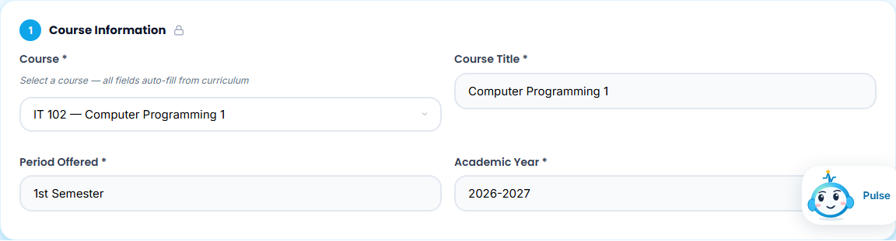

2. In **Section 5 · Course Outline**, write each week's **intended learning outcome** and **topics** (use **Add Topic** for more), and optionally activities, teaching materials and assessments. Weeks 9 and 18 are the midterm and final examinations. This outline is what courseware is generated from, so write measurable outcomes.

   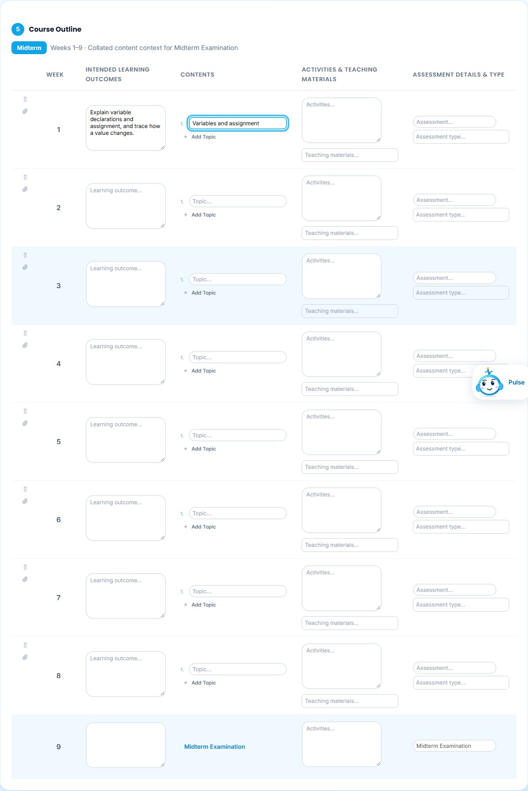

3. Complete Sections 6 (requirements, grading, policies) and 7 (references), then click **Save as Drafted** at the bottom. (**Mark as Checked** saves and checks in one step.)

   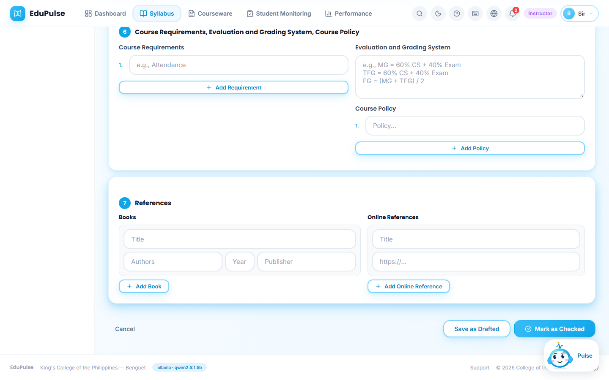

## Move it through the stations

4. The syllabus appears in **My Syllabus** with status **Drafted**, version **v1**, and *18 weeks (not yet extracted)*. The **Next step** column always shows the one action that moves it forward.

   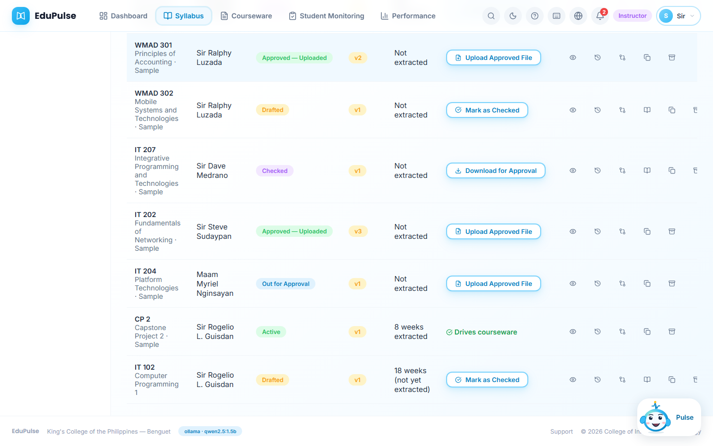

5. After re-reading it, click **Mark as Checked**. The status becomes **Checked** and the next step becomes **Download for Approval**.

   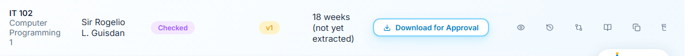

6. Click **Download for Approval** to save the DOCX for the offline signatory route. The status becomes **Out for Approval** and the next step is **Upload Approved File**.

   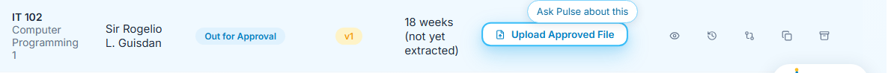

7. When the signed file returns, click **Upload Approved File**. Tick the confirmation that the offline approvals are complete (EduPulse does not verify signatures) and choose the approved DOCX (up to 500 KB). The original file is kept with its checksum.

   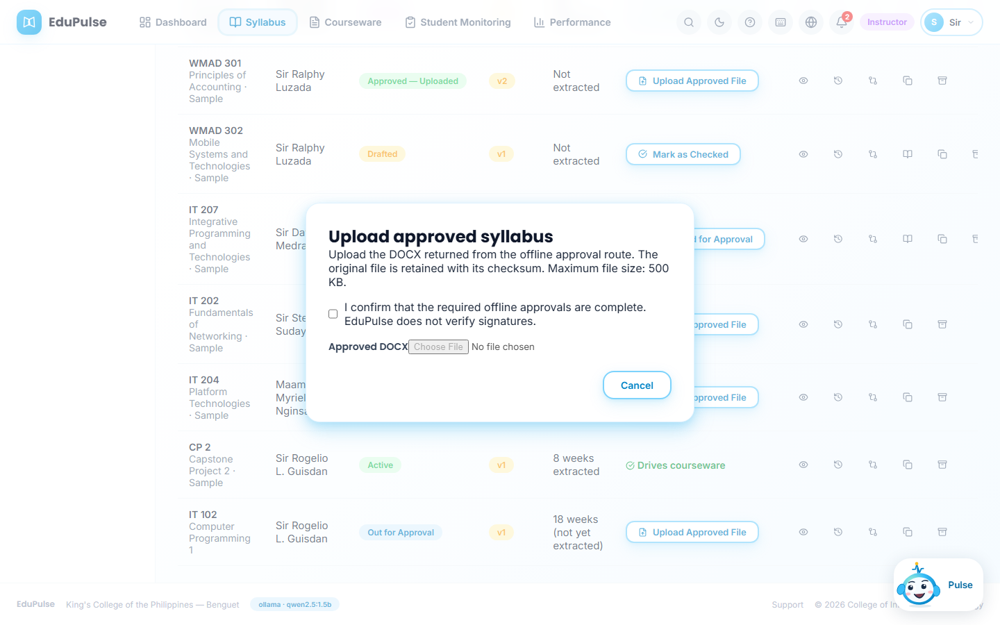

8. The status becomes **Approved — Uploaded** and the next step is **Extract Outline**.

   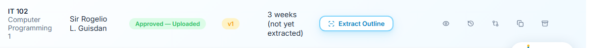

## Activate it

9. Click **Extract Outline**. EduPulse reads Section 5 of the approved file and shows each row (week, outcomes, contents, assessments; exam weeks are marked *Milestone*). Each teaching row becomes one courseware generation unit. Check it against the signed document, then click **Confirm Extraction — Activate Syllabus**.

   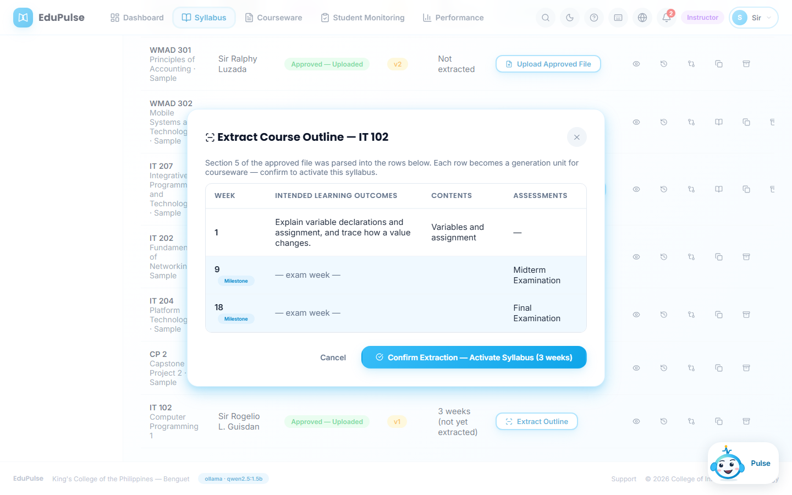

10. The syllabus is **Active**, the outline shows as extracted, and the next-step column reads **Drives courseware**. It now appears in Courseware ([manual 3](../03-courseware-generation-and-review/README.md)).

    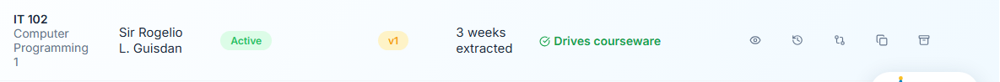

11. **Version History** (clock icon) lists every recorded change with its station, version, time and author. From here you can download the retained approved file, or remove it and return the syllabus to draft if the wrong file was uploaded.

    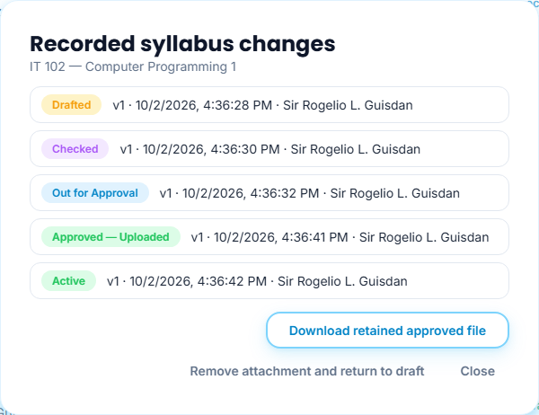

## Good to know

* Edits are saved to the workspace automatically (*Local workspace · Saved*, or the cloud equivalent). **Export backup** downloads everything as JSON.
* Pulse can walk you through any section: drag it onto the section or click **Guide this page** ([manual 7](../07-pulse-guidance/README.md)). Pulse drafts; it cannot check, approve or activate a syllabus.
