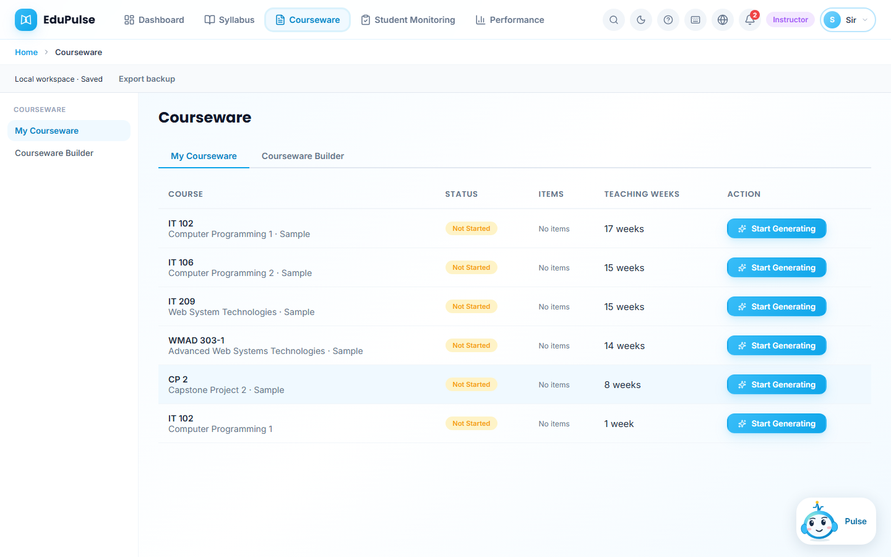
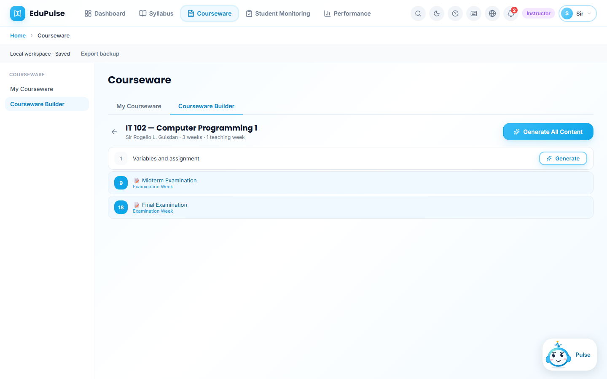
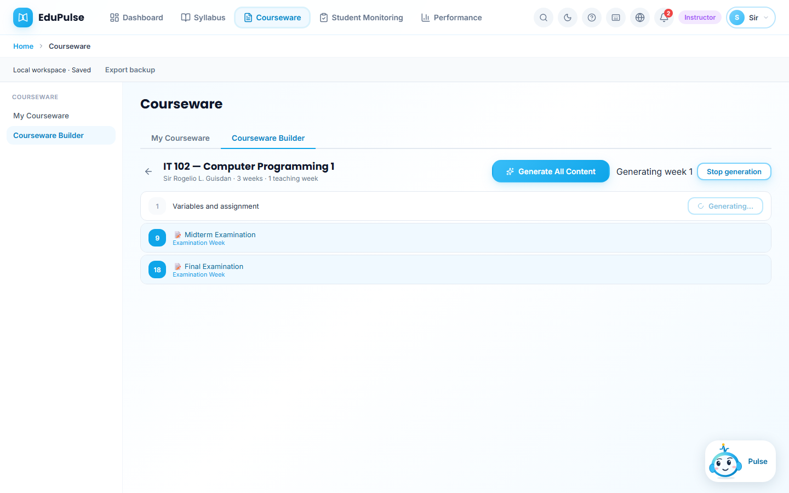
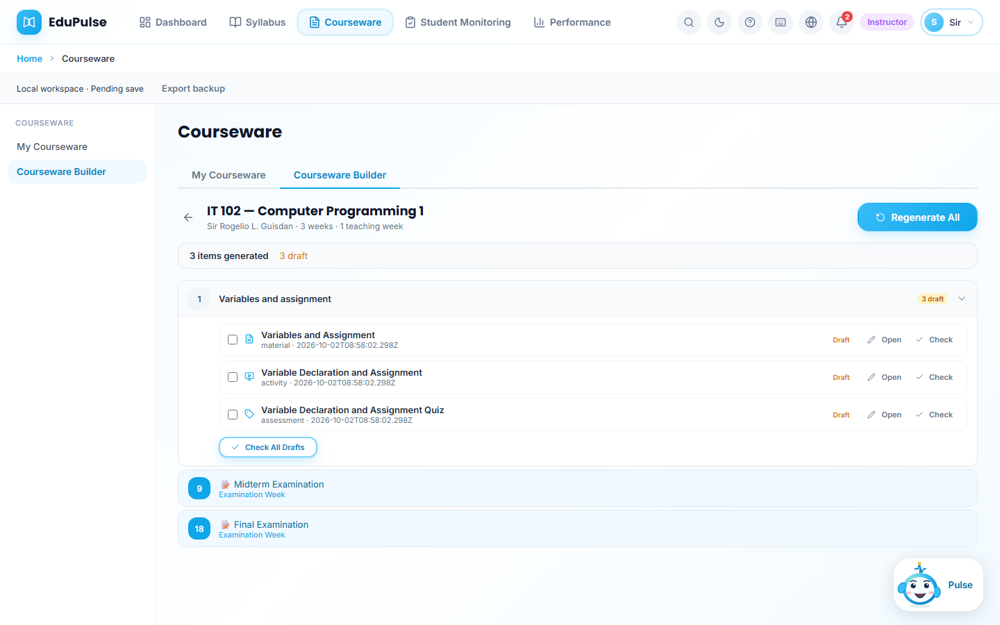
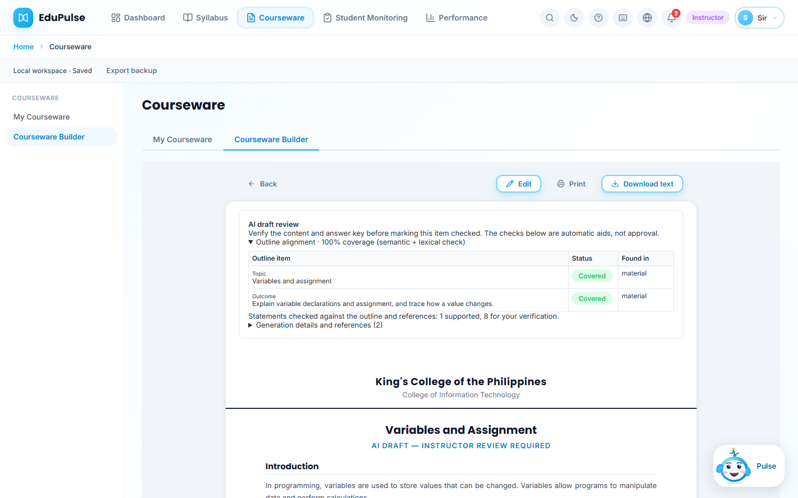
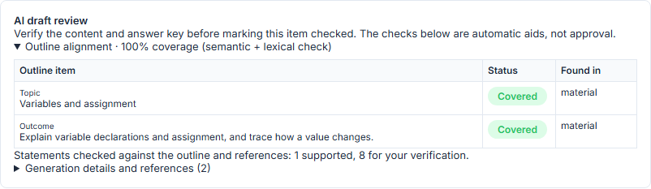

# 3 · Generate and review courseware

**Who:** instructor. **Where:** Courseware → My Courseware and Courseware Builder. The generated material, activity, and assessment stay in Draft until an instructor checks them. The alignment report is an aid to review, not approval.

1. Complete and activate a syllabus outline first. In **My Courseware**, find the instructor's own course and choose **Start Generating**. The sample courses are listed separately; the IT 102 row without “Sample” comes from the completed [syllabus workflow](../02-syllabus-lifecycle/README.md).

   

2. In **Courseware Builder**, find a teaching week with a topic and outcome. The IT 102 outline here has “Variables and assignment” in week 1. Choose that week's **Generate** button. Examination weeks have no Generate button.

   

3. Wait while the local model drafts the week. **Stop generation** cancels this request. The app keeps any existing courseware if generation fails.

   

4. On success, the week expands to three separate **Draft** items: a learning material, an activity, and an assessment. Use **Open** to inspect an item. **Check** and **Check All Drafts** are instructor actions; generation itself does not mark the items checked.

   

5. In the material view, read the draft and the **AI draft review** panel before checking it. The panel shows outline coverage and a statement check against the outline and retrieved references. This capture reports **100% outline coverage** for the one topic and one outcome, while only **1 of 9 material statements** was automatically supported; the other eight are explicitly left for instructor verification. Open **Generation details and references** to inspect the source trace.

   

   

6. Edit any inaccurate explanation or answer key, then use **Check** only after reviewing the material, activity, and assessment. Drafts are not published or graded automatically.

The six images come from the production build using the local `qwen2.5:1.5b` model and a real generated week 1 draft. The [v0.4.0 release record](../../versions/v0.4.0/README.md) maps them to NFR-AI-06 (goal 6).
