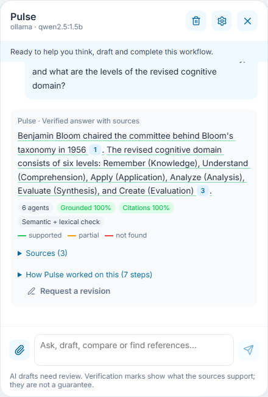
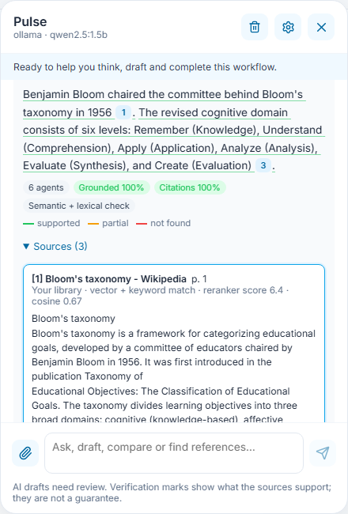
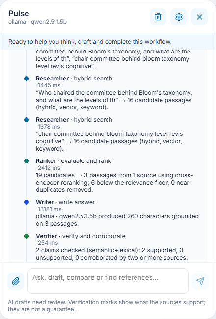
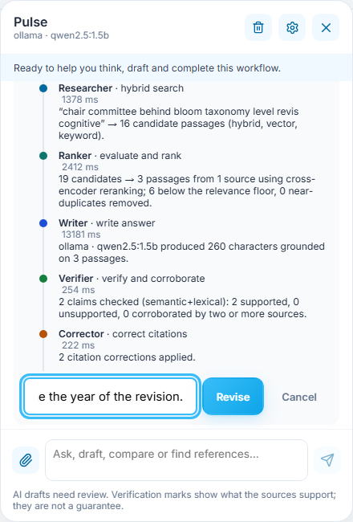
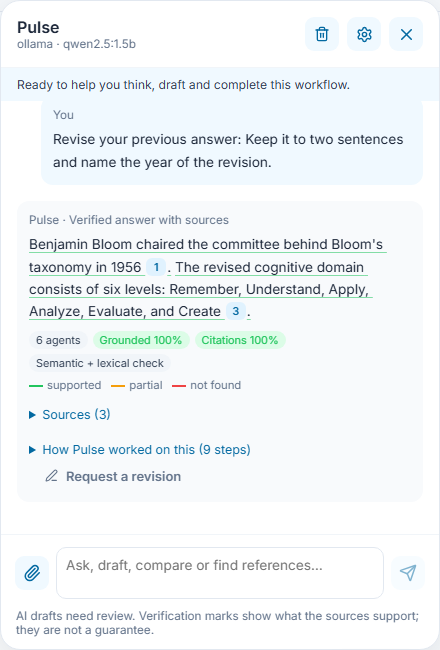

# 5 · Ask Pulse and read a verified answer

**Who:** every role (students get help without assessment answers) · **Where:** the Pulse character at the lower right of every page · Requirements FR-RAG-07–10, FR-GUIDE-10.

## Steps

1. Click **Pulse**, type a question and press **Enter** (Shift+Enter for a new line). Attach up to three files with the paperclip; they are read in the same sandbox as the library.
2. Read the answer. Each sentence is underlined by what the sources support: solid green = supported, double = supported by two or more documents, dotted amber = partly supported or missing a citation, wavy red = not found in your sources. The badges summarize grounding and citation accuracy.

   

3. Click a citation number to open the exact passage, with its page, the document it came from and how it matched.

   

4. Open **How Pulse worked on this** to see each agent’s step: the Planner’s search plan, the Researchers’ searches, what the Ranker kept, the Writer’s model, and the Verifier’s check.

   

5. To change the answer, click **Request a revision**, describe what to change and click **Revise**.

   

   The revised answer is checked again before it is shown. A small free model may not follow every instruction (here it did not add the year), but every statement it shows is checked against your sources.

   

## Good to know

* Without a connected model, Pulse still searches and quotes the best source sentences, labelled **Source excerpts**.
* If nothing in your library or the product guide answers the question, Pulse says the evidence is missing instead of guessing.
* **Stop** (square button) cancels a running request; the trash icon clears the conversation; the gear opens AI settings.
* Answers are drafts for your judgement. Pulse cannot save, approve, publish or grade anything.
