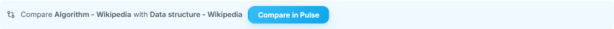
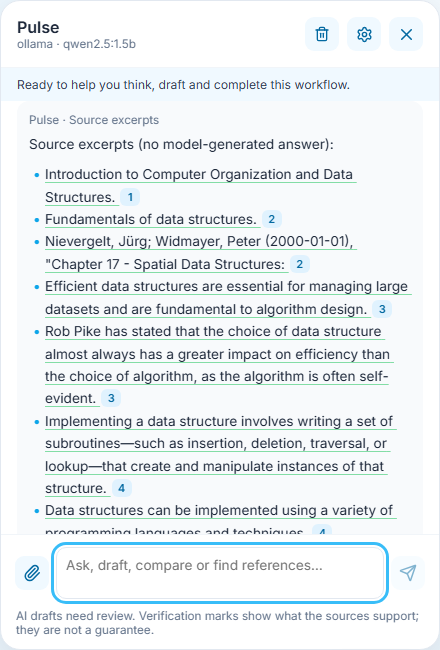
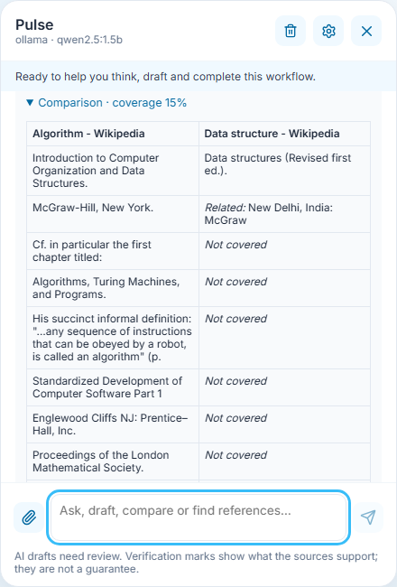
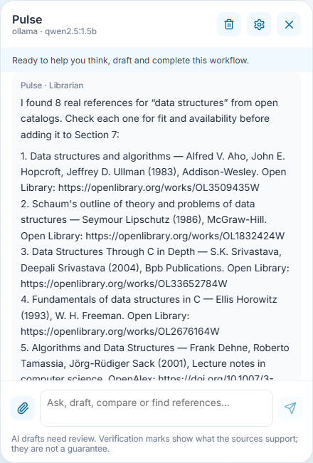

# 6 · Compare two documents and find real references

**Who:** every signed-in account · **Where:** Settings → *AI & Knowledge* → *Knowledge library*, and the Pulse panel · Requirements FR-RAG-11 (comparison), FR-RAG-12 (references), NFR-AI-08 (alignment is not plagiarism detection).

## Compare two documents

1. In the **Knowledge library**, tick exactly two indexed documents. A bar appears: *Compare **first** with **second*** and **Compare in Pulse**.

   

2. Pulse searches **both** documents (each must contribute evidence), and the Writer answers in three parts: *Shared points*, *Points only in the first source*, *Points only in the second source*. Each statement is underlined by how well the sources support it and carries citation numbers that open the passage.

   

   In this capture, the small local model’s comparison could not be verified against both documents. So Pulse shows **Source excerpts (no model-generated answer)**: cited sentences from each document, numbered by source. The alignment table in the next step is computed by the Comparator without the model, so it is still complete.

3. Below the answer, **Comparison · coverage n%** opens the Comparator's alignment table. Each row pairs a statement from one document with its closest match in the other: matched rows are shared, *Related* rows are partial matches, *Not covered* marks statements found in only one document. Coverage is the share of the first document's statements that the second covers.

   

The table measures topical coverage between two sources (for example a syllabus and a textbook, or two versions of a handout). It does not judge authorship or copying. Asking Pulse whether a document is plagiarised or AI-written is declined by the Guardian ([System Manual 5](../05-ask-pulse/README.md#what-pulse-declines)).

*Changed in v0.4.0:* the Ranker skips passages identified as mostly citations, and the Comparator skips recognizable bibliography lines. This is a heuristic: short citation fragments and publisher lines can still remain, as visible in this sample table. Review the paired statements before treating coverage as a measure of the topic.

## Find references from open catalogs

4. Ask Pulse for references, for example *“Find references about data structures for my syllabus”*. The **Librarian** agent queries three open catalogs only (Open Library for books, OpenAlex for scholarly works, Wikipedia), with no API key, rebuilds every link from the catalog's own identifier, and lists real books and articles with author, year, publisher and link.

   

Check each reference for fit and availability before adding it to Section 7 of your syllabus. If a catalog is unreachable, Pulse lists what the others returned and says which one failed.
