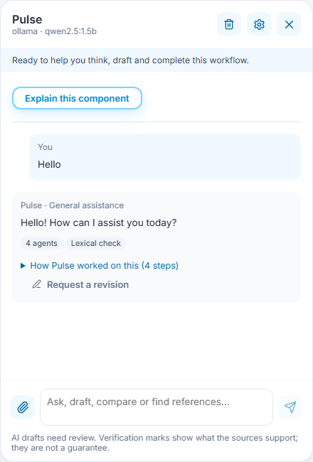
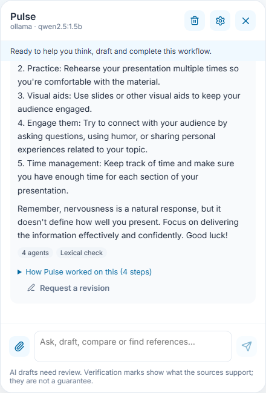
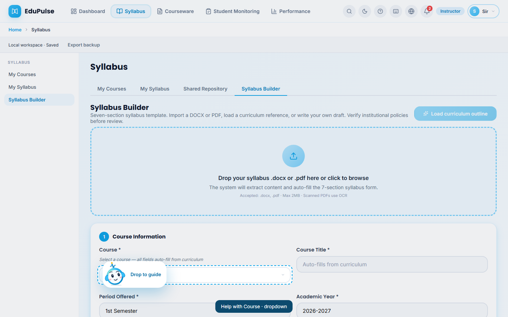
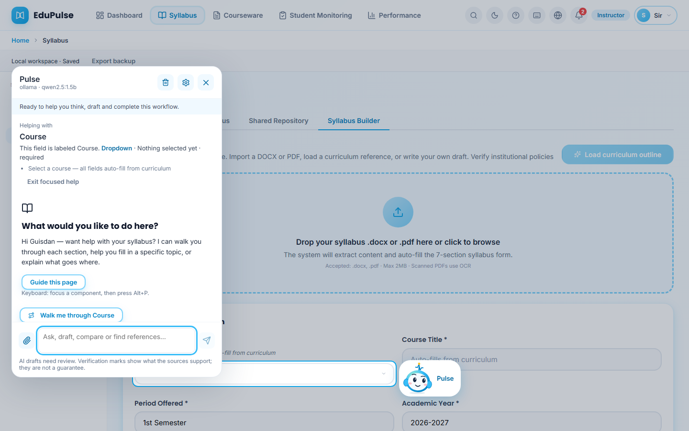
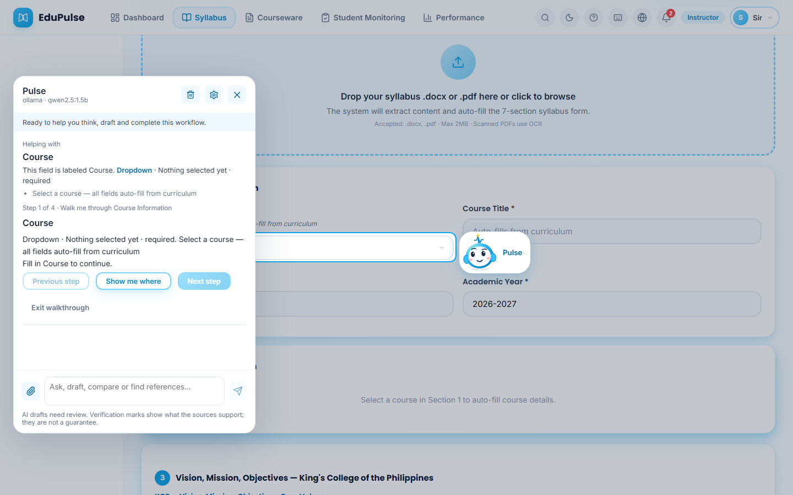
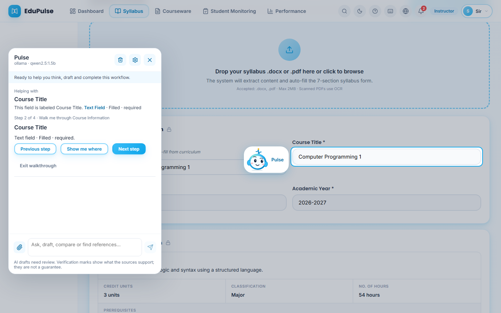
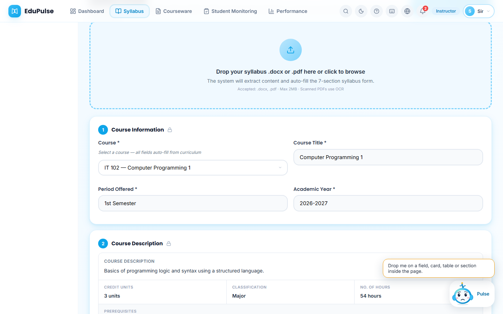

# 7 · Get guidance from Pulse on any part of a page

**Who:** every role · **Where:** the Pulse character at the lower right of every page · Requirements FR-GUIDE-01–10.

Pulse explains the exact component you point it at — a field, card, table or page section — using what is actually on the screen: the control's label, its type, whether it is required, what it currently holds and the hint text around it. It never reads passwords or other sensitive values aloud.

## Conversation and situational help

With a connected model, type a greeting or a situational question in **Ask Pulse**. **Pulse · General assistance** uses the conversation rather than requiring a knowledge-library document. Follow-up questions retain the recent exchange. Document summaries, comparisons and institutional questions use source evidence; general replies are not verified institutional policy. Provider failures show a connection error instead of asking for an unrelated document.

Your provider connection belongs to your signed-in account. The system admin can reuse it while switching role views; another signed-in user or a guest cannot inherit it.

## Drag Pulse onto a component

1. Press and drag the Pulse character. While you drag, the component under it is outlined and a label names it (here *Help with Course · dropdown*); the character reads **Drop to guide**.

   

2. Release. Pulse perches beside the component, the rest of the page dims, and the panel opens on the other side under **Helping with**: the component's name, its type (**Dropdown**), its current state (*Nothing selected yet · required*) and the hint text from the page. **Walk me through Course** starts a step-by-step tour of the section it belongs to; **Exit focused help** returns Pulse to its dock.

   

## Follow a section tour

3. The tour goes through the section's visible controls in order (*Step 1 of 4 · Walk me through Course Information*). When a step needs input, **Next step** stays disabled and Pulse says what to do (*Fill in Course to continue*). **Show me where** scrolls to and highlights the control.

   

4. As soon as the value changes, the step updates from the live page. Here the course was chosen, so the next control, **Course Title**, is described as *Text field · Filled · required* (it auto-filled from the curriculum). **Finish walkthrough** ends the tour.

   

## When Pulse cannot help with a drop

5. Dropping Pulse outside the page content (on the top bar, sidebar or empty space) is refused with a reason: *Drop me on a field, card, table or section inside the page.* Pulse shakes, shows a worried face and returns to its dock. Password fields are refused (*I don’t read password fields*), and areas that belong to another role are refused with a message naming the area.

   

## Other ways to start guidance

* **Click** Pulse and choose **Guide this page** to tour the main area of the current page.
* Rest the pointer on a form control and click **Ask Pulse about this**.
* With the keyboard, focus any control and press **Alt+P**.
* On a touch screen, press and drag Pulse with your finger; it behaves the same way.

To have Pulse **do** something for you (register a class list, file a material under a course, search records, generate a week of courseware or open a page), see [System Manual 9](../09-pulse-actions/README.md).

*Changed in v0.4.0:* tour steps are rebuilt from the live page every time they are shown, so a field filled during the tour is no longer described as “Empty”; the required-field asterisk is no longer read as part of a field's name; and the panel always opens on the side away from Pulse so the two never overlap.
