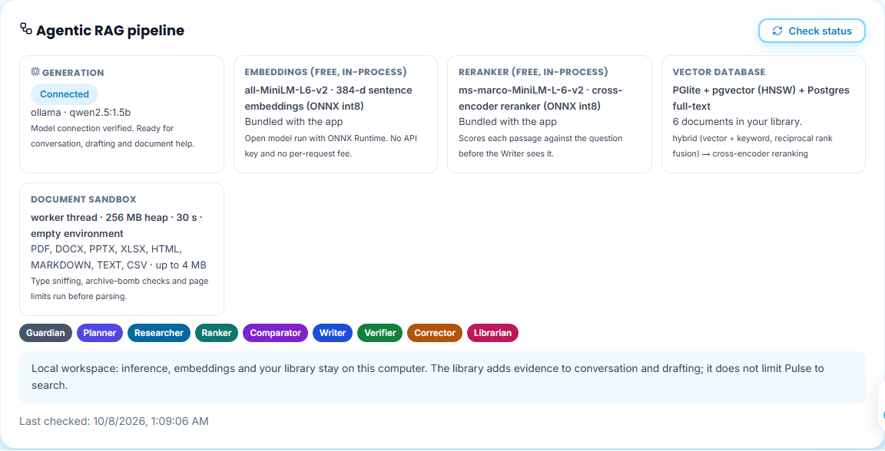
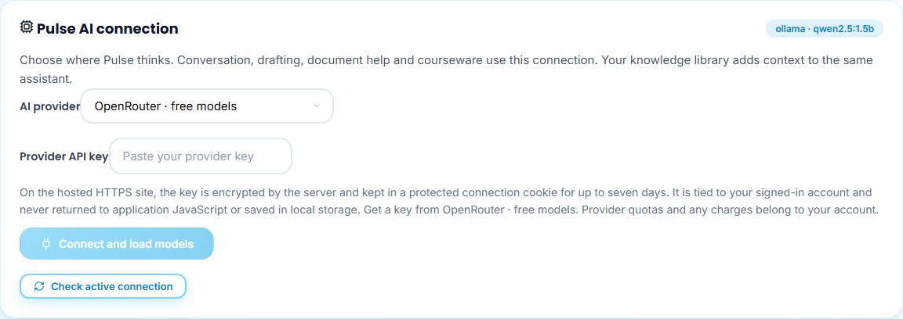
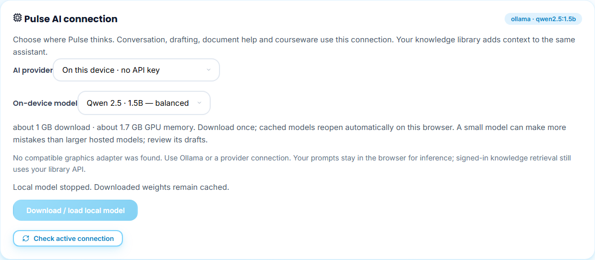

# 8 · Choose where Pulse thinks (AI connections)

**Who:** every account: each admin, instructor and student connects a separate key of their own · **Where:** Settings → *AI & Knowledge* · Requirements FR-SET (as corrected 2026-09-16), NFR-AI-01/02, FR-RAG-05/06.

## Check the pipeline

**Agentic RAG pipeline** shows what is working right now: the generation model, the free embedding model and reranker (always available, no key), the vector database, the document sandbox and the eight agents. Use **Check status** after changing anything.

## Connect a provider

1. In **Pulse AI connection**, open **AI provider**. Free options are labelled: Gemini and Groq free tiers, **OpenRouter · free models**, **Hugging Face Inference · free credits**, or OpenAI/Anthropic with your own key.
2. Paste your key and click **Connect and load models**. The key is sent once, encrypted by the server and kept in a protected cookie for up to seven days. It is tied to your signed-in account and is never shown again. For a signed-in account the form opens on OpenAI; this capture, made with a preview persona, shows **OpenRouter · free models**.
3. Pick a model from the list returned by the provider. For OpenRouter and Hugging Face, free models are listed first and marked “(free)”.

Keys are never shared between accounts. When the owner admin switches to another view, the account and its key stay the same. The hosted site has no shared server key: without your own key, Pulse answers with quoted source excerpts or uses the on-device model.

Every connect, failed connect and disconnect by a signed-in account is recorded in the system audit log, which the system admin sees in *Audit activity* ([System Walkthrough 07](../../system-walkthrough/07-system-admin/README.md)). The log records only the provider name, never the key.

## Run a model on this device (no key)

Choose **On this device · no API key**, pick **Qwen 2.5 · 1.5B — balanced** (≈1 GB download) or **0.5B — lighter**, then **Download / load local model**. It needs a browser with WebGPU (current Chrome or Edge with graphics acceleration). If your device cannot run it, Pulse says so and keeps the button disabled, as in this capture:

In the downloaded local app, **Ollama · local app server** uses models installed with `npm run ai:setup`.
