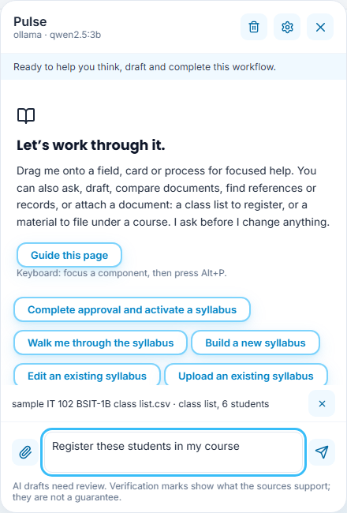
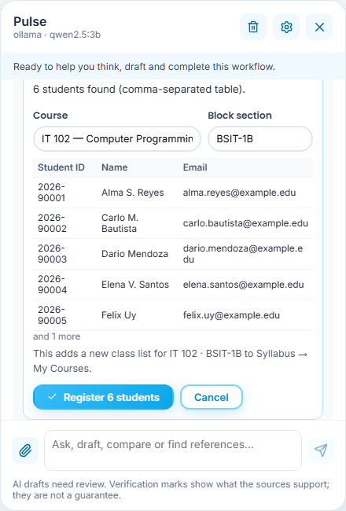
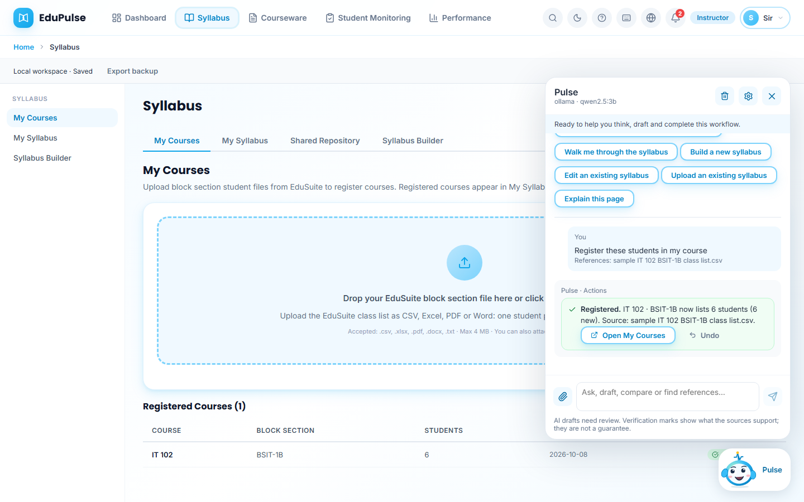
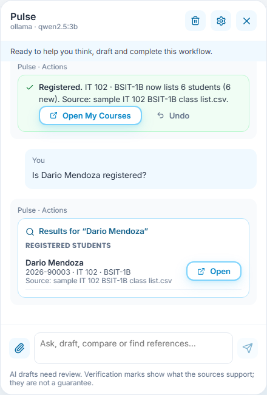
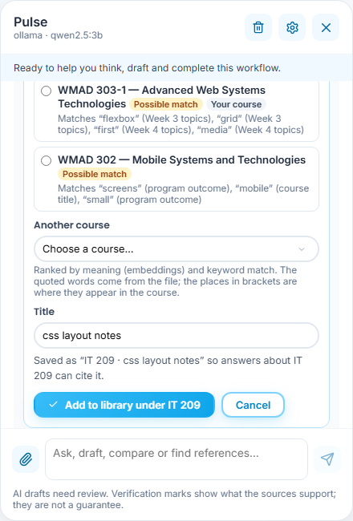
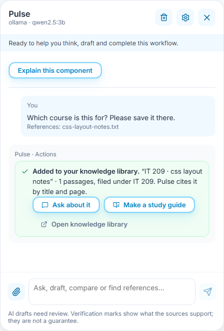
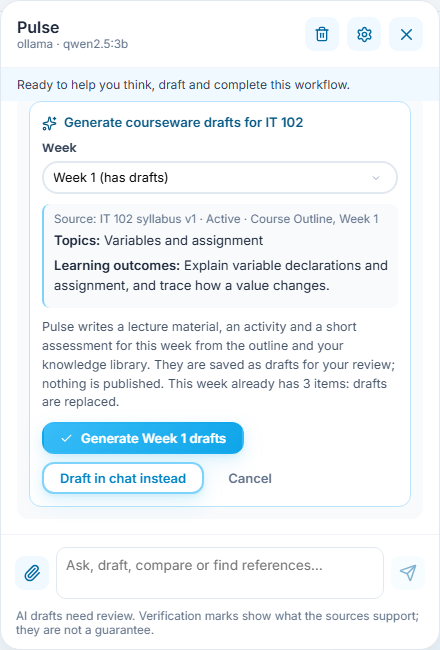
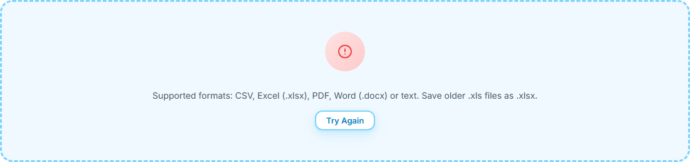

# 9 · Ask Pulse to do it: register a class list, file a material, search, generate, open a page

**Who:** instructors (class lists, generation), students and instructors (materials), every role (search, opening pages) · **Where:** the Pulse panel on any page · Requirements FR-GUIDE-31–36.

Pulse can act on what you ask, not only answer it. It reads your message and any file you attach, then shows an **action card** that says exactly what it will do. Nothing that changes your data happens until you press the card's confirm button; **Cancel** leaves everything as it was. Searches and page changes only read or navigate, so they happen at once.

Pulse decides which action fits with fixed rules, never with the language model, so an answer can never trigger an action by itself. Every finished action links to the page where you can see its result.

The class list in these screenshots is sample data: invented names with `example.edu` addresses, not real student records.

## Register a class list (instructors)

1. Open Pulse and attach the EduSuite class list with the paper clip: CSV, Excel (`.xlsx`), PDF, Word (`.docx`) or text, one student per row with a **Name** column (or **Last Name** and **First Name**). Pulse reads it in the same sandbox as the knowledge library. The file chip under the message box confirms it is a class list and counts the students (*class list, 6 students*). Type what you want, for example *Register these students in my course*, and send.

   

2. The **Register students** card shows how the file was read, the **Course** and **Block section** (detected from the file name, a course column or the first lines; change them if needed), the first five students and what will change: a new class list, or for a course and block you already registered, how many students are new and how many are already listed. Rows without a name are reported, never guessed, and duplicate rows are merged. Press **Register *n* students** to confirm, or **Cancel**.

   

3. Pulse saves the class list to your workspace and opens **Syllabus → My Courses**, where it appears under **Registered Courses**. The card now says what was registered and from which file, with **Open My Courses** and **Undo**. **Undo** removes this registration, or restores the earlier list if it was merged.

   

   The **My Courses** tab's own upload area uses the same reader, so a file uploaded there is registered the same way: real names from the file, merged by student ID, email or name ([System Walkthrough, instructor](../../system-walkthrough/04-instructor/README.md#24-syllabus)).

4. Ask about a student, for example *Is Dario Mendoza registered?* Pulse searches your registered class lists, courses, courseware and knowledge library and lists each match with the record it came from (**Source:** the class list file) and **Open** to go to it. With a class list attached, the same question searches the attached list.

   

## File a material under a course (students and instructors)

5. Attach a handout, notes or slides and ask *Which course is this for?* (or *save this to IT 209*). The card ranks the courses it matches. Each suggestion says why: the words from your file and where they appear in the course (its title, description, program outcomes or a syllabus outline week, for example *Week 3 topics*). Your own courses are marked **Your course**. Pulse ranks first by keywords, then re-ranks the shortlist by meaning with the embedding model; the line under the list says which method was used. Pick another course from **Another course** if needed and check the **Title**.

   

6. Press **Add to library under *course*** to index it in your knowledge library. Its title starts with the course code, so later answers about that course cite it by course, title and page. The card offers **Ask about it**, **Make a study guide** (a cited draft) and **Open knowledge library**, where the document lists its course.

   

   If you attach a material without a message, Pulse offers the same card plus **Summarize it**, **Make a study guide** and **Make practice questions**, all quoting and citing the file. If you ask a question about the file instead, Pulse answers first and offers to file it underneath the answer.

## Prepare a week of courseware (instructors)

7. Ask, for example, *Generate week 1 materials for IT 102*. The card shows the source it will follow, the course's active syllabus and its **Course Outline** week (topics, learning outcomes, activities and assessments), and says that checked or published items are kept. **Generate Week *n* drafts** writes a lecture material, an activity and a short assessment as drafts for your review, then opens **Courseware** on that course with the week expanded. **Draft in chat instead** writes a draft in the conversation without saving anything. A course without an active syllabus cannot be generated; the card says why and opens **My Syllabus**.

   

## Use the class-list uploader directly

In **Syllabus → My Courses**, the uploader also reads CSV, Excel `.xlsx`, PDF, Word `.docx` and text class lists. Review the students, course and block before **Register Course**. If a replacement file is refused, the previous preview is cleared so it cannot be registered by mistake. Click **Try Again**, then select the corrected file; the same filename can be selected again. Save legacy `.xls` workbooks as `.xlsx` first.

## Open a page

Ask *Take me to the scoring sheet*, *Open my courses* or *Where is the knowledge library?* Pulse opens the page and says so (*Opened Student Monitoring.*). It opens only pages your role can use; otherwise it says the page is not available for your role.

## Answers that cite your own records

When your message names a course that has a syllabus in your workspace (for example *What does IT 102 cover in week 3?*), Pulse adds that syllabus to the references it searches, and the answer cites it like any other source. Files you added under a course are found by the course code in their title.
