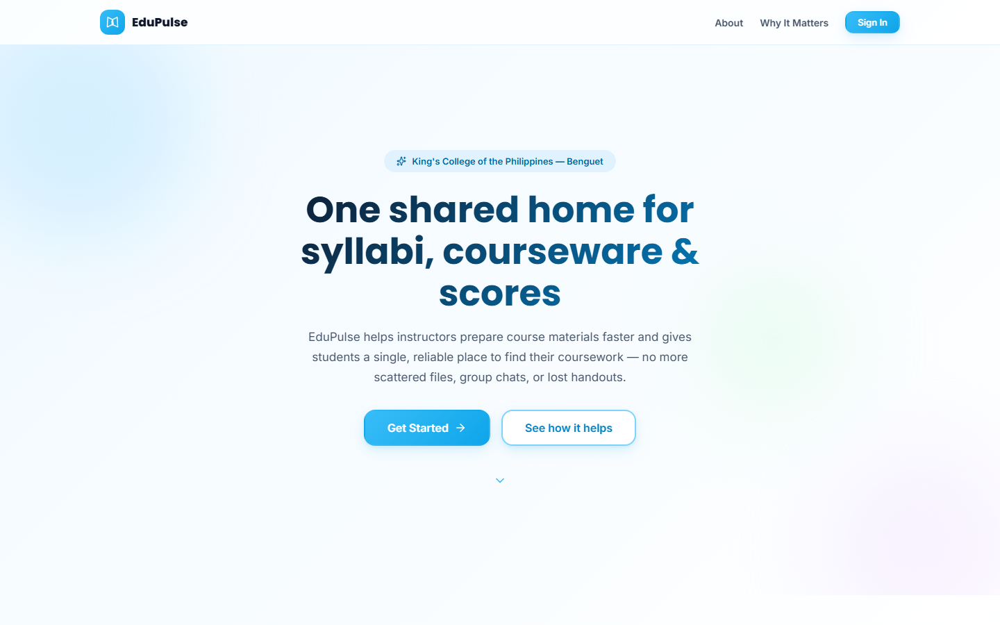
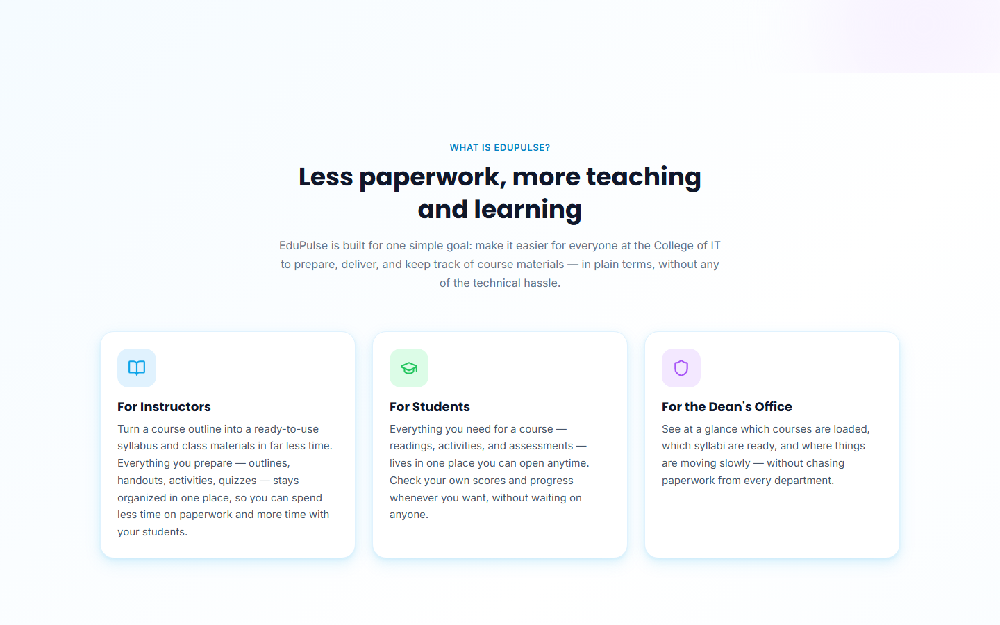
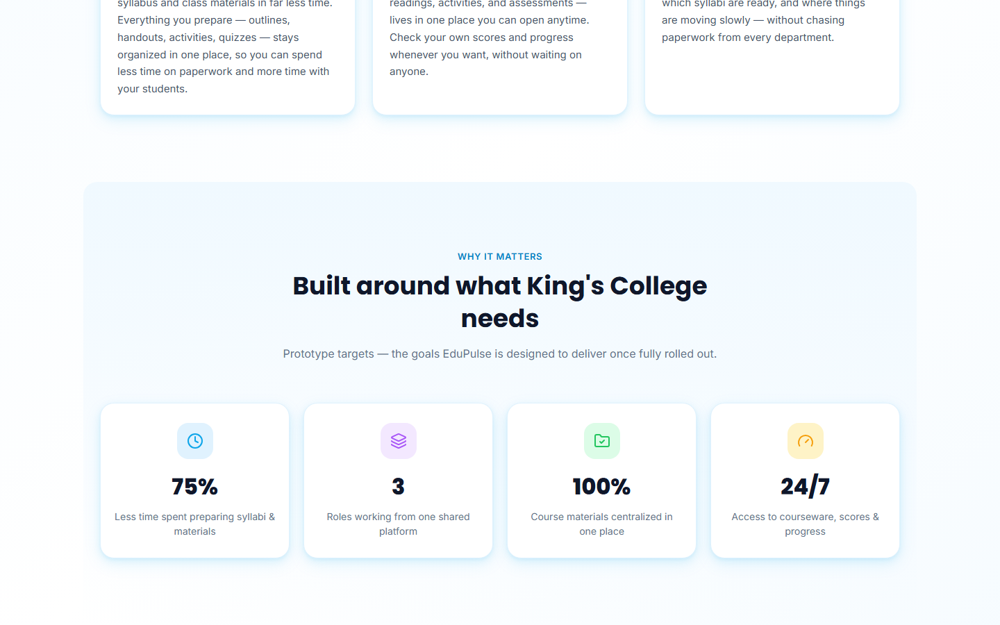
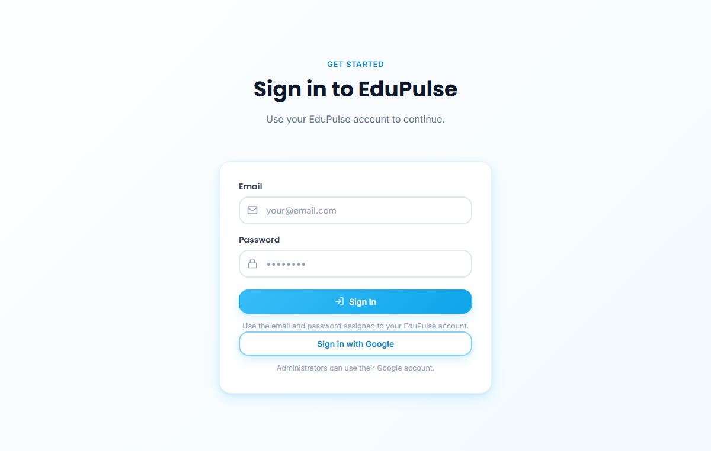
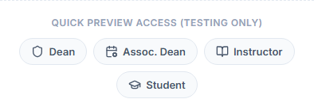
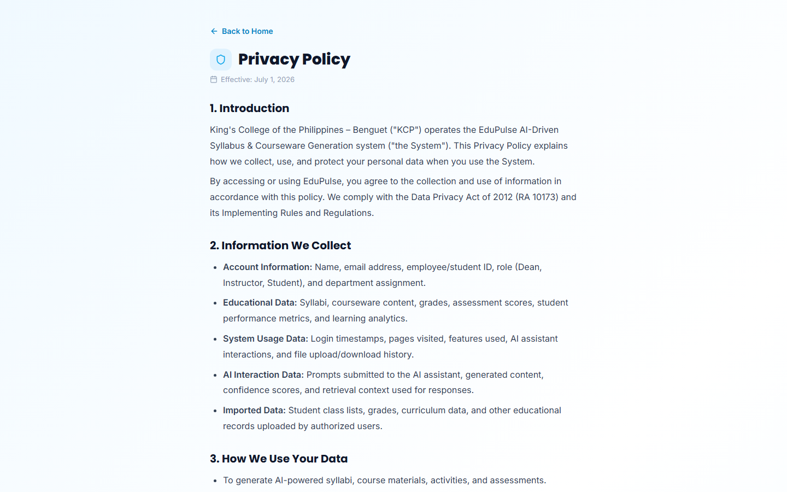
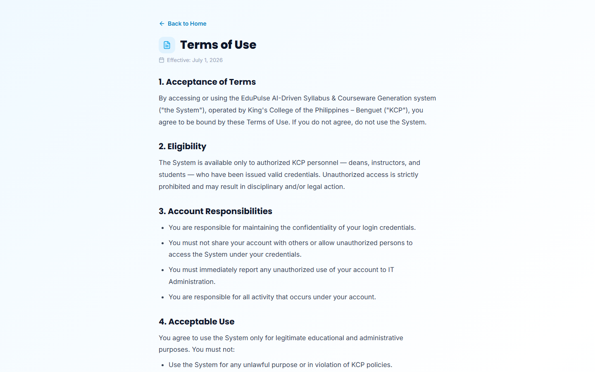
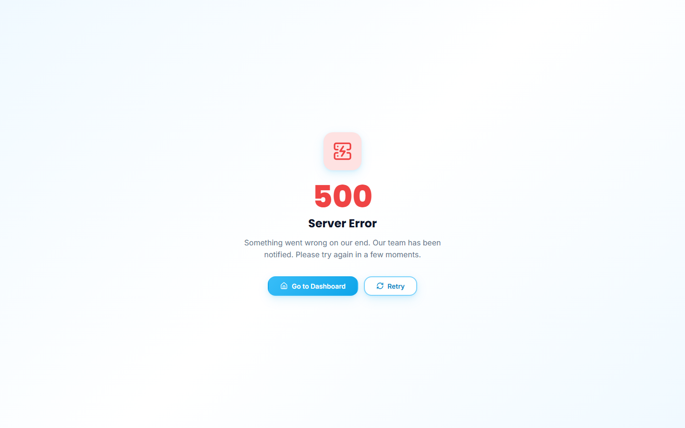

# 01 · Public site

These are the pages a visitor sees before signing in:
* `/`: the landing page, which scrolls through all its sections;
* `/privacy` and `/terms`: the legal pages;
* `/500`: the server error page.

## 1. Landing page: hero

- **Top bar:** EduPulse logo, **About** and **Why It Matters** (jump to their sections) and **Sign In** (jumps to the sign-in panel).
- **Hero:** the institution badge (*King's College of the Philippines — Benguet*), the headline “One shared home for syllabi, courseware & scores” and a one-paragraph summary.
- **Get Started** scrolls to sign-in; **See how it helps** scrolls to the role benefits.

## 2. Landing page: what EduPulse does for each role

Three cards summarise the benefit for each role:
* **Instructors:** outline → syllabus → class materials.
* **Students:** one place for readings, activities, assessments and their own scores.
* **The Dean's Office:** which courses are loaded, which syllabi are ready, and where delivery is slow.

## 3. Landing page: why it matters

These are the prototype's design targets, labelled as targets rather than measured results:
* 75% less preparation time;
* 3 roles (admin, instructor and student) working from one shared platform;
* 100% of course materials centralised in one place;
* access 24/7.

The numbers count up when the section scrolls into view; the screenshot shows their final values.

*Changed after v0.4.0:* the role count is 3, because the Dean and Associate Dean share the admin role.

## 4. Sign-in panel (hosted site)

- **Email** and **Password**, then **Sign In**, for an account the administrator has created. The hint below reads “Use the email and password assigned to your EduPulse account.”
- **Sign in with Google**, with the note “Administrators can use their Google account.” The button works only when Google sign-in is enabled for the project; otherwise the panel says Google sign-in is temporarily unavailable.
- Each account has one assigned role: admin, instructor or student. An account without a role is signed out with the message “This account has no EduPulse role. Contact the administrator.”

*Changed after v0.4.0:* the panel now says “Use your EduPulse account to continue”, and the Google button is new. Preview personas are no longer offered on the hosted site.

## 5. Preview personas (local development and documentation capture only)

**Quick preview access (testing only)** appears below the sign-in panel in two builds only:
* the local development app;
* the documentation capture build (`npm run build:capture`).

The hosted production build does not include it, and the deployment check enforces that. **Dean**, **Assoc. Dean**, **Instructor** and **Student** open the app as that role, with sample data and no account. The rest of this walkthrough was captured with these personas.

## 6. Privacy policy

`/privacy` opens from the landing page footer. **Back to Home** returns to the landing page, and the effective date sits under the title. The numbered sections cover the introduction (operated by King's College of the Philippines – Benguet under the Data Privacy Act of 2012), the information collected, how it is used, retention, your rights and the Data Protection Officer contact. The screenshot shows the top of the page.

## 7. Terms of use

`/terms` opens from the landing page footer and has the same layout: **Back to Home**, the effective date, then numbered sections. These cover acceptance, eligibility (authorised KCP deans, instructors and students only), account responsibilities and acceptable use.

## 8. Server error page

`/500` appears when the app cannot complete a request. It shows **500 · Server Error** and a short apology, with **Go to Dashboard** and **Retry**.
