# 02 · Shared interface

Controls every signed-in role has. Shown here as the Instructor; the Dean and Student see the same tools with their own navigation tabs and notifications.

## Top bar and global tools

### 1. Top bar

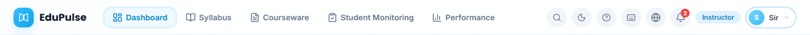

Left to right: logo (returns to the dashboard), the role's main tabs, then **Search**, **Dark mode**, **Help & Support**, **Keyboard shortcuts**, **Language**, **Notifications** (red badge = unread count), the **role badge** and the **account menu**. The owner admin account sees an *Admin · <current view>* button in place of the badge (section 7). Below the top bar on every page: the breadcrumb (*Home › Page*) and the workspace status (*Local workspace · Saved*, or the cloud equivalent) with **Export backup**.

*Changed in v0.4.0:* icon-only buttons now have spoken names for screen readers (“Notifications, 2 unread”, “Account menu”, “Open menu / Close menu”), and the breadcrumb is a labelled navigation landmark.

### 2. Search overlay (Ctrl+K)

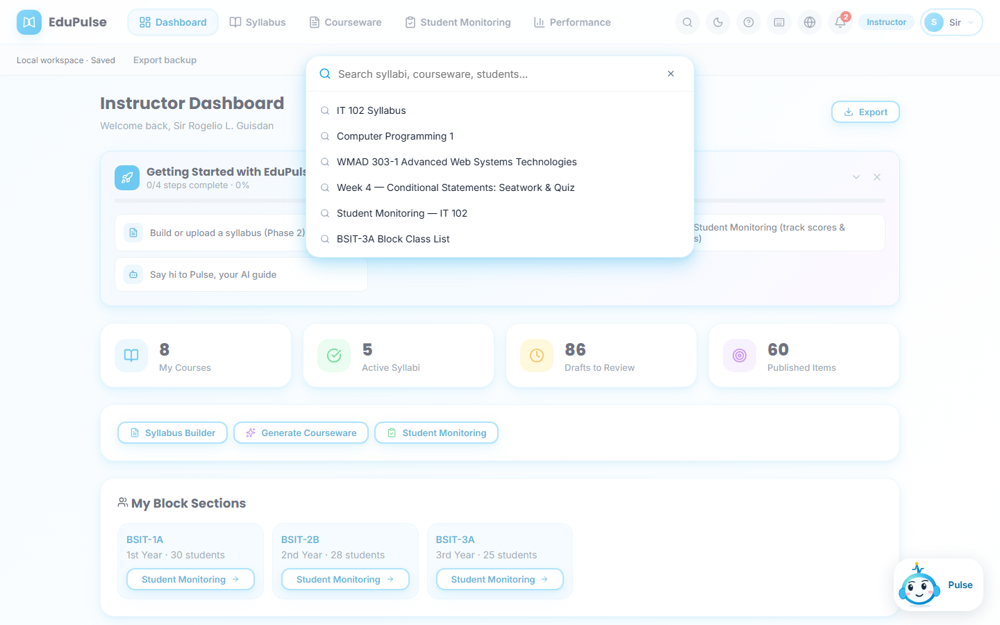

Opens over the page with suggestions (syllabi, courses, courseware items, monitoring pages, class lists). Type to filter; **Esc** or **×** closes it.

### 3. Keyboard shortcuts modal (?)

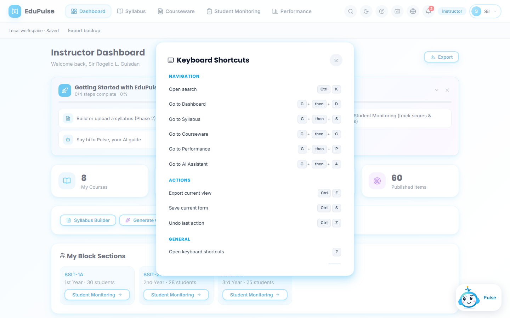

Navigation chords (**G** then **D/S/C/P/A** for Dashboard, Syllabus, Courseware, Performance, AI Assistant), actions (**Ctrl+E** export, **Ctrl+S** save, **Ctrl+Z** undo) and **?** to reopen this list.

### 4. Language menu

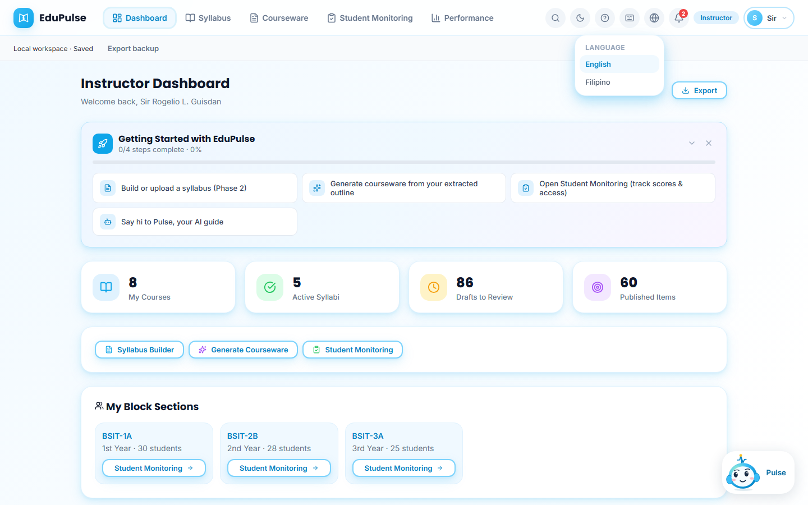

Switches interface text between **English** and **Filipino**.

### 5. Notifications dropdown

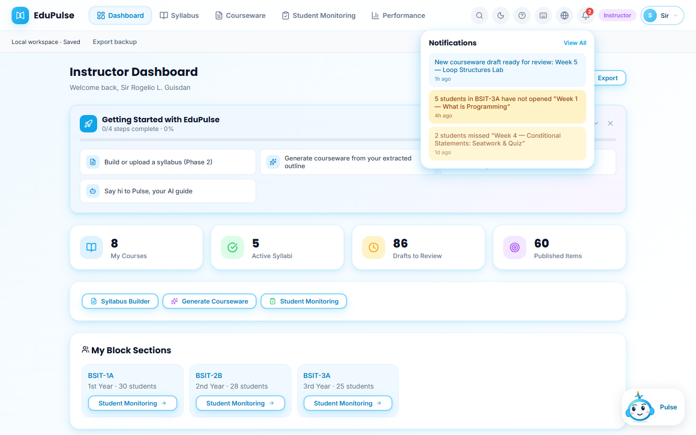

The three most recent notices for the role (warnings in amber, information in blue; read items are dimmed). **View All** opens the Notifications page.

*Changed in v0.4.0:* the dropdown, the badge and the Notifications page read one shared list, so the badge always equals the page's *Unread* count, and **Mark All Read** clears the badge (it previously showed a fixed “3”).

### 6. Account menu

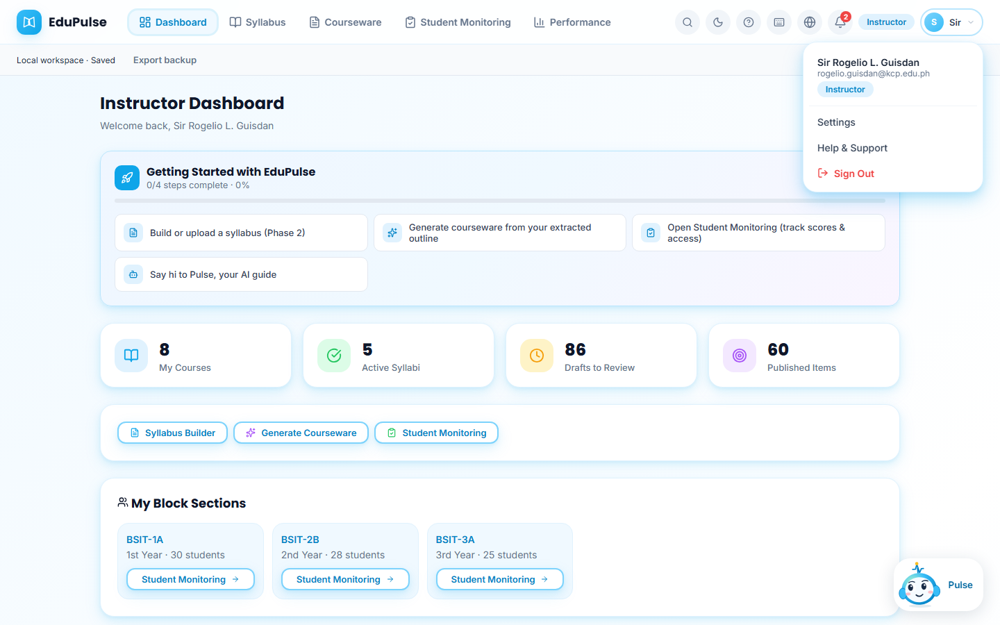

Name, email and role, then **Settings**, **Help & Support** and **Sign Out**. The admin account's email address is not displayed.

### 7. Role badge and admin view switching

Every account sees its role as a badge in the top bar (see image 1, *Instructor*). Roles are assigned by the administrator, and only the owner admin account can change what it sees:
* After signing in with Google, the owner admin account sees a button labelled *Admin · <current view>* where other accounts see the badge.
* The button opens the **Switch View** popover, which offers **System Admin**, **Dean**, **Associate Dean**, **Instructor** and **Student**. On a phone, where the top-bar button is hidden, the account menu has a **Switch view** entry that opens the same popover.
* The popover explains: “You remain signed in as the admin. Your AI key and saved data stay with this account.”

No other account can switch. This screen has no screenshot because it needs the owner's Google session, which the automated capture cannot use.

*Changed after v0.4.0:* the preview role switcher was removed. It used to let any preview session jump between Dean, Associate Dean, Instructor and Student.

## Pages every role has

### 8. Notifications page

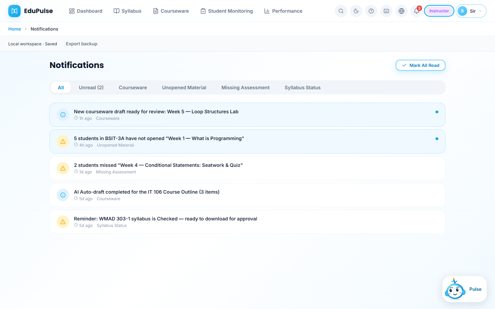

Filter tabs (**All**, **Unread (n)** and one tab per category such as *Courseware*, *Unopened Material*, *Missing Assessment*, *Syllabus Status*). Unread notices have a blue background and dot; click one to mark it read, or use **Mark All Read**.

### 9. Help & Support

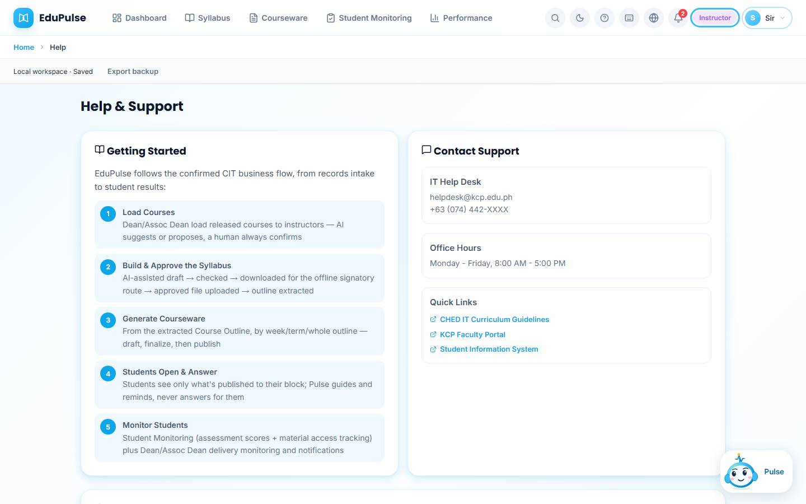

**Getting Started** explains the five-step business flow (Load Courses → Build & Approve the Syllabus → Generate Courseware → Students Open & Answer → Monitor Students). **Contact Support** lists the IT Help Desk, office hours and quick links. The frequently asked questions follow below the visible area. **How do I connect AI?** says that each signed-in account connects its own OpenAI API key in Settings → AI & Knowledge, and that a ChatGPT subscription is separate from OpenAI API billing.

### 10–14. Settings

| Tab | Screenshot | What it holds |
| --- | --- | --- |
| Account | 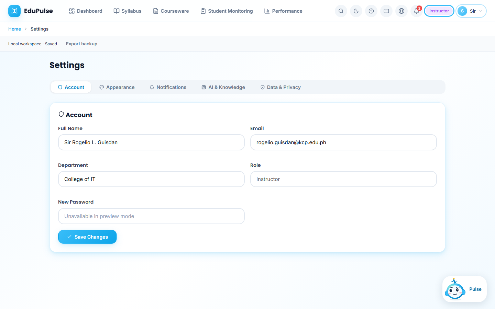 | Full name, email (not shown for the admin account), department, role (read-only) and password (disabled in preview mode); **Save Changes** |
| Appearance | 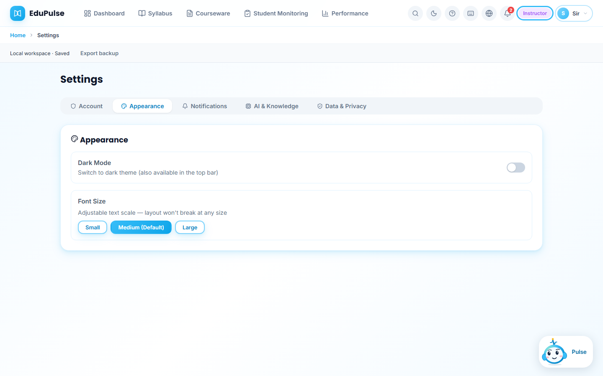 | **Dark Mode** switch and **Font Size** (Small, Medium, Large) |
| Notifications | 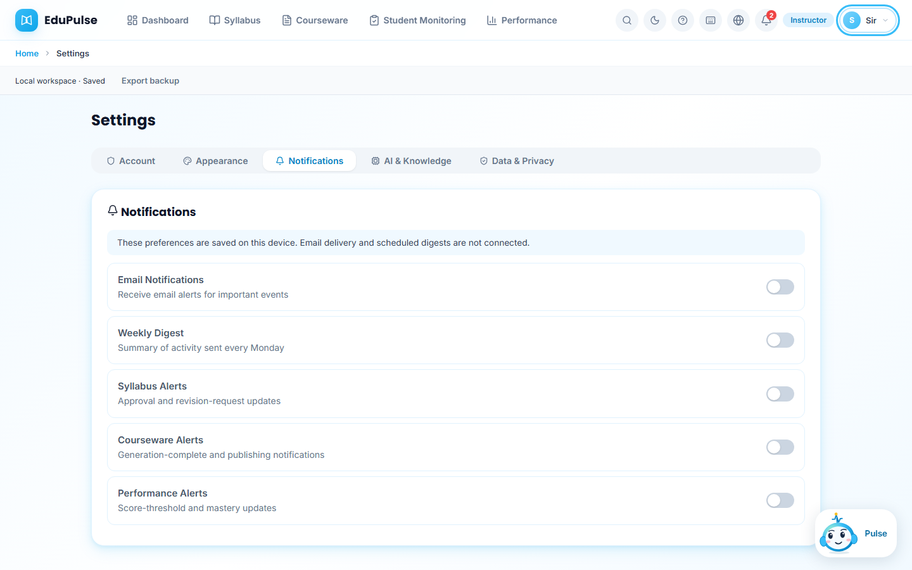 | Device-only preferences for email, weekly digest and syllabus, courseware and performance alerts (the banner states that email delivery is not connected) |
| AI & Knowledge | 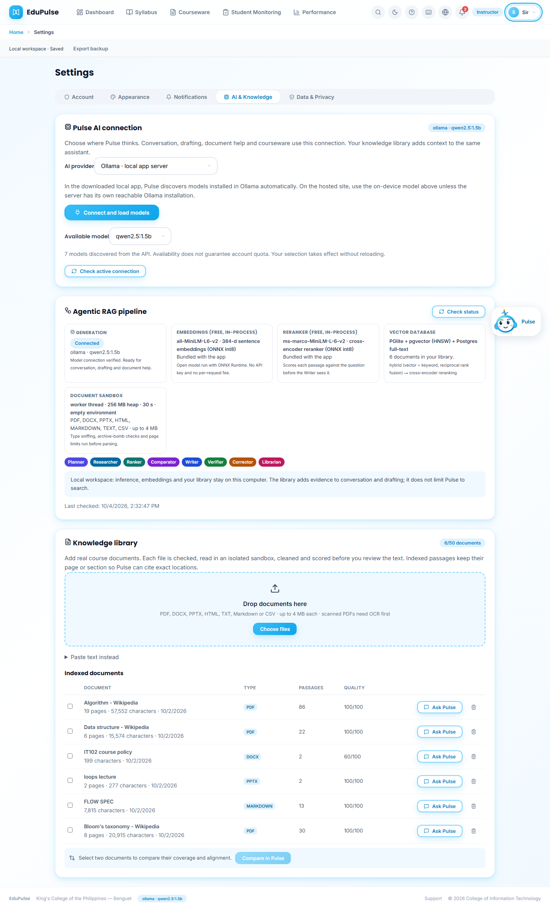 | **New in v0.4.0** — see below |
| Data & Privacy | 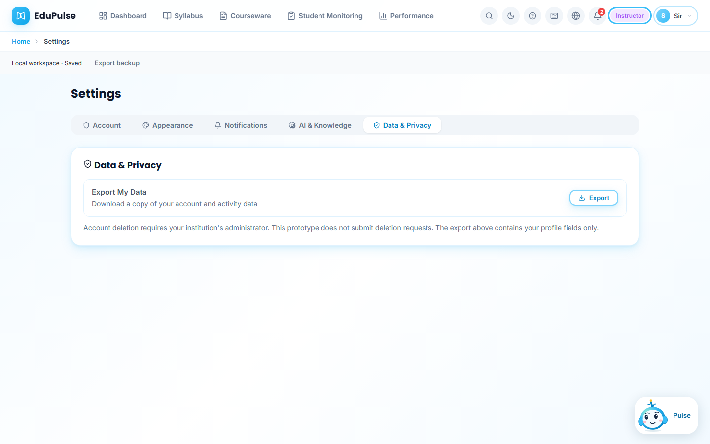 | **Export My Data** and the account-deletion policy |

**AI & Knowledge (New in v0.4.0)** has three cards:

1. **Pulse AI connection:** choose the provider — Ollama in the local app, a model running in this browser (WebGPU, no key), free tiers (Gemini, Groq, OpenRouter free models, Hugging Face) or OpenAI/Anthropic with your own key. Then use **Connect and load models**, pick an **Available model** and **Check active connection**. Each account connects its own key, and the hosted site has no shared key. Details: [System Manual 8](../../system-manual/08-ai-connections/README.md).
2. **Agentic RAG pipeline:** live status of the five parts Pulse depends on — *Generation* (connected model), *Embeddings* (all-MiniLM-L6-v2, 384-d, free, in-process), *Reranker* (ms-marco-MiniLM-L-6-v2 cross-encoder), *Vector database* (PGlite + pgvector locally, Supabase pgvector when hosted; hybrid vector + keyword search with reciprocal rank fusion) and *Document sandbox* (worker thread, 256 MB heap, 30 s, empty environment). The coloured chips name the eight agents: Planner, Researcher, Ranker, Comparator, Writer, Verifier, Corrector, Librarian.
3. **Knowledge library:** drop zone and the indexed-documents table with type, passages, quality, **Ask Pulse** and delete, plus **Compare in Pulse** when two documents are ticked. Step-by-step use is in [System Manual 4](../../system-manual/04-knowledge-library/README.md).

### 15. Dark mode

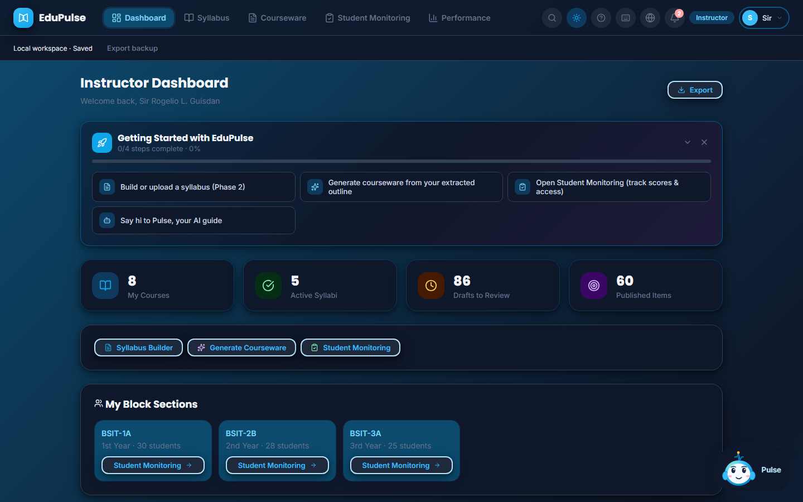

The whole interface switches to a dark palette (top-bar moon button or Settings → Appearance). A *Theme updated* toast confirms the change.

*Changed in v0.4.0:* the dashboard's *Getting Started* card now has a dark background in dark mode; before, its heading was white text on a white card.

## Pulse, the AI assistant (New in v0.4.0)

### 16. Pulse dock

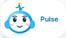

The mascot sits bottom-right on every page. Its eyes follow the pointer. **Click** to open the panel; **drag** it onto any field, card, table or section for help with exactly that component (see [System Manual 7](../../system-manual/07-pulse-guidance/README.md)).

### 17. Pulse panel

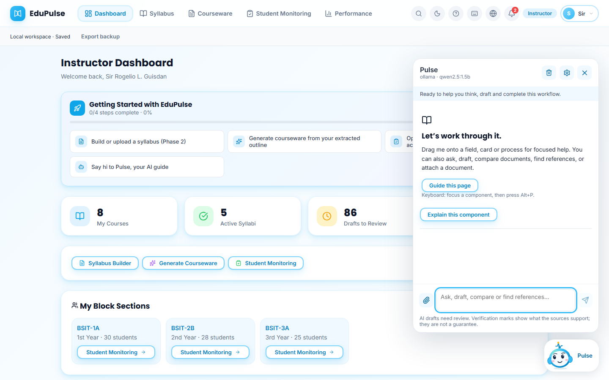

Header: the connected model (here *ollama · qwen2.5:1.5b*), **clear conversation**, **AI settings**, **close**. The welcome explains the three ways to use Pulse: drag it onto a component, ask/draft/compare/find references in the message box, or attach a document (paper-clip). **Guide this page** starts a walkthrough of the current page; **Explain this component** describes whatever has keyboard focus (also **Alt+P**). The footnote reminds users that AI drafts need review.

### 18. “Ask Pulse about this” hover badge

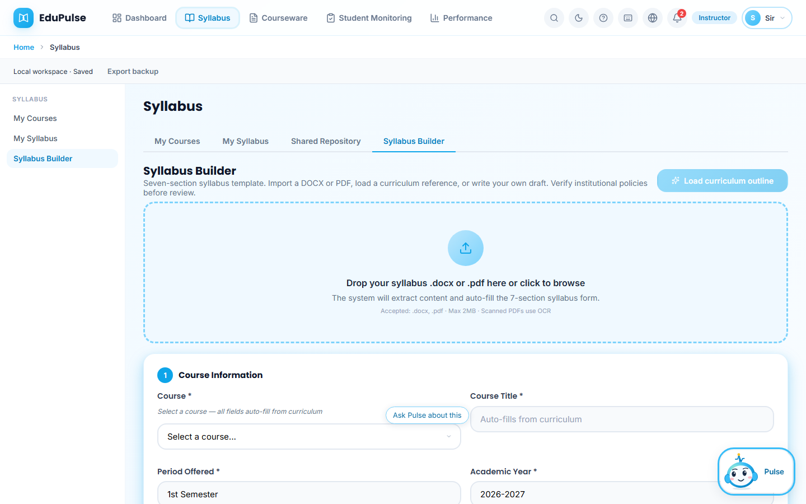

Resting the pointer on a form control (here *Course* in the Syllabus Builder) shows a small **Ask Pulse about this** badge; clicking it opens Pulse focused on that control.
