# 02 · Shared interface

The shared public sign-in form provides an eye-shaped **Show password / Hide password** control with a visible keyboard focus ring and a 44-pixel touch target. **Sign in with Google** includes its Google mark even when disabled. The [sign-in guide](../../system-manual/01-getting-started/README.md#password-visibility-and-google-icon) documents both icons and the pending state; the authentication flow is unchanged.

Browser refresh keeps the current route/query and restores supported view references after authorization. Header account, notification, language, role, search and mobile-navigation surfaces retain their visibility; close/Escape clears it. Search text and private result payloads are not saved as view hints. Selected course readers retain their slide, while business actions remain explicit. [Manual 23](../../system-manual/23-account-support-and-pulse-context/README.md#reload-the-selected-account-without-returning-to-dashboard) shows restored popovers and recovery; [Manual 27](../../system-manual/27-cached-workspaces/README.md) shows the reloaded presentation.

Controls every signed-in role has. Shown here as the Instructor; the Dean and Student see the same tools with their own navigation tabs and notifications.

The owner System Admin can ask Pulse to open a named role dashboard and correct that destination in conversation. Ordinary accounts keep their assigned role. [Manual 17](../../system-manual/17-pulse-navigation-and-provider-recovery/README.md) shows the synthetic owner-view handoff and the retained Anthropic connection after an API-credit failure.

## Top bar and global tools

### 1. Top bar

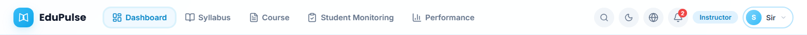

Left to right: logo (returns to the dashboard), the role's main tabs, **Search**, **Dark mode**, **Language**, **Notifications**, the role badge and the account menu. Either designated Google admin can switch views. The breadcrumb remains below the bar. **Help & Support** and **Keyboard Shortcuts** are Settings tabs. Workspace backup and conditional save recovery are in **Settings → Data & Privacy**. There is no page-wide workspace save banner.

*Changed in v0.4.0:* icon-only buttons now have spoken names for screen readers (“Notifications, 2 unread”, “Account menu”, “Open menu / Close menu”), and the breadcrumb is a labelled navigation landmark.

**Skip to main content**, the first Tab stop on every page (it stays hidden until focused), moves focus to the page content. *Changed on 29 October 2026:* it used to open the Not Found page instead, and its white text now sits on a darker blue that reaches the 4.5:1 contrast minimum.

### 2. Search overlay (Ctrl+K)

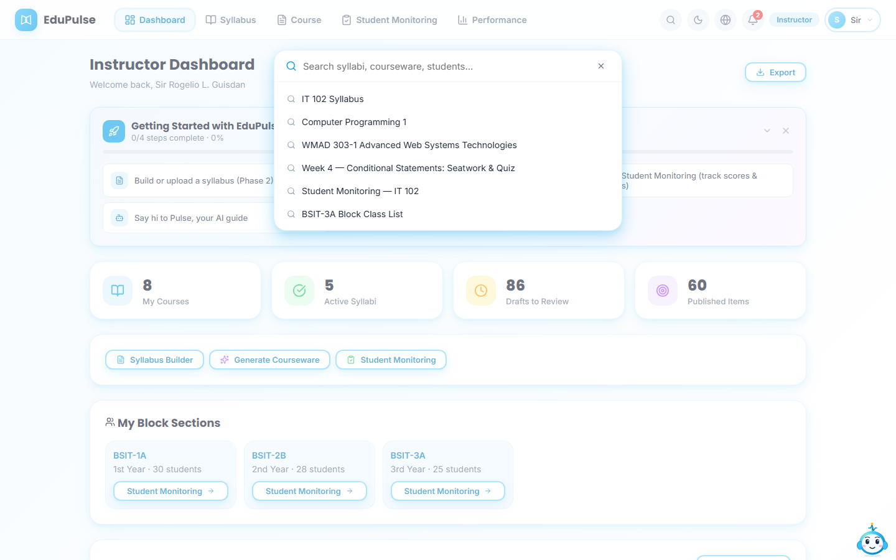

Opens over the page with suggestions (syllabi, courses, courseware items, monitoring pages, class lists). Type to filter; **Esc** or **×** closes it.

### 3. Keyboard Shortcuts in Settings (?)

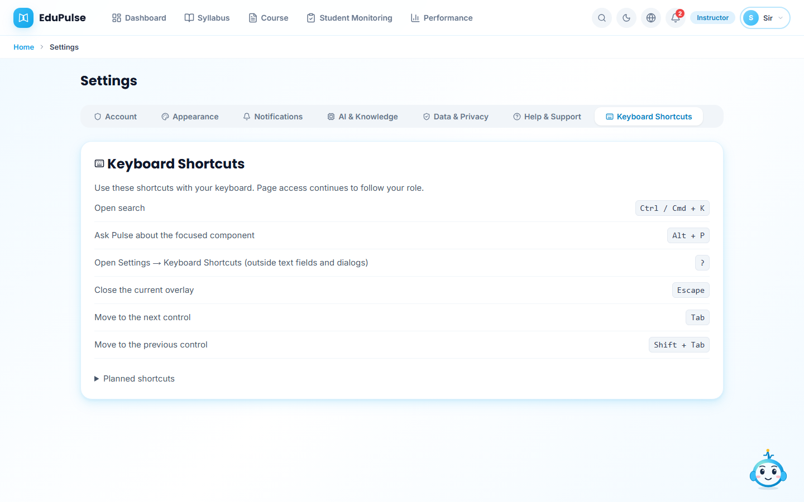

**Settings → Keyboard Shortcuts** lists search, Pulse focus, opening this tab, Escape and Tab navigation. **Planned shortcuts** separates the unconnected navigation chords and export/save/undo bindings. Press **?** outside a form control to open this tab.

### 4. Language menu

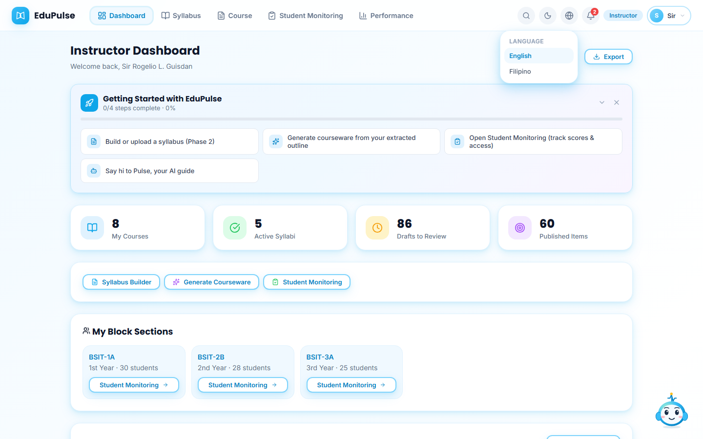

Switches interface text between **English** and **Filipino**.

### 5. Notifications dropdown

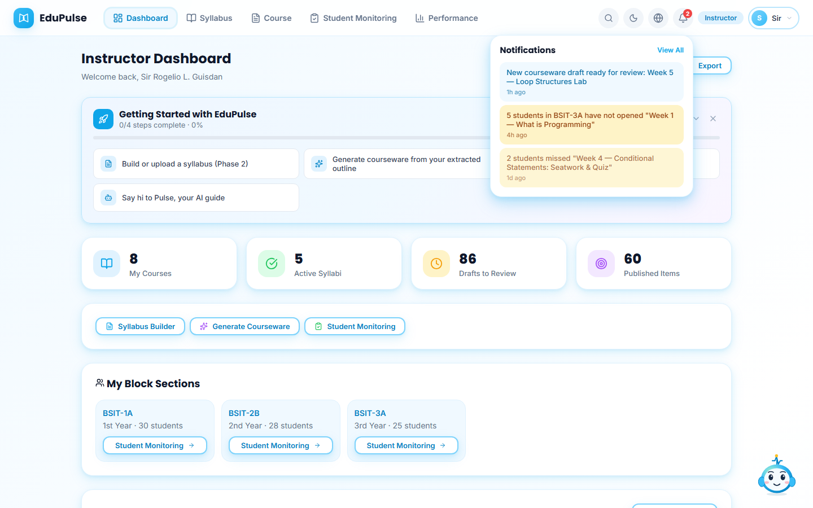

The three most recent notices for the role (warnings in amber, information in blue; read items are dimmed). **View All** opens the Notifications page.

*Changed in v0.4.0:* the dropdown, the badge and the Notifications page read one shared list, so the badge always equals the page's *Unread* count, and **Mark All Read** clears the badge (it previously showed a fixed “3”).

### 6. Account menu

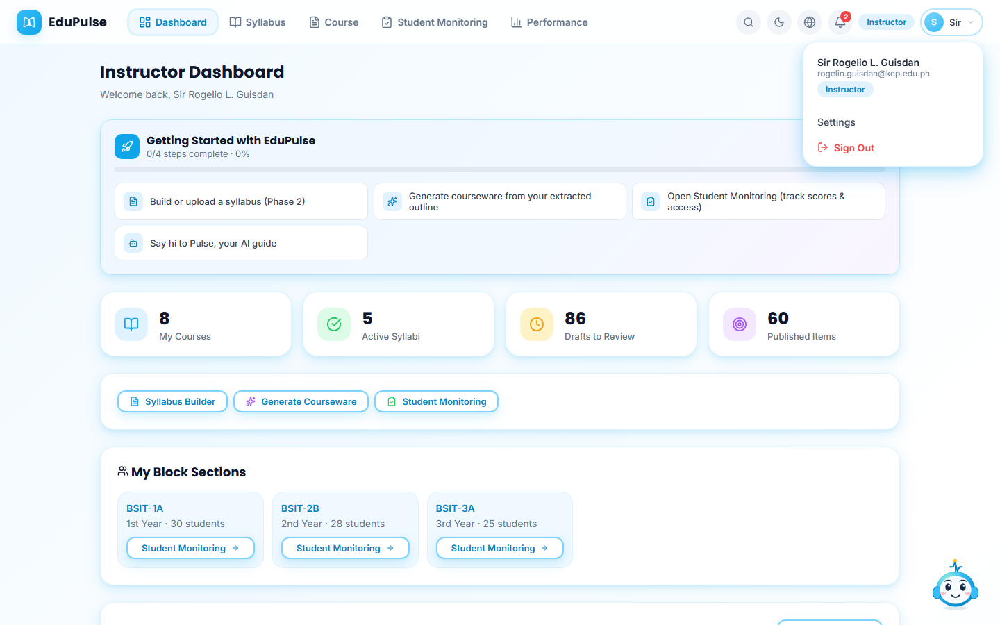

Name, email and role, then **Settings** and **Sign Out**. The admin account's email address is not displayed.

### 7. Role badge and admin view switching

Every account sees its role as a badge in the top bar (see image 1, *Instructor*). Roles are assigned by the administrator, and the two designated Google admin accounts can change what they see:
* After signing in with Google, either admin account sees a button labelled *Admin · <current view>* where other accounts see the badge.
* The button opens the **Switch View** popover, which offers **System Admin**, **Dean**, **Associate Dean**, **Instructor** and **Student**. On a phone, where the top-bar button is hidden, the account menu has a **Switch view** entry that opens the same popover.
* The popover explains: “You remain signed in as the admin. Your AI key and saved data stay with this account.”

Other roles cannot switch. The [second-admin captures](../07-system-admin/README.md#two-designated-google-admins) use synthetic account transport; actual Google consent is completed in the account holder's browser.

*Changed after v0.4.0:* the preview role switcher was removed. It used to let any preview session jump between Dean, Associate Dean, Instructor and Student.

## Pages every role has

### 8. Notifications page

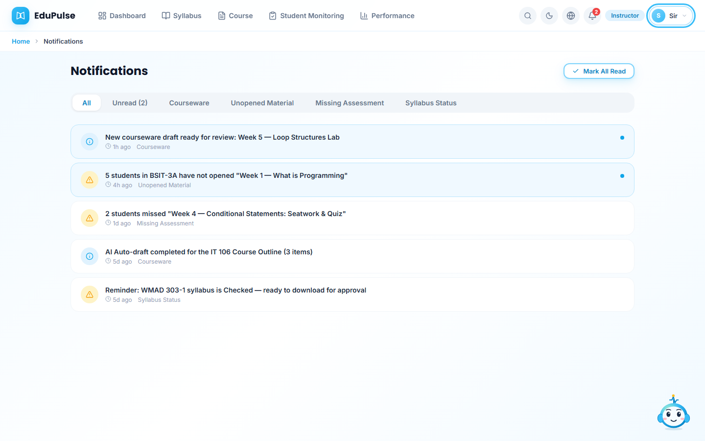

Filter tabs (**All**, **Unread (n)** and one tab per category such as *Courseware*, *Unopened Material*, *Missing Assessment*, *Syllabus Status*). Unread notices have a blue background and dot; click one to mark it read, or use **Mark All Read**.

### 9. Help & Support in Settings

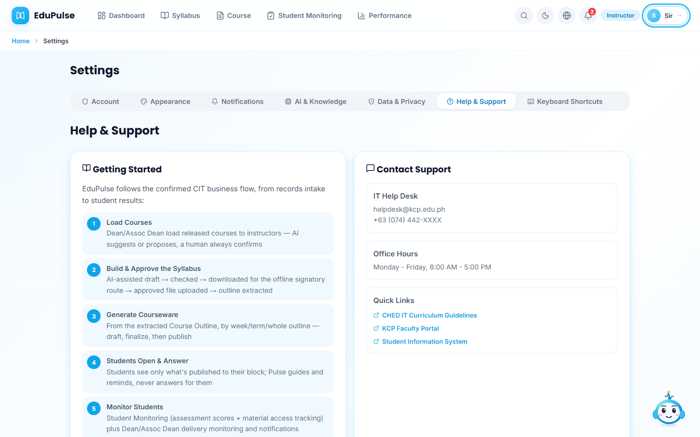

**Getting Started** explains the five-step business flow (Load Courses → Build & Approve the Syllabus → Generate Courseware → Students Open & Answer → Monitor Students). **Contact Support** lists the IT Help Desk, office hours and quick links. The frequently asked questions follow below the visible area. **How do I connect AI?** says that each signed-in account connects its own OpenAI API key in Settings → AI & Knowledge, and that a ChatGPT subscription is separate from OpenAI API billing.

### 10–14. Settings

| Tab | Screenshot | What it holds |
| --- | --- | --- |
| Account | 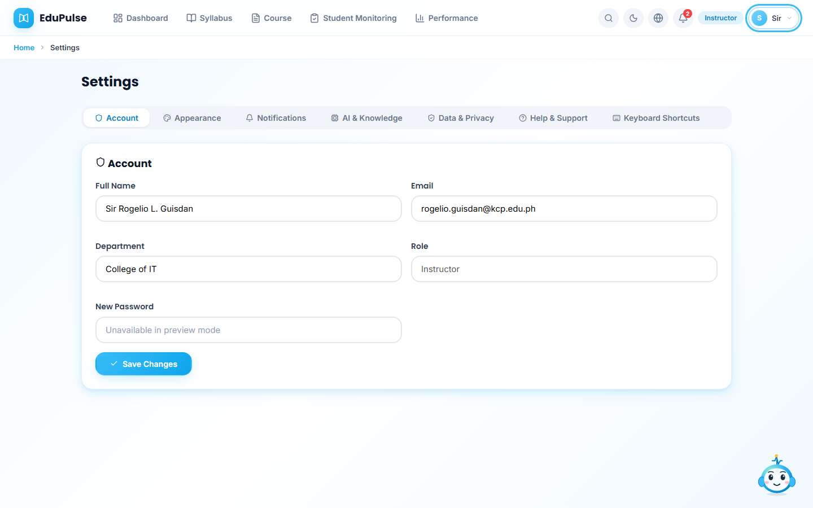 | Full name, email (not shown for the admin account), department, role (read-only) and password (disabled in preview mode); **Save Changes** |
| Appearance | 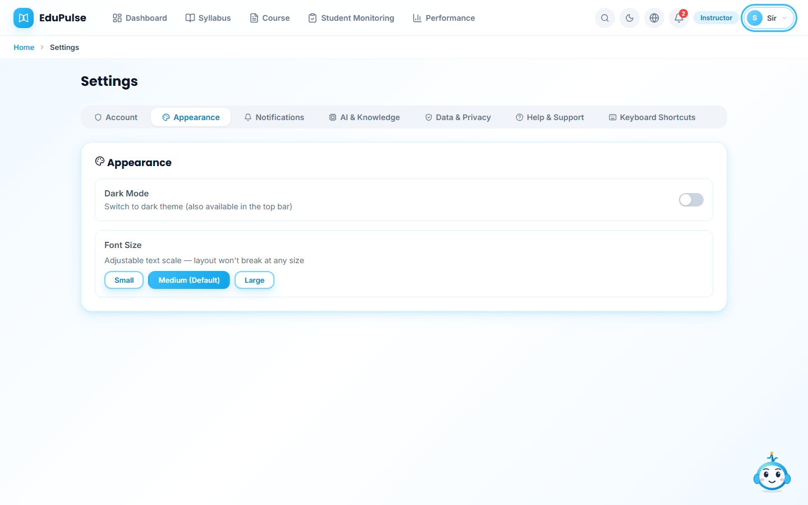 | **Dark Mode** switch and **Font Size** (Small, Medium, Large) |
| Notifications | 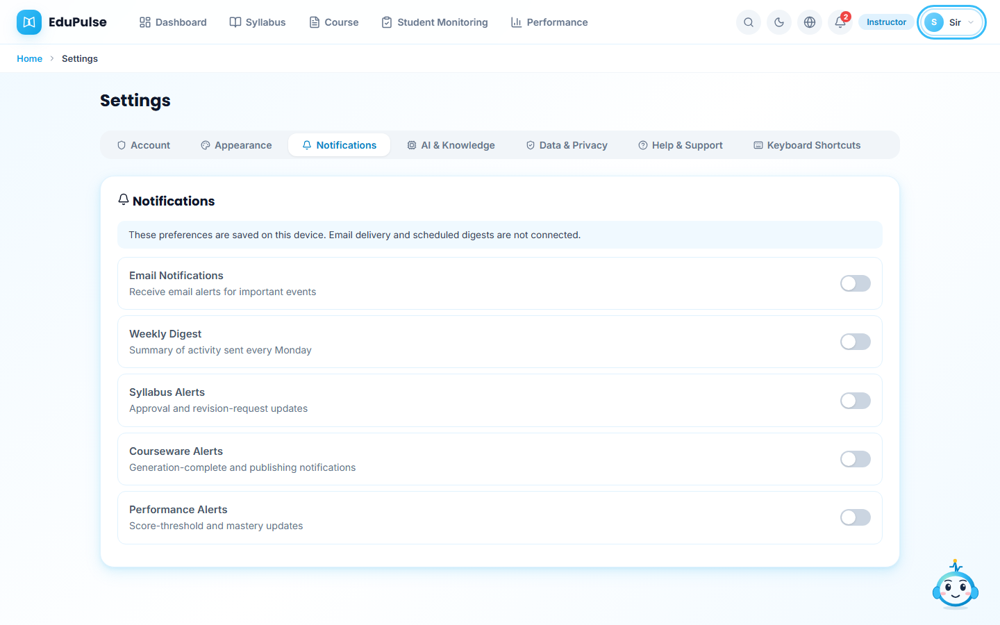 | Device-only preferences for email, weekly digest and syllabus, courseware and performance alerts (the banner states that email delivery is not connected) |
| AI & Knowledge | 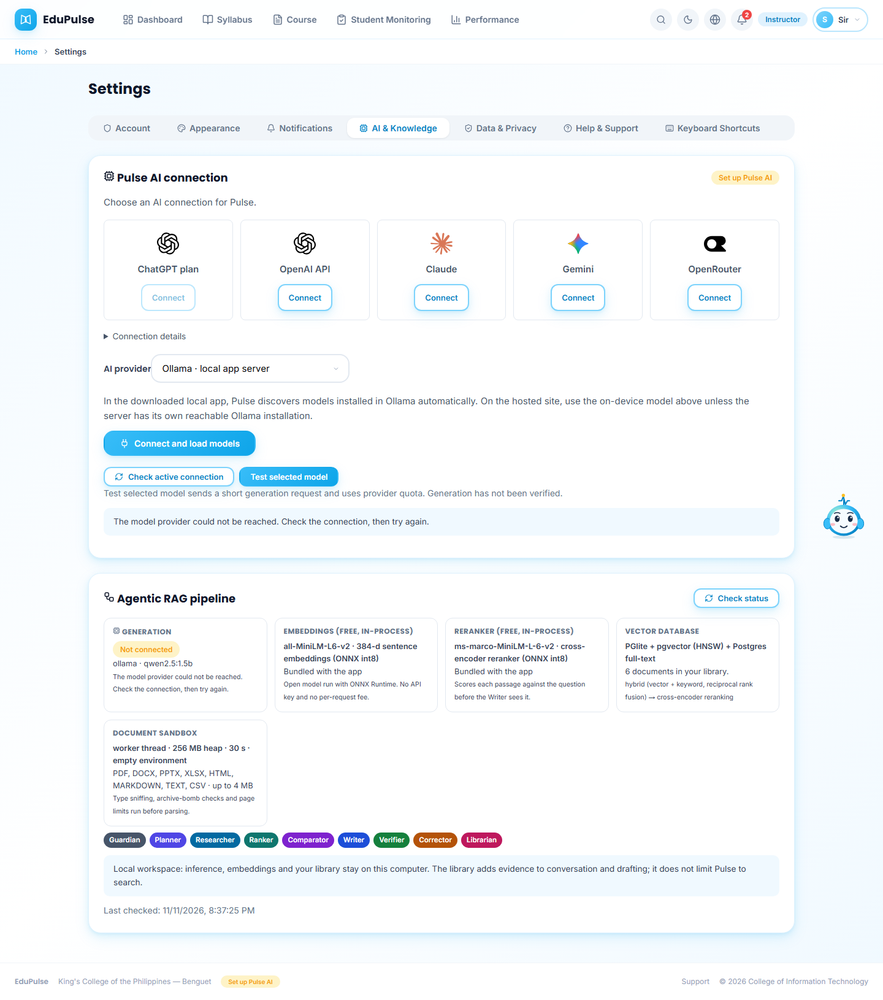 | **New in v0.4.0** — see below |
| Data & Privacy | 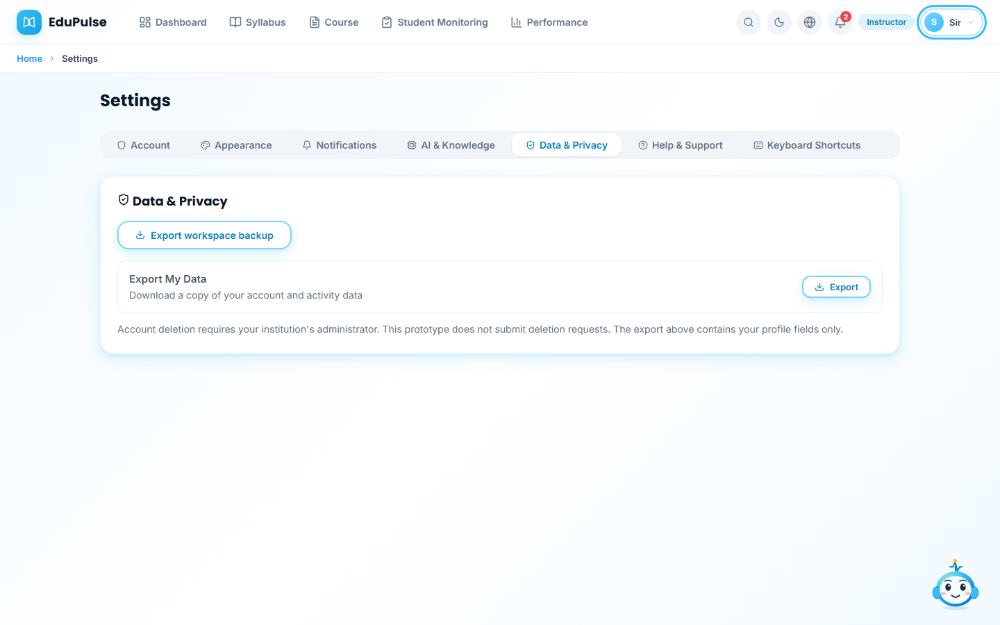 | **Export My Data**, **Export workspace backup**, **Refresh workspace and records**, conditional save recovery and the account-deletion policy |
| Help & Support | Image 9 above | Getting started, contacts and frequently asked questions |
| Keyboard Shortcuts | Image 3 above | Working shortcuts and a separate planned list |

Failed saves show **Workspace save** with **Retry save** in this tab. Conflicts offer **Load latest after export**, enabled after exporting the pending workspace. [Manual 14](../../system-manual/14-pulse-and-outline-workspace/README.md#save-recovery-without-a-page-wide-banner) shows both synthetic recovery states and the clear page outside Settings.

A Settings address with an unknown or unavailable tab, such as an old bookmark, opens **Account** instead of an empty page.

**AI & Knowledge** has two main cards:

The connection card shows provider logos, names and **Connect** buttons, including **Gemini**. **Connection details** expands the subscription and sign-in explanation. A saved connection shows a masked **Saved provider credential**. The pipeline distinguishes **Model listed · not tested** from **Generation verified** after a successful **Test selected model** request. Connection status and the selected local model are shown separately from bundled embeddings and reranking. [Manual 8](../../system-manual/08-ai-connections/README.md) documents authorization, model tests, credential replacement and the hosted ChatGPT approval requirement.

1. **Pulse AI connection:** choose the provider — Ollama in the local app, a model running in this browser (WebGPU, no key), free tiers (Gemini, Groq, OpenRouter free models, Hugging Face) or OpenAI/Anthropic with your own key. Then use **Connect and load models**, pick an **Available model** and **Check active connection**. Each account connects its own key, and the hosted site has no shared key. Details: [System Manual 8](../../system-manual/08-ai-connections/README.md).
2. **Agentic RAG pipeline:** live status of the five parts Pulse depends on — *Generation* (connected model), *Embeddings* (all-MiniLM-L6-v2, 384-d, free, in-process), *Reranker* (ms-marco-MiniLM-L-6-v2 cross-encoder), *Vector database* (PGlite + pgvector locally, Supabase pgvector when hosted; hybrid vector + keyword search with reciprocal rank fusion) and *Document sandbox* (worker thread, 256 MB heap, 30 s, empty environment). The coloured chips name the nine agents: Guardian, Planner, Researcher, Ranker, Comparator, Writer, Verifier, Corrector, Librarian. Hover over a chip to see the task that agent works on.

The former **Knowledge library** upload and indexed-document panel is removed from settings. Existing private sources remain available through Pulse attachments and syllabus reference intake; see [System Manual 4](../../system-manual/04-knowledge-library/README.md).

### 15. Dark mode

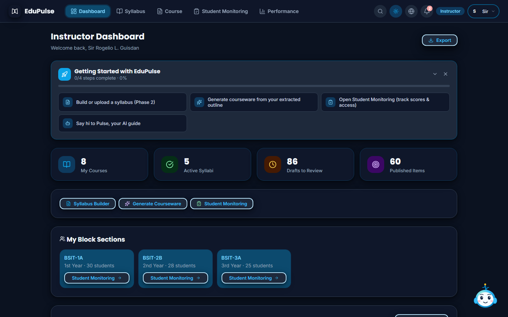

The whole interface switches to a dark palette (top-bar moon button or Settings → Appearance). A *Theme updated* toast confirms the change.

*Changed in v0.4.0:* the dashboard's *Getting Started* card now has a dark background in dark mode; before, its heading was white text on a white card.

## Pulse, the AI assistant (New in v0.4.0)

### 16. Pulse dock

The mascot sits bottom-right on every page. Its eyes follow the pointer. **Click** to open the panel; **drag** it onto any field, card, table or section for help with exactly that component (see [System Manual 7](../../system-manual/07-pulse-guidance/README.md)).

### 17. Pulse panel

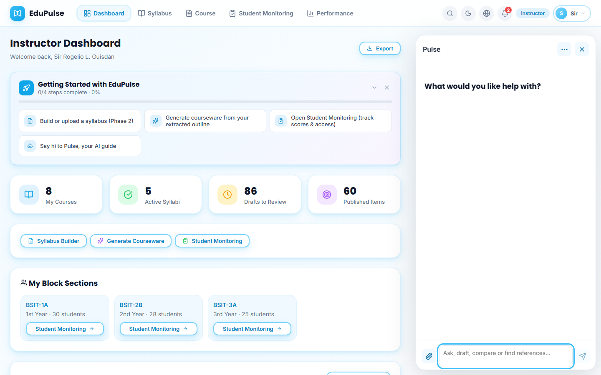

The header contains **Pulse**, **Pulse options** and **Close Pulse**. The empty conversation asks **What would you like help with?**. Open **Pulse options** for new conversation, history/memory, page or selected-component guidance, workspace buddies and AI settings. Draft or edit actions appear after a relevant prompt and require review and confirmation. Dragging the avatar, the hover help badge and **Alt+P** still select a component.

### 18. “Ask Pulse about this” hover badge

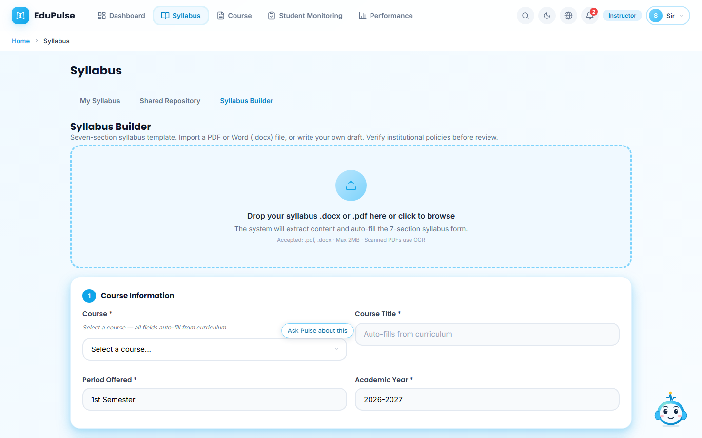

Resting the pointer on a form control (here *Course* in the Syllabus Builder) shows a small **Ask Pulse about this** badge; clicking it opens Pulse focused on that control.

## Pulse tools and private context ? 25 October 2026

**Pulse options → Conversations and memory** opens archive and preference controls. Natural-language redirects open role-authorized pages; precise edits produce selected-field previews. See [Manual 9](../../system-manual/09-pulse-actions/README.md) for source import, confirmed edits, archive controls, preferences and installed tools. The new [field and outline guide](../../system-manual/14-pulse-and-outline-workspace/README.md) includes native file drops and whole-section targeting.

## Workspace buddies

Open **Pulse options → Workspace buddies**. The optional 3D office is the same cosy studio as the agent workspace on the public landing page, with six named desks, name tags, domain-specific conversations, real request/review states, a pause control and reduced-motion support. Mobile users scroll from the office to the buddy chat. See [the illustrated office guide](../../system-manual/11-workspace-buddies/README.md).

## Focused conversation layout and source context

At wide desktop widths, opening Pulse reserves a separate column beside the workspace; the mascot returns when it closes. Focused help highlights the selected section without dimming the editor. The selected-component chip names the target without technical descriptions. Saving failures remain visible when a conversation has unsaved messages. Attachments remain usable for follow-up questions and can be removed. Generated replies offer **Response actions → Download response as PDF**. Verification indicators are under **Verification details**. Connected buddy conversations use the selected persona and recent exchange; an unavailable model is labelled as an offline role guide.

## Dialog spacing, page tabs and loading feedback

Page-specific views use the tabs inside the page, with no duplicate left sidebar. Pulse opens from its avatar without a name pill. Dialogs share screen space with Pulse on desktop and stack above it on narrow displays; nested dialogs show one active surface at a time. Pending academic records display skeleton cards and table rows; short requests use spinners and file scanning uses an indeterminate bar. Reduced-motion preferences stop these animations. See [the illustrated interface guide](../../system-manual/12-interface-and-loading/README.md).

## Page, view and dialog transitions, 28 October 2026

Moving between top-bar sections fades the new page in as it rises slightly into place. Moving within a section (another page tab or editor item) keeps the page's state. When a page tab swaps its view, the new view fades in the same way. Dialogs rise in while the backdrop fades in its tint and blur; on phones, full-screen dialogs slide up like a sheet. The top-bar dropdowns (**Language**, **Notifications**, account menu) open from their button, and the search overlay opens from the top centre. These are entrance effects only: every screenshot in this walkthrough shows the settled screen, which is unchanged. With *reduce motion* turned on in the operating system they are switched off (NFR-ACC-04).

## Account notices and solid dark surfaces, 28 October 2026

Authenticated notifications now derive from authorized records instead of an empty placeholder feed. Read state is scoped to the account/role on this device. Appearance uses solid dark body/cards/primary controls with readable semantic and muted text. Laptop navigation compacts to preserve route access. See the [current account notices, charts and mobile captures](../09-restored-role-pages/README.md). The existing preview notifications remain labelled demonstration data.

## Account notices and current theme

The [current account screenshots](../09-restored-role-pages/README.md) supplement the preview scenes above. Academic publication, marking, appeal, correction and instructor reminder notices and read receipts persist to the recipient account; future releases remain hidden. Current-record reminders additionally keep device read state. In-app delivery is implemented; email/push delivery is not. Mark-read failures remain visible. Feedback uses unique toast IDs, including when multiple saves complete together.

Signed-in charts, dialogs and page surfaces use the existing solid dark palette. Page tabs and desktop/mobile route access remain without duplicate left navigation.

[Generate content and verify its save](../../system-manual/15-backend-content-delivery/README.md) documents the real local model, existing Pulse confirmation card, persisted receipt and reloaded syllabus. The backend harness changes do not change the restored header, settings, charts or layout.

Provisioned students also see read-only **Student number**, **Year level** and **Program** under Settings Account. The [student profile capture](../../system-manual/16-student-directory/04-student-profile.png) uses a synthetic account; official directory records are maintained through administrative provisioning.

## Loading and provider retention, 7 November 2026

Saved provider keys and selected models now survive sign-out under the same account. **ChatGPT plan** and **OpenAI API** are separate choices; the former links to OpenAI hosted-app approval requirements. Initial account/connection/list reads use skeletons, pending actions use spinners, and Pulse uses animated dots. Notifications wait for their record request before showing an empty state. Static popovers open immediately. [Manual 19](../../system-manual/19-loading-and-saved-connections/README.md) contains the current captures and surface-by-surface audit.

## Optional microphone in Pulse

**Pulse options** includes **Voice input**. Controls appear only when enabled. The default is transcript review; optional conversation mode sends completed speech. Browser/device voices can read generated and quick replies. Microphone denial, unsupported languages and API failures stop the voice loop with readable recovery. **AI settings** is offered beside credit/rate-limit failures. [Manual 20](../../system-manual/20-voice-and-provider-errors/README.md) contains current light/dark and mobile captures.

## Account support and contextual Pulse, 8 November 2026

The existing role chooser now leads to a searchable account dialog. A selected account has a support banner and **Return to System Admin** action; the admin keeps their own AI connection. Pulse source details distinguish authorized account records from public references and remembered outcomes. [Manual 23](../../system-manual/23-account-support-and-pulse-context/README.md) shows the picker in light, dark and mobile layouts and the three conversation types.

## System Search and public images

Pulse now shows **System search · No AI credits used** for simple quoted local answers. Approximate name or keyword matches can begin **Did you mean**. Public fallback is labelled **Internet suggestions**, with source-linked thumbnails and **Image credits** when the API provides images. The existing theme, compact verification controls and role boundaries remain. See [Manual 24 and its desktop/mobile captures](../../system-manual/24-system-first-search/README.md).

The existing account picker now includes registered named staff. [Manual 25](../../system-manual/25-staff-test-accounts/README.md) shows instructor surname searches and the corrected Dean and Associate Dean selections with controlled transports.

## Planned courseware save receipts

Pulse and the Course workspace use the same bounded week-generation plan and revision-checked save. A failed part reports failure without replacing the saved week. The completion receipt waits for actual persistence; checked/published types are skipped before inference. See [Manual 26](../../system-manual/26-outline-driven-courseware/README.md). No shared navigation or restored dashboard controls are removed.

## Cached account views

[Manual 27](../../system-manual/27-cached-workspaces/README.md) supersedes timer/focus reload guidance: loaded work stays visible until a deliberate refresh or an authorized readback after the current user's mutation. **Data & Privacy** offers a safe manual refresh. The refreshed privacy capture uses a synthetic signed-in instructor and contains no credentials or real student records.

## Current Monitor guidance

Pulse and Dashboard links open **Syllabus & Delivery**. Old syllabus/delivery links resolve to the combined view without an extra browser-history entry. Guidance retains offline review and the Associate Dean score restriction. See [Manual 29](../../system-manual/29-combined-oversight/README.md).

## Person follow-ups

Self questions such as **do you know me?** and **kilala mo ba ako?** now show the verified username, role and role functions directly. A support view identifies both the signed-in admin and the selected account. Guests are asked to sign in; these phrases do not become public searches. [Manual 24](../../system-manual/24-system-first-search/README.md) shows the desktop/mobile answer.

Pulse retains an unambiguous recent person for **him**, **her**, **siya**, **niya**, and short **on fb?** questions. It checks the accessible record again, offers a correctly named manual search link when no Facebook profile is verified, and keeps explicit new topics separate. [Manual 24](../../system-manual/24-system-first-search/README.md#keep-the-person-in-follow-up-questions) contains the current desktop/mobile views.

## Acknowledged generation progress

Course generation uses the existing owner-scoped workspace journal and revision checks for each validated part. Its pending row, **Stop generation**, unfinished reader and explicit **Resume** survive acknowledged saves; reloading never starts AI work. A shared confirmed-commit reference advances immediately so sequential saves do not reuse an older revision. [Course examples](../../system-manual/26-outline-driven-courseware/README.md#save-parts-and-resume) show the settled light, dark and narrow layouts.

## Downloadable local model choices

Settings → **AI & Knowledge** offers twelve browser model choices with download sizes, GPU-memory estimates, source/license links and checked cache status. **Load downloaded model** reuses cached weights; **Remove downloaded model** targets the selected model. The scoped selection survives reload without generation. [Manual 8](../../system-manual/08-ai-connections/README.md#run-a-model-on-this-device-no-key) shows the controls and verification limits.

## Dean activity navigation

Dean uses **Dashboard**, **Course**, **Instructors** and **Students**, also under the phone menu. Summary cards share the dashboard component and open matching records or dialogs. **Course** links to combined oversight; syllabus review happens outside EduPulse; **Students** links to read-only Performance. The Associate Dean retains Records/Course Loading/Monitor and its shared intake controls. See [Manual 36](../../system-manual/36-dean-activity-records/README.md).

## Conditional horizontal scrolling

Shared academic tables and charts use available container width. Short phone tables no longer reserve a 420-pixel minimum, and charts retain their measured width without forcing a minimum. Horizontal scrolling appears only for genuinely wider content. All five roles retain their existing data permissions. [Manual 36](../../system-manual/36-instructor-syllabi/README.md) shows the related instructor controls and cross-role layout verification.

System Admin account selection requires a named registered person. The former **Use my own student/instructor/associate dean/dean view** shortcuts are removed. A legacy subjectless hint is cleared; named authorized support views retain their route and selected person after reload.

## Combined instructor monitoring

Instructor navigation now has Dashboard, Syllabus, Course and Student Monitoring. Its former Performance link redirects to the combined class workspace. Student and Dean performance remain authorized. Restored nested class/student dialogs keep the child above the parent with keyboard focus. See [Manual 37](../../system-manual/37-instructor-monitoring/README.md).
