# 03 · Dean and Associate Dean

The Dean and the Associate Dean share one role (`admin`) and see the same screens. Main tabs: **Dashboard**, **Course Loading**, **Monitor**; **Records** opens from the dashboard and search. Course assignments come from EduSuite; EduPulse monitors them and never edits the curriculum.

## 1. Dean dashboard

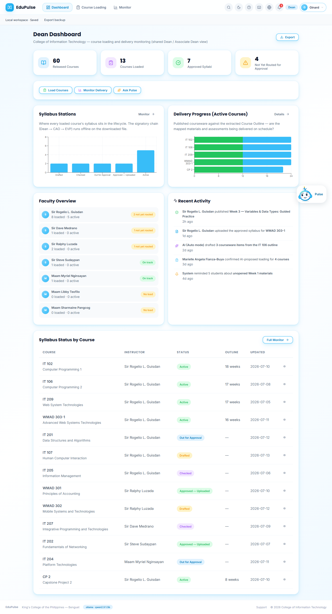

- **Summary cards:** released courses, courses loaded, approved syllabi, and syllabi not yet routed for approval.
- **Quick actions:** **Load Courses**, **Monitor Delivery**, **Ask Pulse**.
- **Syllabus Stations:** how many loaded courses sit at each lifecycle station (Drafted → Checked → Out for Approval → Approved — Uploaded → Active). The signatory chain (Dean → CAO → EVP) happens offline on the downloaded file.
- **Delivery Progress (Active Courses):** published versus planned courseware per active course.
- **Faculty Overview:** each instructor's load, active syllabi and a status chip (*On track*, *n not yet routed*, *No load*).
- **Recent Activity** and **Syllabus Status by Course** (course, instructor, status, extracted outline weeks, last update; the eye icon opens the syllabus).

## 2. Course Loading · Loaded Courses

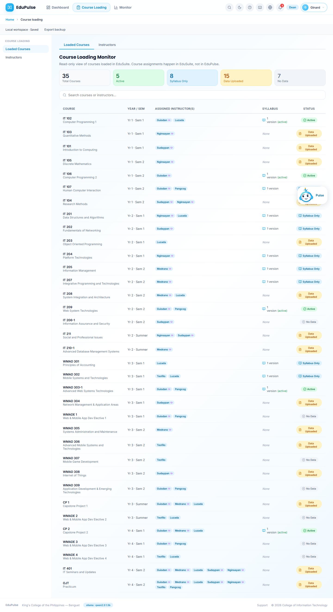

**Course Loading Monitor**, a read-only view of the courses loaded in EduSuite: totals by state (*Active* = active syllabus and enrolled blocks, *Syllabus Only*, *Data Uploaded* = enrolment but no syllabus, *No Data*), a search box for course or instructor, and one row per course with year and semester, the assigned instructor(s), its syllabus versions and the state.

*Changed in v0.4.0:* the sidebar link (now named **Loaded Courses**) opened an empty page because it pointed to a tab the page did not recognise. It now opens this view; the in-page tab was renamed from *Course Monitoring* to match.

## 3. Course Loading · Instructors

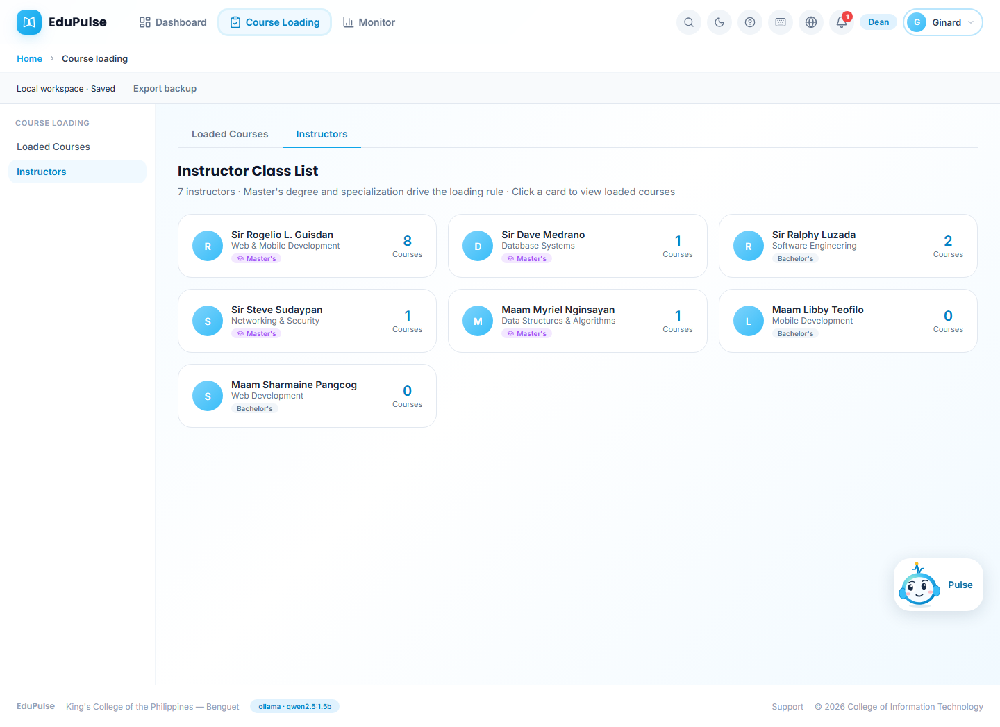

Instructor cards with specialisation, degree (*Master's* or *Bachelor's*, which drives the loading rule) and number of loaded courses. Click a card to see that instructor's courses.

## 4–7. Monitor

| Tab | Screenshot | What it answers |
| --- | --- | --- |
| Syllabus Status | 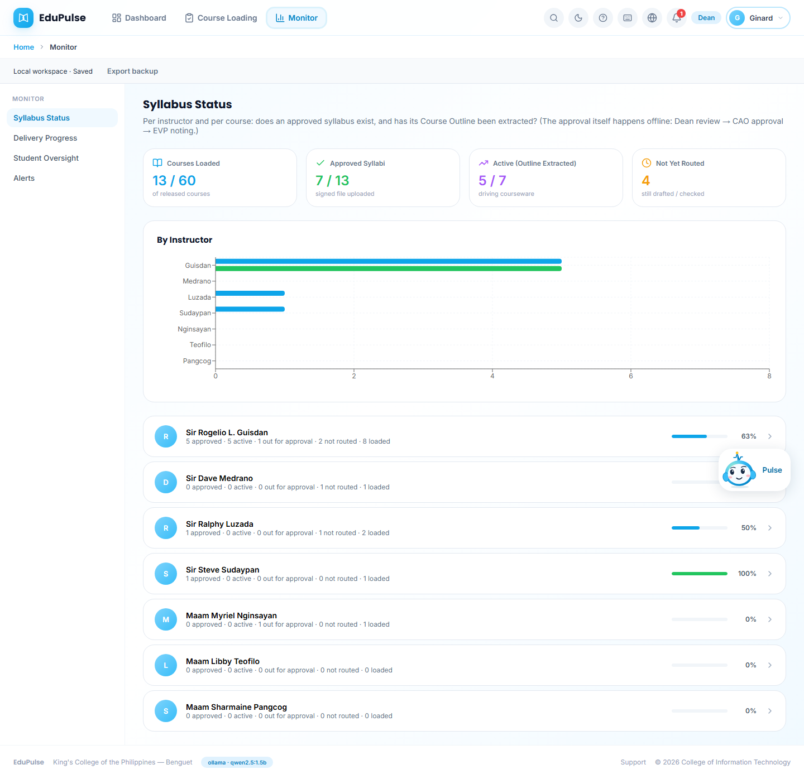 | Per instructor and course: does an approved syllabus exist and has its Course Outline been extracted? Summary cards, a by-instructor chart and a progress row per instructor. |
| Delivery Progress | 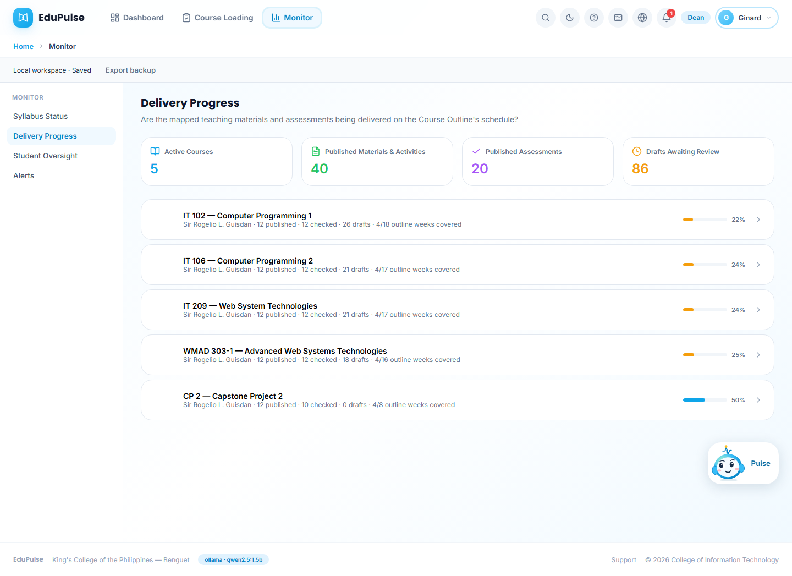 | For each active course: published, checked and draft items and how many outline weeks are covered. |
| Student Oversight | 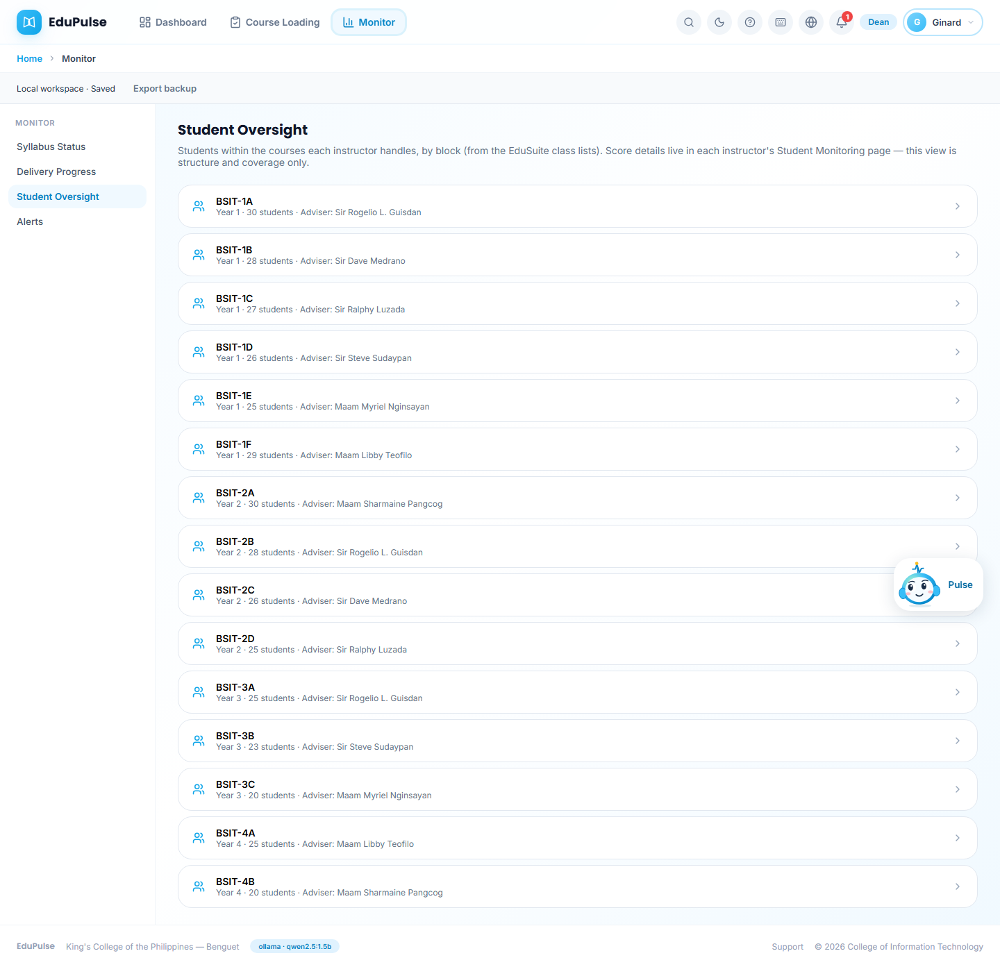 | Block sections with year, size and adviser (from the EduSuite class lists). Scores stay in each instructor's Student Monitoring page. |
| Alerts | 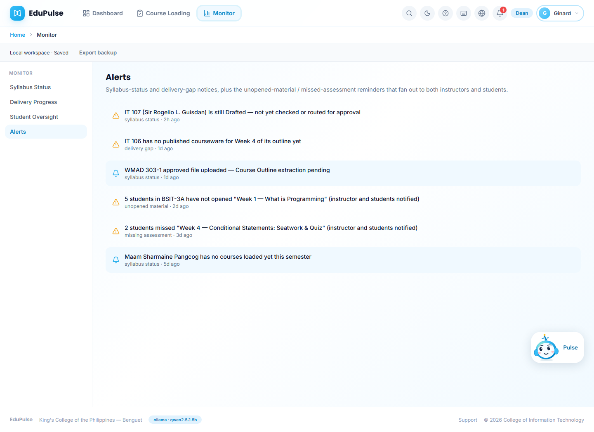 | Syllabus-status and delivery-gap notices, plus the unopened-material and missed-assessment reminders sent to instructors and students. |

## 8–10. Records (EduSuite intake)

| Tab | Screenshot | What it holds |
| --- | --- | --- |
| Import EduSuite Files | 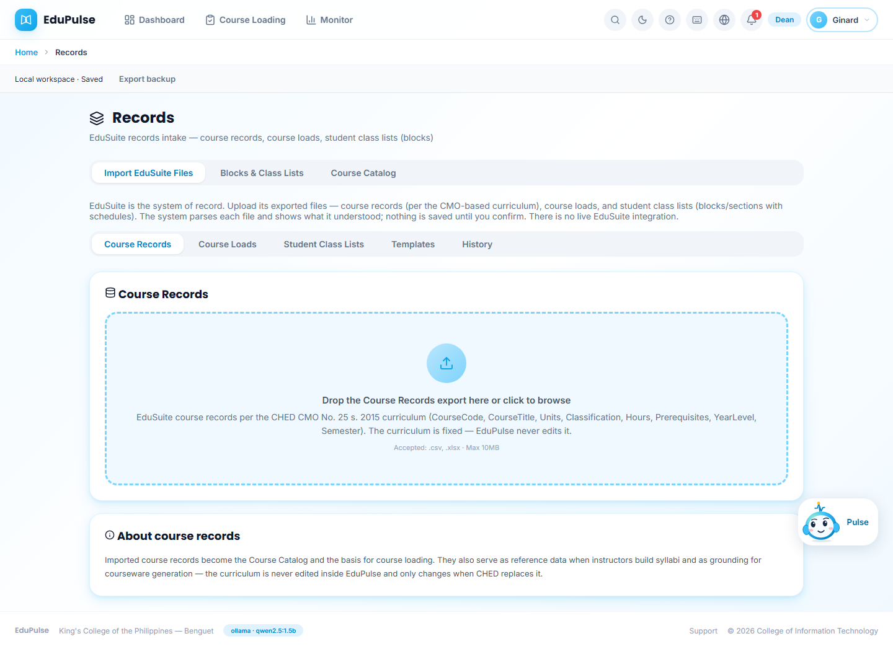 | Upload EduSuite exports by type (**Course Records**, **Course Loads**, **Student Class Lists**), plus **Templates** and import **History**. Each file is parsed and shown for confirmation; nothing is saved until confirmed. |
| Blocks & Class Lists | 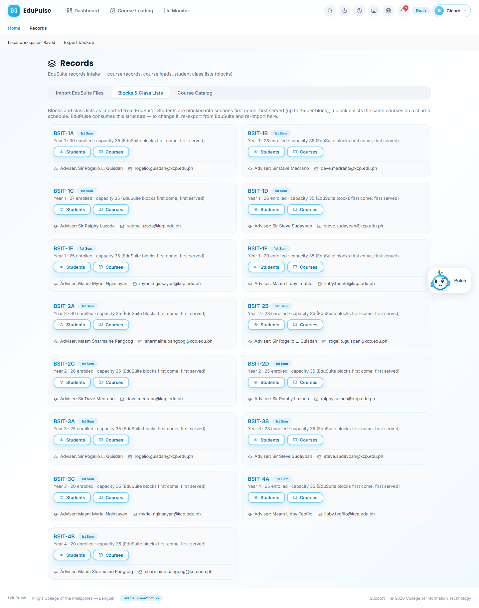 | Every block (e.g. BSIT-1A) with enrolment against the 35-student capacity, adviser and contact, and **Students** / **Courses** buttons. |
| Course Catalog | 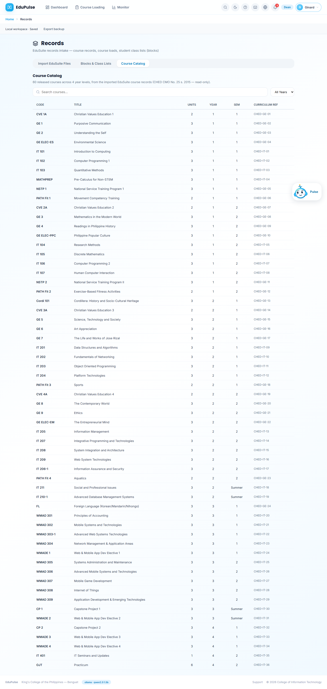 | The 60 released courses of the CHED CMO No. 25 s. 2015 curriculum (read-only), searchable and filterable by year. |

## 11. Pulse on an admin page

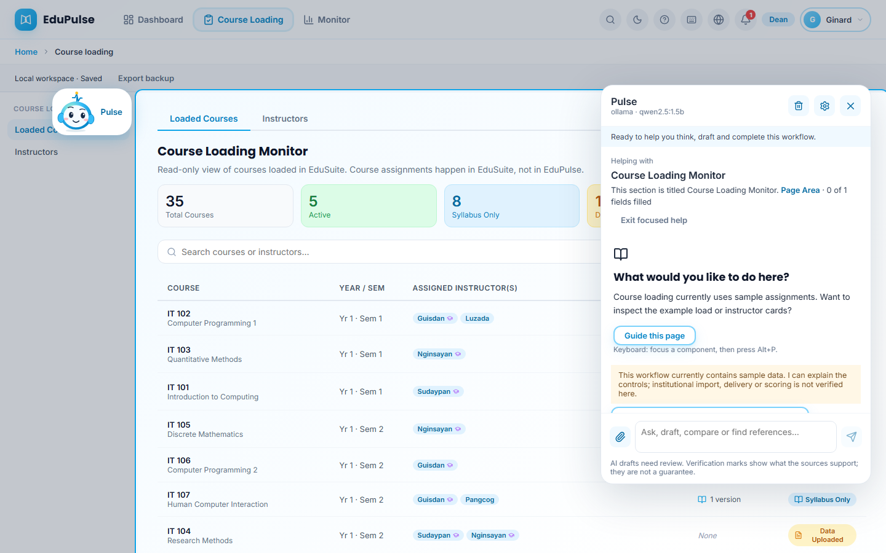

**Guide this page** on Course Loading. Pulse focuses the *Course Loading Monitor* area (highlighted; the rest of the page is dimmed), perches at its corner, and the panel opens on the opposite side with what the area contains. Because this workflow uses sample assignments, Pulse says so and offers to explain the controls rather than present sample data as verified.

*Changed in v0.4.0:* the panel now opens on the side away from the perched mascot, so the mascot no longer covers the panel header when Pulse guides a whole page.

## 12. Associate Dean dashboard

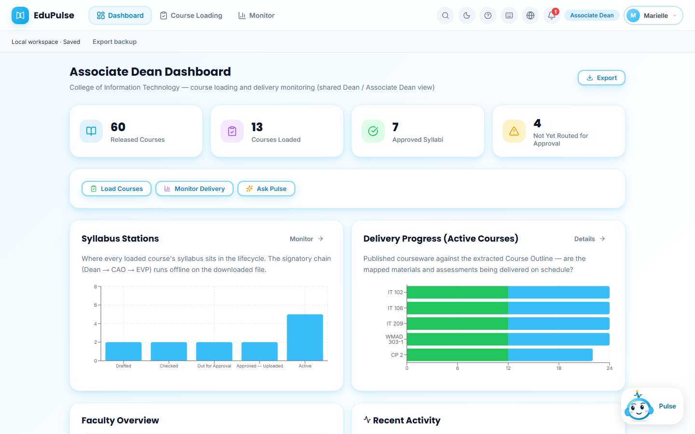

Identical to the Dean's dashboard apart from the name and the role badge: both titles are the same shared role with the same permissions.
