# 04 · Instructor

Main tabs: **Dashboard**, **Syllabus**, **Courseware**, **Student Monitoring**, **Performance**. Pages with sub-views show them both as a left sidebar and as tabs inside the page. Rows marked *Sample* are built-in examples; the instructor's own syllabi have no label. Task-by-task instructions for the syllabus and courseware flows are in [System Manual 2](../../system-manual/02-syllabus-lifecycle/README.md) and [3](../../system-manual/03-courseware-generation-and-review/README.md).

## 1. Instructor dashboard

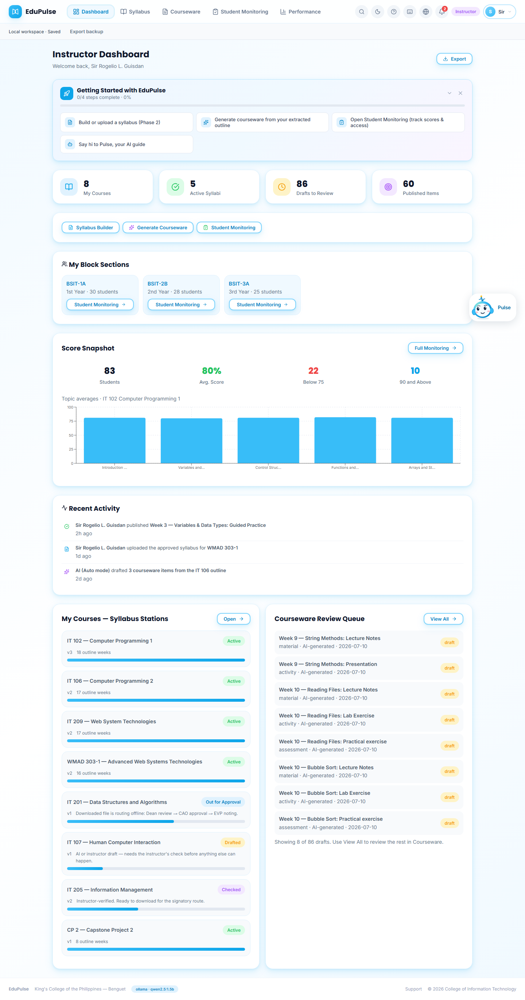

- **Getting Started with EduPulse:** four onboarding steps with progress; each opens the right page.
- **Summary cards:** my courses, active syllabi, drafts to review, published items.
- **Quick actions:** **Syllabus Builder**, **Generate Courseware**, **Student Monitoring**.
- **My Block Sections:** advisory blocks with a link to their monitoring page.
- **Score Snapshot**, **Recent Activity**, **My Courses — Syllabus Stations** and the **Courseware Review Queue**.

*Changed in v0.4.0:* the Score Snapshot's topic chart averages only the students who have a score for that course (every bar previously showed about 29% because students from other courses were counted as zero) and names the course it shows. The Courseware Review Queue lists only drafts awaiting review, earliest outline week first, shows eight and states how many more there are (**View All** opens them in Courseware). It previously listed every courseware item, which made the dashboard over 16,000 pixels tall.

## 2–4. Syllabus

| Tab | Screenshot | What it holds |
| --- | --- | --- |
| My Courses | 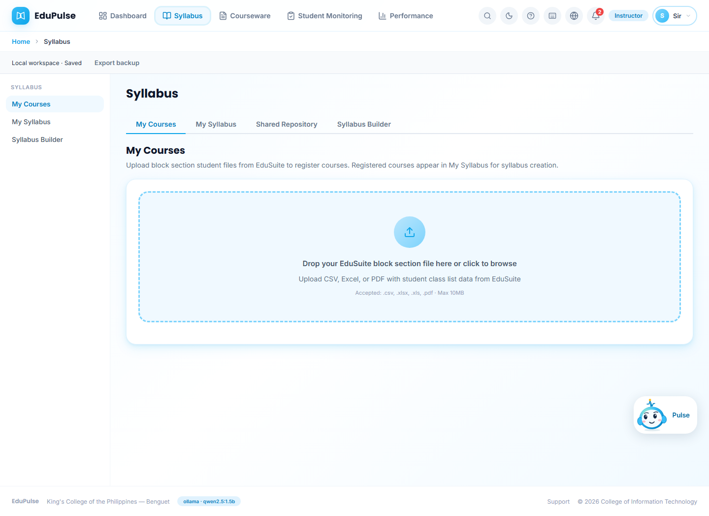 | Upload an EduSuite block-section file (CSV, Excel or PDF) to register the courses you teach. |
| My Syllabus | 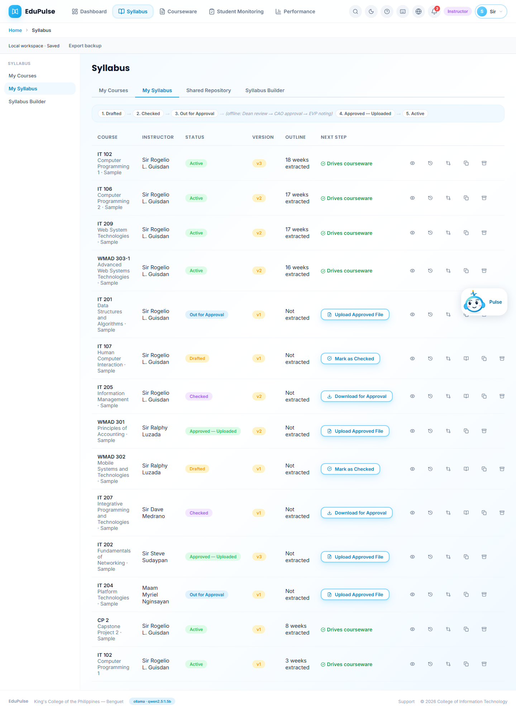 | The lifecycle strip (1 Drafted → 2 Checked → 3 Out for Approval → *offline signatures* → 4 Approved — Uploaded → 5 Active) and every syllabus with status, version, extracted outline, the **next step** button for its status, and icons for **View Syllabus**, **Version History**, **Review recorded changes**, **Edit in Builder** (drafts and checked syllabi only), **Copy for next term** and **Archive**. |
| Shared Repository | 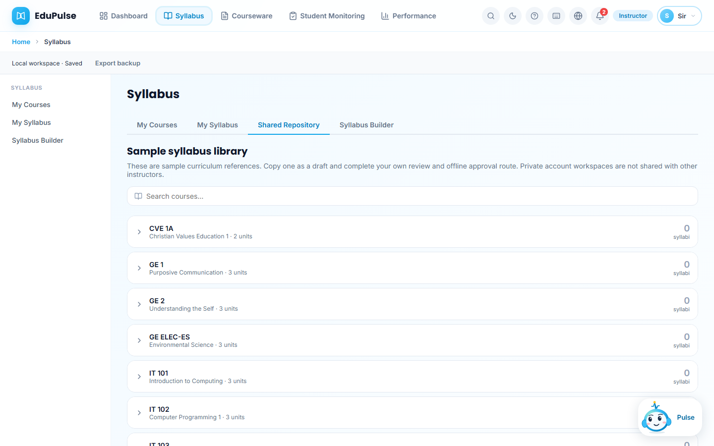 | Sample syllabus library by curriculum course. Copy one as your own draft; private workspaces are not shared with other instructors. |

## 5–6. Syllabus Builder

The DOCX upload area accepts files up to 2 MB. Review **Extracted Sections Preview** before selecting **Use This Syllabus**. Invalid files show an error with **Try Again**; **Choose Different File** clears the preview. See the [import preview and retry steps](../../system-manual/02-syllabus-lifecycle/README.md#build-the-draft) for captured examples.

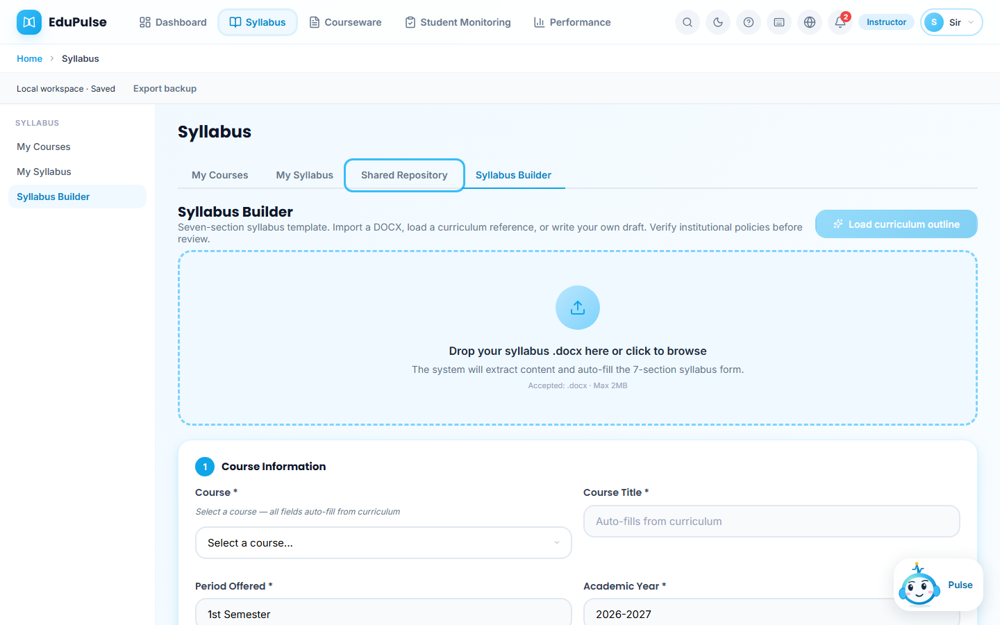

The seven-section template. Start by dropping an existing syllabus `.docx` (its content fills the form), by **Load curriculum outline**, or by selecting a course in Section 1, which auto-fills the locked course information and description. Required fields are marked with an asterisk.

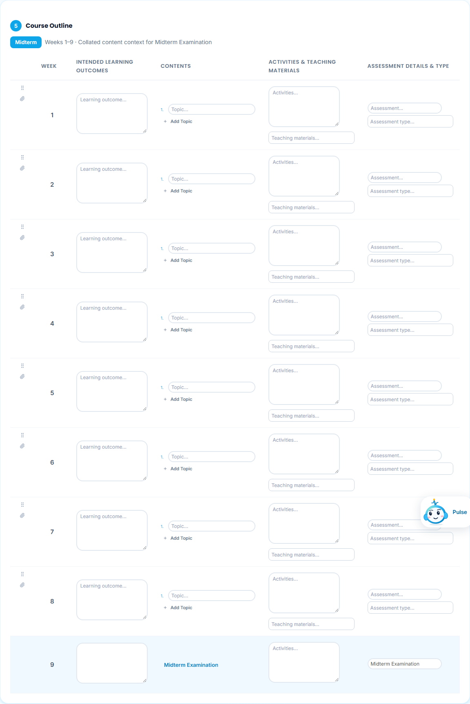

Section 5, **Course Outline**, is the part that later drives courseware: one row per week with intended learning outcomes, topics (**Add Topic**), activities and teaching materials, and assessment details. Weeks 9 and 18 are fixed exam weeks; rows can be reordered with the drag handle and given attachments with the paper-clip.

## 7–8. Courseware

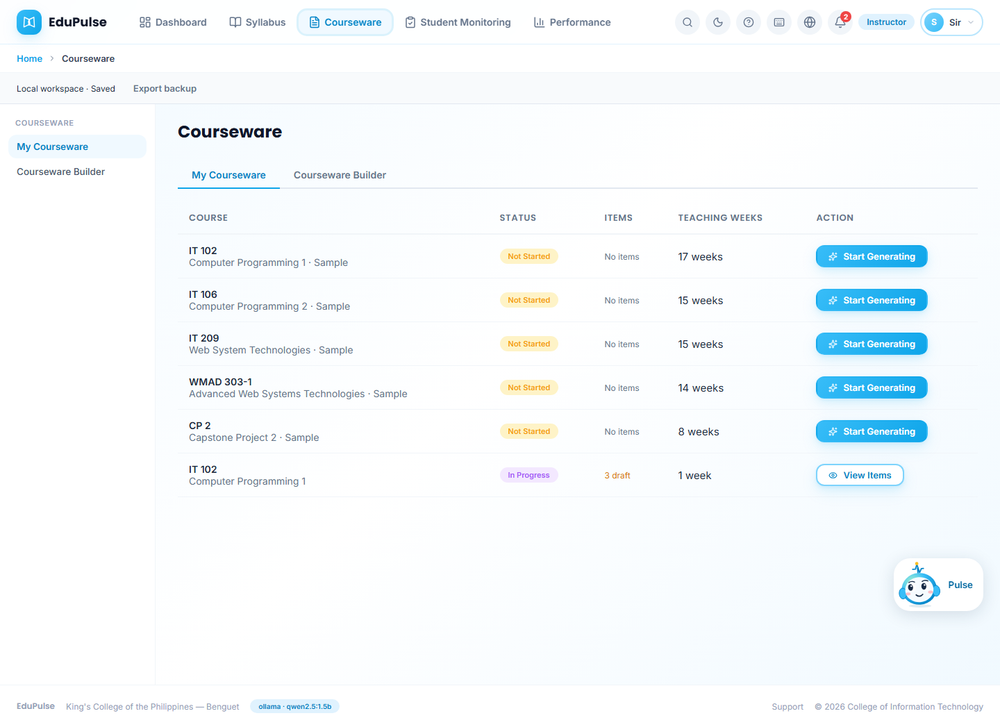

**My Courseware:** each active syllabus with its status (*Not Started*, *In Progress*, *Complete*), item counts and teaching weeks; **Start Generating** opens the builder for that course.

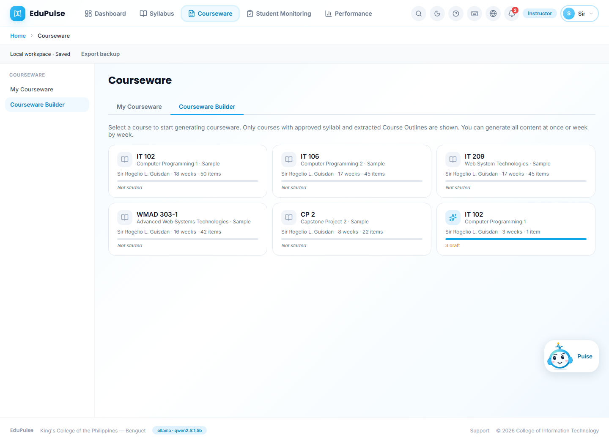

**Courseware Builder:** one card per course with an approved syllabus and extracted outline, showing weeks, planned items and progress. Opening a card lists the outline weeks with **Generate** per week and **Generate All Content**.

*Changed in v0.4.0:* the teaching-weeks column is labelled as such (it excludes exam weeks) and counts read “1 week”, “1 item” in the singular.

## 9–10. Student Monitoring

| Tab | Screenshot | What it shows |
| --- | --- | --- |
| Assessment Scores | 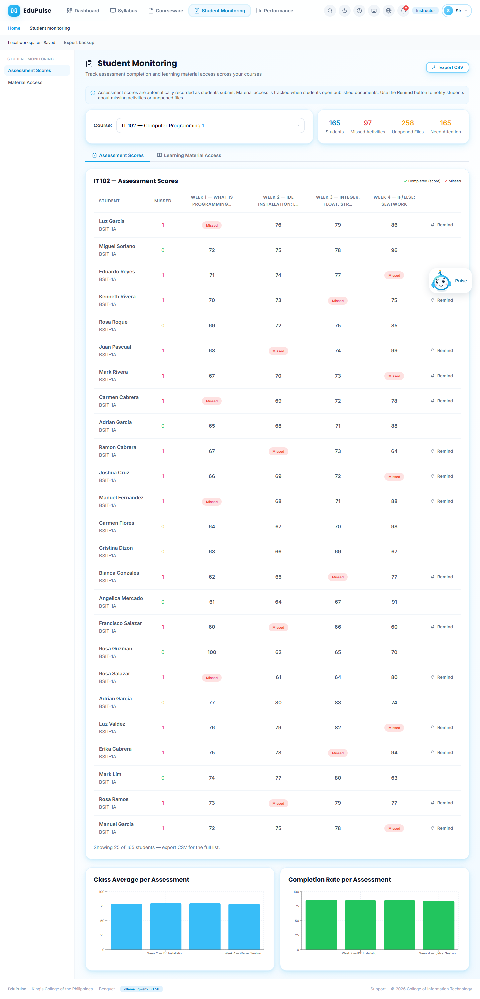 | Pick a course; totals for students, missed activities, unopened files and students needing attention; the score grid per student and assessment with *Missed* markers and **Remind**; class average and completion charts. **Export CSV** for the full list. |
| Material Access |  | Which students opened each published material, with reminders for unopened files. |

## 11–13. Performance

| Tab | Screenshot | What it shows |
| --- | --- | --- |
| Overview | 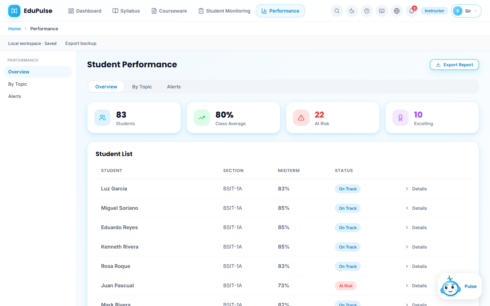 | Student count, class average, at-risk and excelling counts, and the student list with section, midterm score, status and **Details**. |
| By Topic | 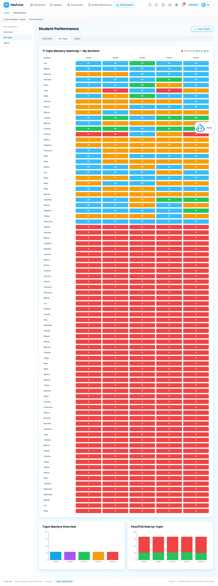 | Mastery per syllabus topic across the instructor's classes. |
| Alerts | 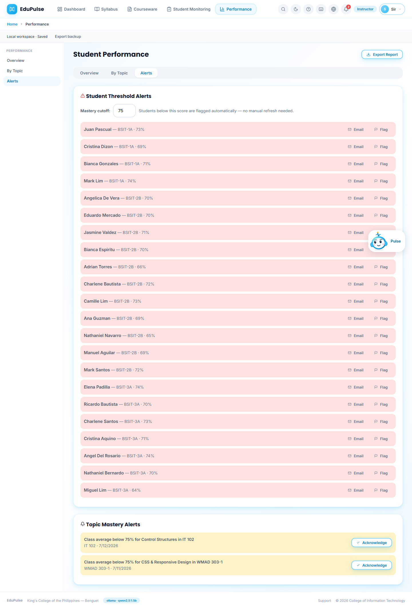 | **Mastery cutoff** (default 75): students below it are listed automatically with **Email** and **Flag**; **Topic Mastery Alerts** for class averages below the cutoff, each with **Acknowledge**. |
