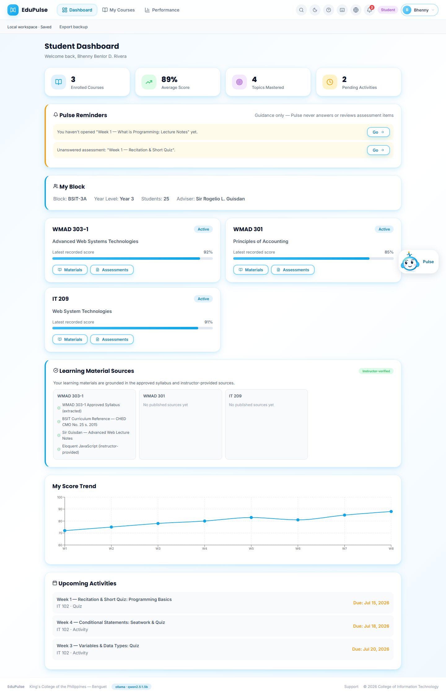
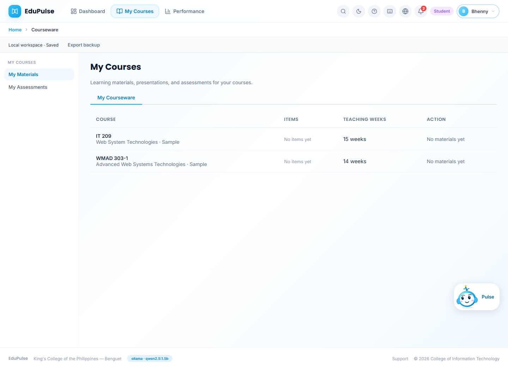
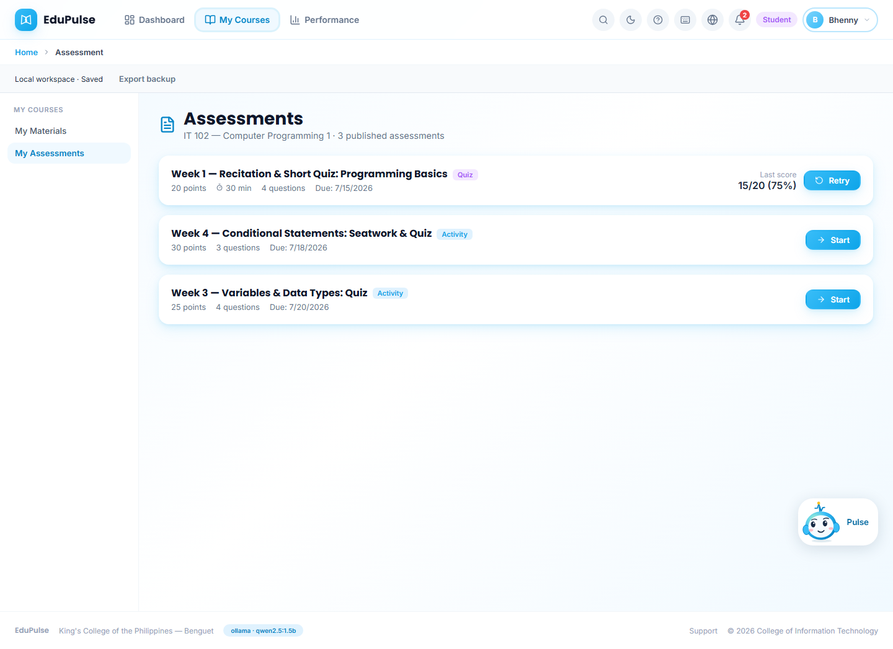
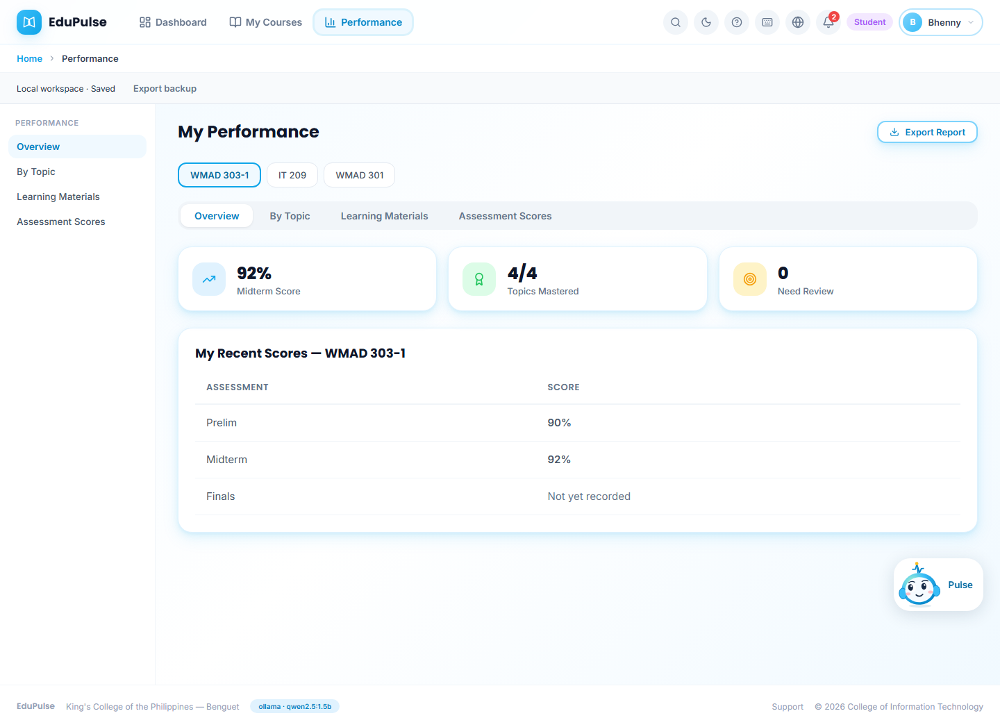
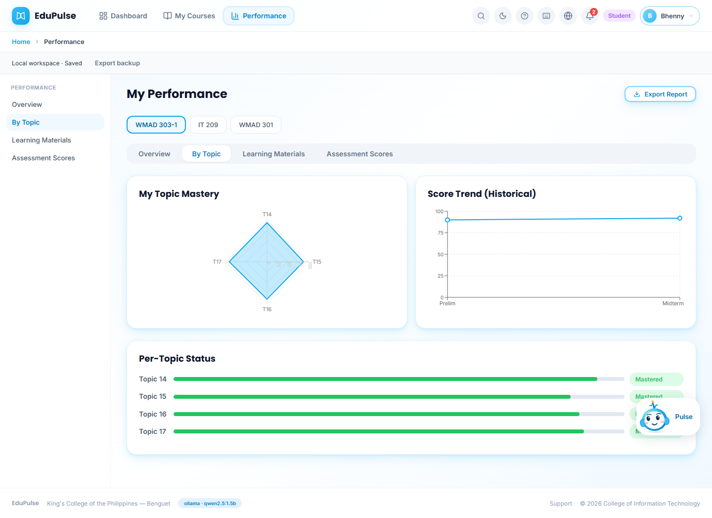
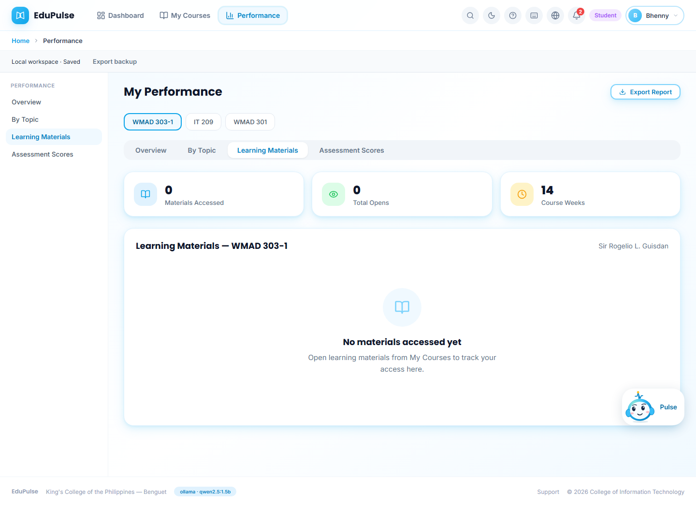
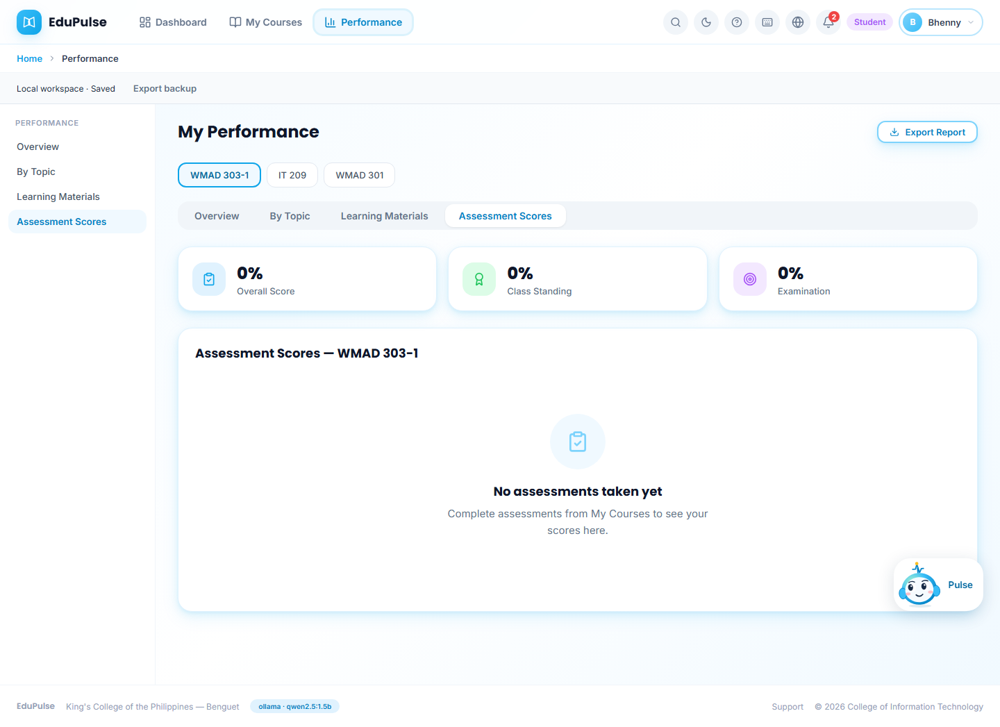
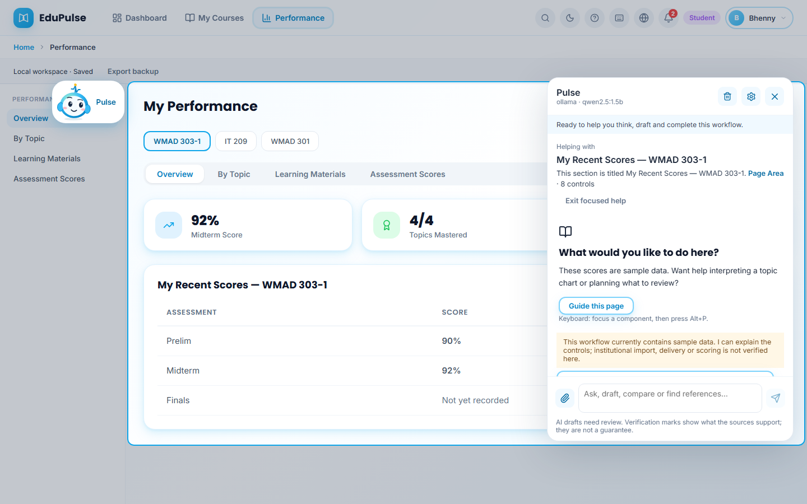

# 05 · Student

Main tabs: **Dashboard**, **My Courses**, **Performance**. Students see only what is published to their block, and Pulse guides them without answering assessment items. Shown as the preview student Bhenny Benlor D. Rivera (BSIT-3A).

## 1. Student dashboard

- **Summary cards:** enrolled courses, average score, topics mastered, pending activities.
- **Pulse Reminders:** unopened materials and unanswered assessments, each with **Go**. The note states that Pulse never answers or reviews assessment items.
- **My Block:** block, year level, size and adviser.
- **Course cards:** each enrolled course with its latest recorded score and **Materials** / **Assessments** buttons.
- **Learning Material Sources:** the approved syllabus and instructor-provided references behind each course's materials (*Instructor-verified*).
- **My Score Trend** and **Upcoming Activities** with due dates.

## 2. My Courses · My Materials

The student's enrolled courses that have an active syllabus, with the number of published items and teaching weeks. **View Courseware** opens the published weekly materials; until an instructor publishes, the row reads *No materials yet*.

*Changed in v0.4.0:* the list is limited to the courses on the student's EduSuite enrolment, matching the dashboard's *Enrolled Courses*; it previously listed every active syllabus in the workspace.

## 3. My Courses · My Assessments

Published quizzes and activities with points, time limit, number of questions and due date. **Start** opens an assessment; a completed one shows the last score and **Retry** when retakes are allowed.

## 4–7. My Performance

A course switcher (one button per enrolled course) sits above four tabs.

| Tab | Screenshot | What it shows |
| --- | --- | --- |
| Overview |  | Midterm score, topics mastered, topics needing review, and recent scores (Prelim, Midterm, Finals). |
| By Topic |  | Mastery per syllabus topic for the selected course. |
| Learning Materials |  | Which published materials the student has opened. |
| Assessment Scores |  | Every recorded assessment score for the course. |

**Export Report** downloads the student's own report.

## 8. Pulse for students

**Guide this page** on My Performance. Pulse focuses the score section, explains what it shows and offers help interpreting a topic or planning review. Its answers are scoped to the student role; a notice states when the page holds sample data.
