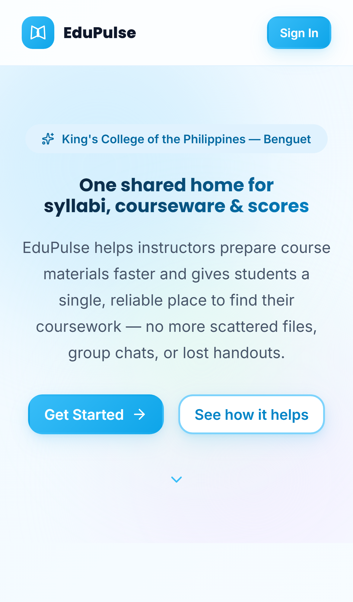
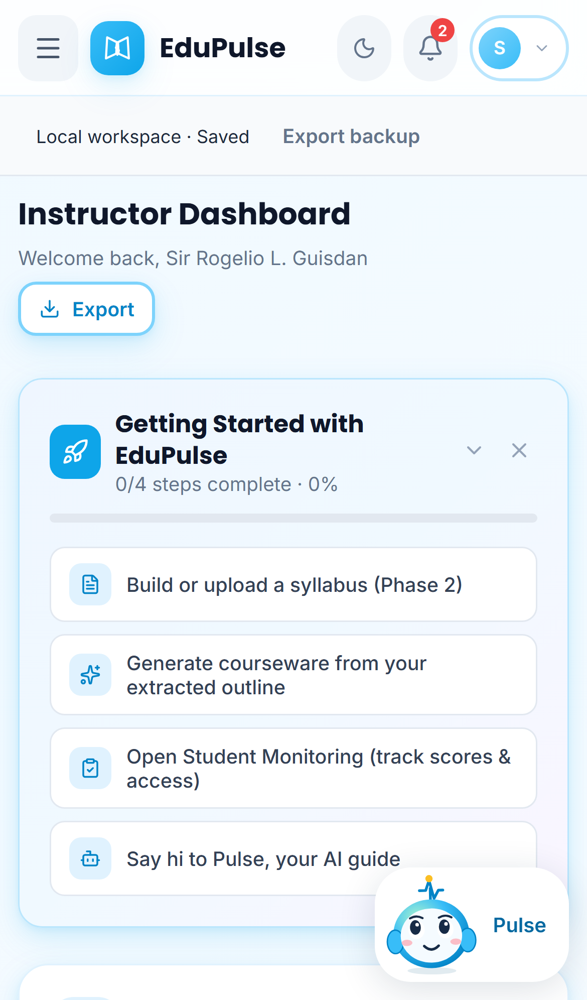
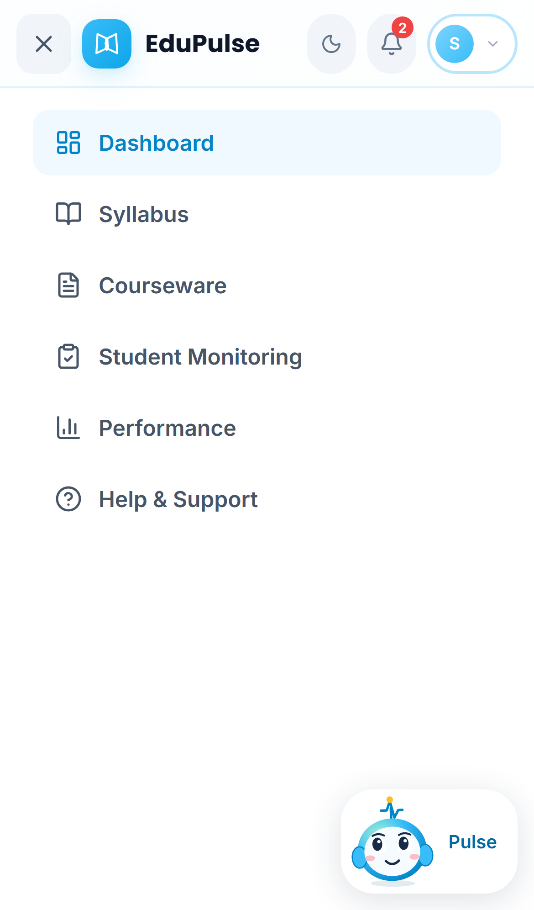
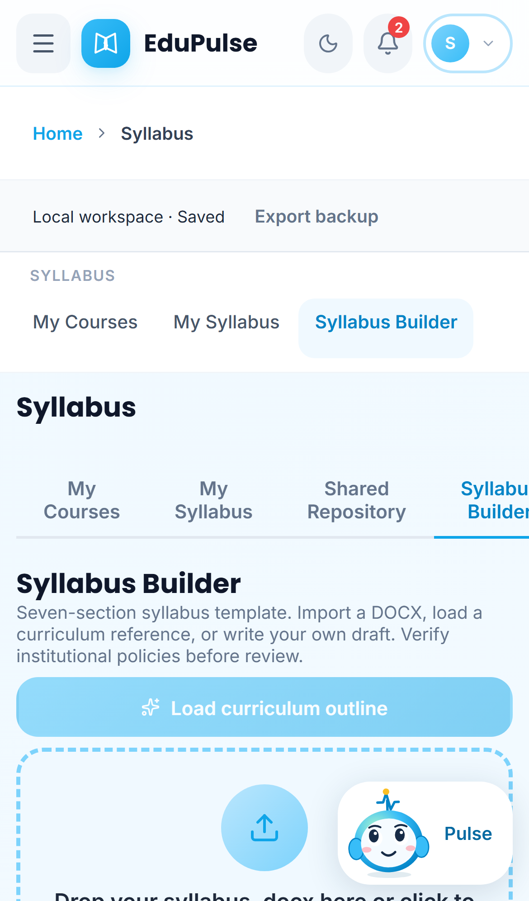
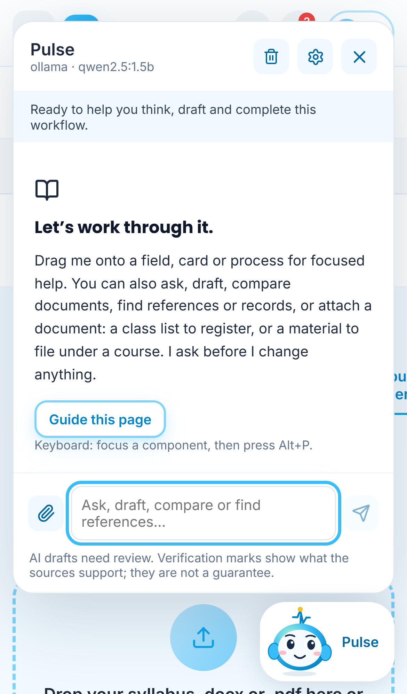
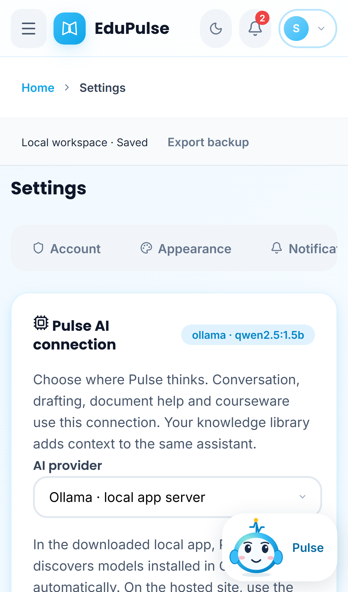

# 06 · Mobile (390 px)

The same application on a phone-sized screen (iPhone 13 viewport, captured at 3× pixel density). Nothing is hidden behind a separate mobile app; the layout reflows.

| # | Screenshot | What changes on a phone |
| --- | --- | --- |
| 1 |  | The landing page stacks its sections in one column. |
| 2 |  | The top bar keeps the menu button, logo, dark-mode, notifications and account; the other tools move into the menu. The role badge is not shown on a phone. The account menu shows the role, and for the owner admin it also offers **Switch view**. Cards stack in one column and the Pulse dock stays bottom-right. |
| 3 |  | **Open menu** (☰) shows the role's tabs plus Help & Support; the button becomes **Close menu** (×). |
| 4 |  | Page sub-views appear as a horizontal strip under the breadcrumb, and every control is at least 44 px tall for touch. |
| 5 |  | The Pulse panel fills the width of the screen above the dock; dragging Pulse works with touch (see [System Manual 7](../../system-manual/07-pulse-guidance/README.md)). |
| 6 |  | Settings tabs scroll sideways; the AI connection, pipeline and knowledge library cards stack. |

*Changed in v0.4.0:* the breadcrumb no longer splits “Home” and the current page onto different lines (the 44 px touch-target rule had made the link taller than its row), and the menu button announces whether it opens or closes the menu.
