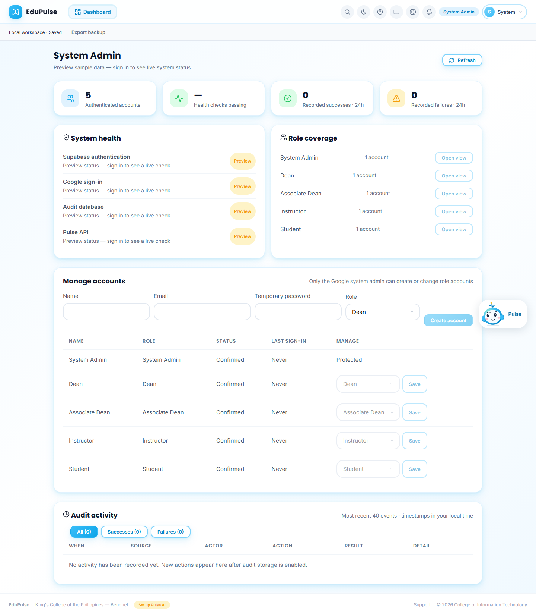
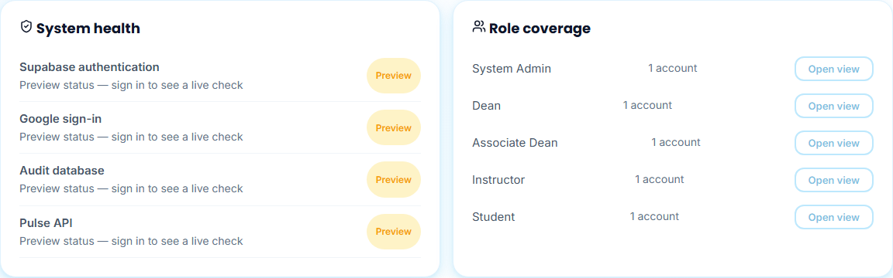
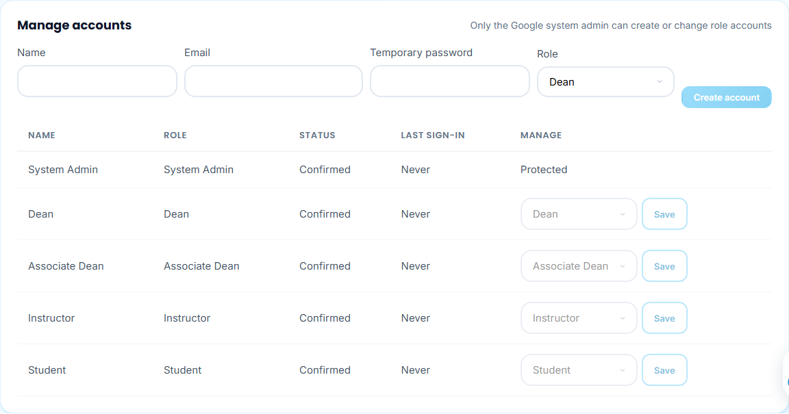
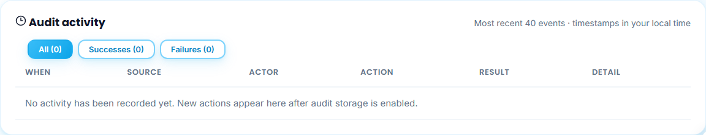

# 07 · System Admin

**New after v0.4.0.** The system admin is a separate role from the Dean and Associate Dean. It runs the system: accounts, service health and the audit trail. Academic work (course loading, monitoring, records) belongs to the Dean and Associate Dean.

The system admin signs in with Google, and only the owner's Google-linked account is accepted as admin. The admin's dashboard (`/dashboard`) is the system console, and its top bar shows only **Dashboard** plus the shared tools.

These screenshots come from the documentation capture build and show **preview sample data**. A preview session cannot change accounts, so its controls are disabled. In a signed-in admin session, the same screen loads:
* live Supabase accounts;
* service checks;
* recorded activity.

## 1. System console

From top to bottom: four summary cards, **System health** and **Role coverage**, **Manage accounts**, and **Audit activity**. **Refresh** repeats every check and reloads the accounts and events.

The summary cards show:
* authenticated accounts;
* health checks passing;
* recorded successes in the last 24 hours;
* recorded failures in the last 24 hours.

## 2. System health and role coverage

**System health** runs four live checks, and each one reads **Healthy** or **Needs attention**. They show *Preview* in this capture.

| Check | What it verifies |
| --- | --- |
| **Supabase authentication** | The signed-in identity verifies against Supabase Auth |
| **Google sign-in** | The Google provider is enabled for the project |
| **Audit database** | The admin overview query (accounts and activity) succeeds |
| **Pulse API** | The application API responds |

**Role coverage** counts the accounts in each of the five roles: System Admin, Dean, Associate Dean, Instructor and Student.
* **Open view** opens EduPulse as that role, so the admin can reach and check any role's screens directly.
* The admin identity, AI key and saved data stay the same while viewing as another role.
* The view can also be changed from the top bar (*Admin · <view>*) or, on a phone, from **Switch view** in the account menu.

## 3. Manage accounts

To create an account:
1. Enter **Name**, **Email**, a **Temporary password** of at least 12 characters, and a **Role** (Dean, Associate Dean, Instructor or Student).
2. Choose **Create account**, then give the credentials to that person securely.

To change an existing account's role, choose the new role in its **Manage** column and select **Save**. The person signs in again to receive the new role.

The system admin account shows **Protected** and cannot be reassigned. A protected Supabase Edge Function (`admin-accounts`) checks the admin's Google-verified identity before every change, and records each change in the audit log.

## 4. Audit activity

The table lists the 40 most recent events, newest first. It combines EduPulse actions with Supabase Auth events and shows when, source, actor role, action, result and detail. The filter buttons switch between **All**, **Successes** and **Failures**, and each button shows how many events it holds.

EduPulse records these actions:
* sign-in and sign-out;
* view switches;
* page visits;
* workspace saves;
* AI provider connections;
* role changes.

The records never contain passwords, tokens, provider keys, prompts or the system admin's email address. This preview has no events yet, so the table shows its empty message.
