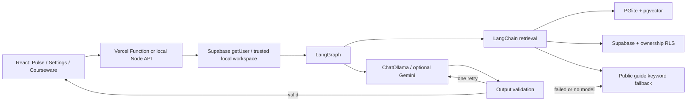

# Architecture and security

Chat graph: START → retrieve → generate → validate → END. No evidence routes to an explicit missing-evidence result. Validation can retry generation once, then fall back to labeled excerpts. Recursion limit: 9. Courseware uses the same retrieval/model adapters with a bounded two-attempt structured-output loop; it cannot call arbitrary tools or mutate academic records. Traces record execution events, never private reasoning.

API operations use one deployable function to fit the existing Vite/Vercel project. The SPA rewrite excludes `/api`. The local server binds only to 127.0.0.1; local authorization additionally rejects non-loopback Host names to mitigate DNS rebinding. Cross-origin browser requests are rejected. Clients cannot choose URLs, keys or roles in request bodies. Payloads, attachments, document quotas, model tokens and wall time are bounded. A per-instance limiter admits one active mutation per identity and 15 requests/minute. It is not a distributed quota service; hosted providers still need account quotas and abuse controls appropriate to deployment scale.

The Supabase migration creates only `edupulse_ai_documents`, `edupulse_ai_chunks`, and two RPCs. RLS requires `auth.uid()` ownership. RPCs are SECURITY INVOKER with an empty search path and explicit grants. The ingest RPC runs transactionally, deduplicates and serializes account imports. Cascading deletes remove chunks. The published migration filename matches the recorded remote version `20260913112259`.

Secrets remain in ignored server environment configuration. Provider/database exception text is never returned or logged because it can contain credentials or user content. Source text is rendered as React text. Request text and retrieved/attached excerpts are sent to the selected generation provider; indexing sends selected document text to the embedding provider. User documents and local databases are excluded from git and deployment uploads. Remote Ollama endpoints can use a server-only `OLLAMA_API_KEY` bearer token.

The frontend remains JavaScript with its existing permissive check configuration. New server/API/contracts/client code is TypeScript with strict checking. Tests run actual SQL and RLS in an isolated PGlite database; provider-free graph tests inject deterministic responses. Separate live smoke tests require genuine model responses.
