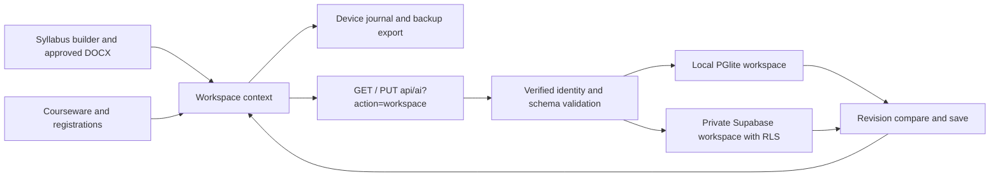

# Architecture and compatibility

## Storage and authorization

The additive migration `20260915042129_persistent_workspace.sql` creates one `edupulse_workspaces` row per account. The primary key references `auth.users`; row-level policies restrict reads and writes to the owner. Only trusted `app_metadata.role` values of instructor/admin authorize writes. User-editable metadata does not grant access. Explicit grants exclude anonymous access. The invoker RPC increments the revision only when the supplied prior revision matches; conflict SQLSTATE 40001 becomes HTTP 409.

Follow-up migration `20260915100411_workspace_policy_initplan.sql` wraps JWT lookup itself in a scalar subquery. This resolves the Supabase performance advisor's policy warning while preserving ownership and role checks. Both migrations passed the SQL policy tests and were applied.

Local development stores the same snapshot in `ep_workspaces` within the existing PGlite data directory. Existing vector document tables are unchanged. Local development remains bound to loopback with its existing origin checks. Hosted guests receive no private row and use browser-only preview storage.

Workspace snapshots contain `syllabi`, `content`, and `registrations`. Bounds: 50 syllabi, 52 outline rows per syllabus, 1,000 content items, 200 registration entries, 3 MB API request maximum. The database's slightly larger serialized JSON limit accommodates JSONB formatting; API validation remains tighter. Approved DOCX attachments are base64 inside the private snapshot, capped at 500 KB each. This is suitable for a bounded prototype workspace; larger institutional file repositories require a separate storage design.

## Compatibility and recovery

React/Vite, the same `/api/ai` function, the LangChain/LangGraph generation flow, and existing Supabase authentication are retained. DOCX export loads `docx` dynamically. Legacy courseware with actual content migrates from the account's device cache; metadata-only placeholder records are ignored. Preview data does not seed a real account.

Each tab retains a pending journal in session storage as well as the device cache. A save failure is visible and does not discard pending values. If another writer advances the server revision, the user can export pending edits and then load the latest server snapshot. This is optimistic conflict detection, not collaborative document merging or a durable version archive. A trusted owner using the direct database API can write their own row; the application uses the compare-and-save RPC.

## Research

- [Supabase changelog](https://supabase.com/changelog): checked current platform changes before the additive migration; explicit grants are supplied.
- [Supabase row-level security](https://supabase.com/docs/guides/database/postgres/row-level-security): owner policies, trusted claims, and indexed ownership filters.
- [Supabase database functions](https://supabase.com/docs/guides/database/functions): invoker function, explicit search path, and function privileges.
- [docx documentation](https://docx.js.org/): actual browser DOCX creation; pinned 9.7.1 and verified against installed APIs and a browser export/import round trip.
- [Ollama chat API](https://docs.ollama.com/api/chat): documented JSON output mode replaces native schema-constrained sampling after an observed runner crash. Full Zod validation and the two-attempt limit still apply. Memory mapping and a smaller inference batch reduce peak memory usage.
