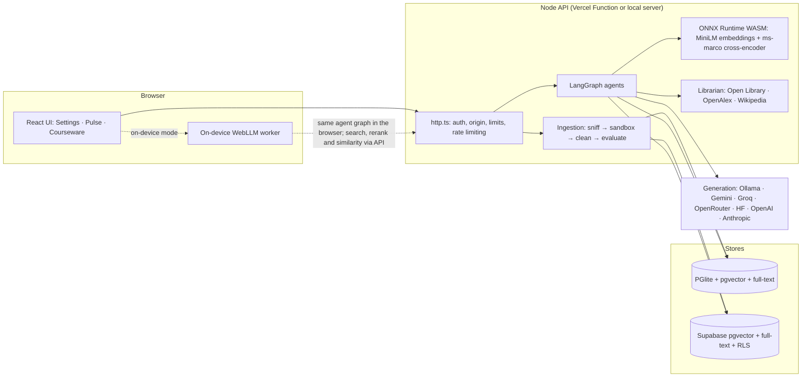

# Architecture and security design — v0.4.0

Figures (generated): [agent workflow](../../../session-generated/2026-10-02-agentic-rag/architecture-figures/01-agent-workflow.png) · [ingestion pipeline](../../../session-generated/2026-10-02-agentic-rag/architecture-figures/02-ingestion-pipeline.png).

## 1. Components

The agent graph (`src/lib/rag/agents.ts`) is shared code. On the server it uses real dependencies (`server/graph.ts`). In on-device mode the identical graph runs in the browser: Researcher queries issued in parallel are micro-batched into one `context` request (server-side hybrid search + cross-encoder), the Verifier calls `similarity`, and the Writer uses WebLLM.

## 2. Agent workflow (LangGraph `StateGraph`)

| Agent | Node | Responsibility | Model use |
| --- | --- | --- | --- |
| Planner | `planner` | Classifies the task (answer, summarize, compare, draft, references, general); decomposes into up to 3 queries (follow-up context, focused-term query, one query per compared side) | none (rules, zero latency) |
| Researcher ×N | `researcher` via `Send` | Parallel hybrid search per query | MiniLM embedding |
| Ranker | `ranker` | Fuses duplicates by RRF, reranks with the cross-encoder, applies a relevance floor (−9.5 logit) and window (7 below best), removes near-duplicates within a document, caps 3 passages per document | ms-marco cross-encoder |
| Comparator | `comparator` | Aligns statements of two sources: shared (≥0.55), related (≥0.35), unique; coverage | MiniLM similarity + lexical |
| Writer | `writer` / `extractor` | Cited answer with spotlighted, neutralized evidence; or verbatim extractive answer when no model or the model fails | provider / WebLLM |
| Verifier | `verifier` | Splits claims; support = 0.55·semantic + 0.45·lexical, gated by number/name/absolute consistency; marks supported, partial, uncited, miscited, unsupported; counts corroborating documents | MiniLM similarity |
| Corrector | `corrector` | Repairs wrong/missing/out-of-range citations deterministically; one model revision for unsupported claims; replaces an answer with no supported claim by cited excerpts | provider (revision only) |
| Librarian | `librarian` | Searches open catalogs in parallel, ranks by semantic similarity to the topic | MiniLM embedding |

State channels with reducers (`ReducedValue`) merge parallel Researcher output and the agent trace. Recursion limit 20; at most two model calls per chat answer and two per courseware draft. The courseware graph (`src/lib/rag/courseware.ts`) runs Planner → Researcher per topic → Ranker → Writer (JSON) → Checker (schema, Verifier, Comparator coverage) ⇄ Corrector, and keeps the best checked draft if a revision fails.

## 3. Ingestion pipeline (LangChain runnables)

`extractionPipeline` is a `RunnableSequence` of named `RunnableLambda` stages (`extract`, `clean`, `evaluate`), so each stage is traceable with LangChain callbacks. Indexing (`ingest`) runs `clean → evaluate → chunk → embed → index`, timing each stage for the UI.

* **Sniff**: magic bytes (`%PDF-`, ZIP), OOXML part names, UTF-8/UTF-16 detection, NUL-byte binary rejection; extension must match.
* **Extract**: `unpdf` (serverless PDF.js, no eval code path), `mammoth` (`externalFileAccess: false`, images never decoded), a PPTX reader that follows `presentation.xml` slide order and speaker-note relationships, an HTML-to-structure converter that drops scripts, styles, frames and embedded objects.
* **Clean**: NFKC, control/zero-width removal, running headers/footers (top/bottom two lines repeated on ≥60% of pages), page numbers, hyphenation and broken PDF lines.
* **Evaluate**: 0–100 score from words, empty-page share (scanned PDFs), alphabetic ratio, unreadable characters, word length, duplicate lines; injection scan.
* **Chunk**: structure-aware segments by heading and `[[Page n]]`/`[[Slide n]]` markers, LangChain `RecursiveCharacterTextSplitter` (900/120), contextual embedding header `title › section (p. n)`; ≤250 passages.
* **Embed**: all-MiniLM-L6-v2 int8 ONNX, mean pooling, L2 normalization, batches of 16, 4 WASM threads locally (≈49 ms/passage).
* **Index**: pgvector HNSW (cosine) and a generated `tsvector` with GIN index.

## 4. Data model and migration

Local PGlite schema migrates in place (`ADD COLUMN IF NOT EXISTS`); documents embedded by the earlier Ollama model are re-embedded before the next search. Supabase migration `20261001090000_agentic_rag.sql` (additive):

* `edupulse_ai_documents`: `source_type`, `file_name`, `char_count`, `page_count`, `quality` (JSON ≤ 8 KB); model check allows the new `all-minilm-l6-v2-int8`.
* `edupulse_ai_chunks`: `chunk_index`, `page`, `section`, `flagged`, generated `fts tsvector` + GIN index.
* `edupulse_ingest_document_v2(doc, chunks)`: transactional, advisory-locked per owner, deduplicated, quota 50 documents, ≤250 chunks, ≤6 MB.
* `edupulse_hybrid_chunks(...)`: `SECURITY INVOKER`, empty `search_path`, owner filter plus RLS, model filter, optional document scope (≤5), validates every query term against `^[a-z0-9]{2,40}$` before `to_tsquery`, returns vector and keyword ranks separately for fusion.

## 5. Threat model and sandboxing

| Threat | Control | Evidence |
| --- | --- | --- |
| Malicious parser input (PDF/Office exploits, memory exhaustion) | Worker thread, 256 MB heap, 48 MB young gen, 4 MB stack, 30 s hard timeout, two concurrent workers, `env: {}` (no secrets), stdout/stderr discarded | `tests/ingest.test.ts` (timeout, damaged PDF); [screenshots](../../../system-manual/04-knowledge-library/README.md#when-a-file-is-refused-or-flagged) |
| Archive bombs, encrypted or ZIP64 archives | Central-directory inspection before decompression: ≤2,000 entries, ≤60 MB expanded, ratio ≤200 for large entries | `archive bombs and encrypted Office files…` test |
| File-type spoofing | Content sniffing; extension must match content | `type sniffing rejects renamed…` test |
| PDF font code execution (CVE-2024-4367 class) | unpdf's PDF.js build compiles PostScript functions to WebAssembly and contains no `eval`/`new Function` (verified by scanning the bundle) | design note in `formats.mjs` |
| Prompt injection inside documents | Injection scan at evaluation and per chunk; flagged passages carry a caution; `neutralize()` defangs role tags, delimiters and footnote markers; fixed system prompt; evidence passed as JSON data | `history and attachments are neutralized…` test; [screenshot](../../../system-manual/04-knowledge-library/09-instruction-like-text-flagged.png) |
| Model output abuse | `sanitizeOutput()` strips control/bidi characters, script/iframe/image markup; React renders text only; citations validated and repaired | Verifier/Corrector tests |
| External API abuse (SSRF, oversized or hostile responses) | Fixed origins, `redirect: 'error'`, 8 s timeout, 1.5 MB cap, Zod schemas, links rebuilt from validated identifiers | `Librarian calls only allowlisted catalogs…` test |
| Supply chain (model files) | Pinned Hugging Face revisions with SHA-256 verification at load and download | `server/ml/models.ts` |
| XSS / clickjacking in the hosted app | CSP `script-src 'self' 'wasm-unsafe-eval'`, `object-src 'none'`, `frame-ancestors 'none'`, `X-Frame-Options`, `nosniff`, Referrer and Permissions policies, COOP; snapshots captured under this CSP | `scripts/check-deployment.ts`; snapshot capture log |
| Cross-account data access | Supabase RLS + owner filters in RPCs; local owner scoping | SQL tests in `tests/database.test.ts`, owner isolation in `tests/rag.test.ts` |

Limits stated honestly: worker threads share the process's OS privileges (they are not an OS-level jail; network and file APIs are not blocked inside the worker). The rate limiter is per instance. The Verifier measures support, not truth: a claim that reuses the source's words with the opposite meaning can still pass (see the evaluation).
